# I. 緣起目的

> 產品定位、需求方是誰要什麼、MVP 範圍（全文件級一次；不展開解法元件）。規格條目見 ＜III 規格指標＞。

* 需求方為 [USR] 本人（遊戲玩家兼英文學習者）。
* 需求為：遊玩英文遊戲時，能以一組熱鍵框選畫面任意區塊，立即取得該區塊英文之原文、KK 音標、繁體中文翻譯，並可聆聽原文發音，全程不中斷遊戲。
* MVP 範圍：背景常駐＋熱鍵喚起＋變暗選區＋單次辨識翻譯查詢＋獨立字典視窗顯示與朗讀（含手動打字查詢）＋查詢歷史本機回顧（清單／詳情／重聽／刪除清除）＋我的筆記收藏（依資料夾分類、拖曳排序、檢視重聽、去重、**逐則發音練習**——就地錄音、AI 評分、成績框回饋）＋可管理多個命名主題（文字或貼圖／上傳檔 vision 自動解釋、擇一使用注入查詢）；不含生詞本、多語言。
* **本增量（v2.0.0 影片來源升格）**：本方案由「螢幕翻譯工具」升格為**多來源英文擷取練習中樞**——螢幕與 **YouTube 影片**為可插拔擷取來源，下游查詢／筆記／發音練習共用。本增量新增**影片「學習查詢」主動線**（Mode A，`spec#2`–`spec#2`）：選定 YouTube 影片、自動取得字幕、導引播放到句暫停顯字幕、於暫停句點字查詢並加入既有「我的筆記」；**不含**說話者標註、代言練習、完整影片庫（後續增量另立工單）。
* **本增量（電子書來源）**：本方案再擴一擷取來源——**本機電子書（EPUB）**，與螢幕、影片並列之可插拔擷取來源。本增量交付**電子書增量1「獲得＋書櫃」地基**（`spec#4`–`spec#6`）：匯入本機 `.epub`（含批次）、解析容器/中繼（書名/作者/語言/dc:identifier）/spine/目錄（EPUB3 nav＋EPUB2 ncx）/封面、書櫃列出整理（封面縮圖、主題篩選、四鍵排序、依 dc:identifier 去重、刪除清空）、每本書一資料夾持久化並跨啟動還原、納入既有整包備份；**不含**章節閱讀渲染、逐段導讀、TTS 朗讀、逐字查詞、加入筆記、依說話人變色（由**電子書增量2「內容閱讀」**接續交付，見下條；增量1【內容】子頁僅骨架）。
* **本增量（v4.0.0 電子書內容閱讀）**：承電子書增量1「獲得＋書櫃」，本增量交付**內容側閱讀器**——電子書模式**首度可閱讀學習**（定位升格里程碑、規劃版號 v4.0.0）。**電子書增量2「內容閱讀」**（`spec#7`–`spec#10`）：翻開藏書**逐段閱讀**（line-stepped 逐段導讀：上一段/下一段/繼續、雙擊章節目錄或段落跳讀、閱讀進度跨啟動記憶）、**TTS 逐段朗讀**（唸完自動前進、續讀/重聽/調速）、閱讀中**逐字點選查詞並加入「我的筆記」**、段落開頭 `Name:` **說話人依主題色上色**（沿用影片頁說話人面板/篩選/於指定說話人暫停）；章節渲染以**段落純文字自繪**（剝章節 XHTML 取 `
` 段落、每段一 cue、`StartSec=null`），**EPUB 內嵌圖與複雜排版列後續增量**（本增量誠實 MVP 取捨）。下游查詢/筆記/朗讀/說話人完全複用螢幕、影片既有子系統、不另造。

# II. 分析設計

> 逐高度 zoom：＜A 需求分析＞（sol／org 視角）→＜B 方案設計＞（sol／sys 切分·team 視角）→＜C 系統設計＞（mod／prsn 視角）。各高度恆含 (A) 運作想定＋(B) 實作規劃。

## A. 需求分析

> 需求視角；使用者之初始需求。只談「使用者是誰、做什麼、要什麼」，不預設解法。

### (A) 運作想定

#### 1. 架構圖

> 描述本層方案與外部之運作關係與部署環境偏好；圖＝正本，圖後不複述節點與邊。

運作關係（sol 與外部）：

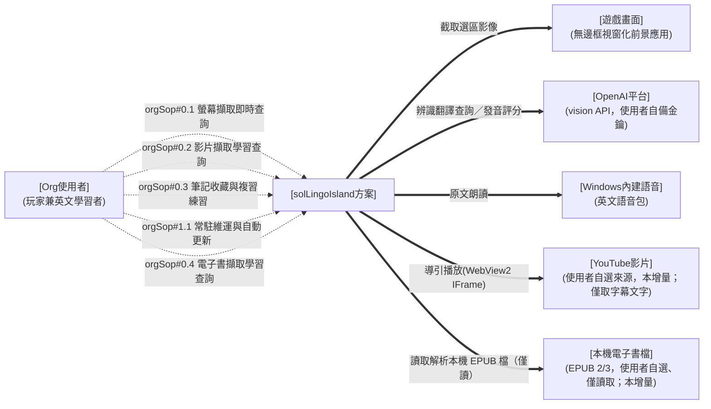

> 圖例（三線通則）：粗 `==>`＝運行關聯／細 `-->`＝部署設定關聯／虛 `-.->`＝人員操作；本層為需求層示意，正式介面契約於 ＜II.B＞／＜II.C＞ 落地。

部署環境（需求偏好）：

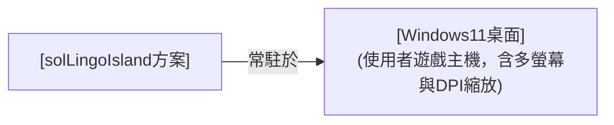

> 圖例：細 `-->`＝部署設定關聯（沿三線通則）。
* **sol 查詢工具**：solLingoIsland 畫面選區查詢工具，對內以單一系統實現（見 ＜II.B＞）。
* **外部關聯項目**：遊戲畫面（查詢對象、非介接系統）、OpenAI 平台（辨識翻譯外部服務）、Windows 內建語音（朗讀引擎）、**YouTube 影片（本增量之影片擷取來源；僅取字幕文字、不下載影片內容）**、**本機電子書檔（本增量之電子書擷取來源；使用者自選 `.epub`、僅讀取解析、原檔複本落地個人藏書資料夾、不改寫使用者原檔）**。
* **部署偏好**：使用者自有 Windows 11 遊戲主機，免安裝、單一執行檔、系統匣常駐。

#### 2. 單位組織

> 收 ＜(A).1 架構圖＞ 之 org 型別。

**方案外單位人員關聯**（本需求與方案外之關聯對象）：

* [遊戲畫面]：前景執行之英文遊戲（無邊框視窗化前提），本方案僅截取其畫面、不介接。
* [OpenAI平台]：提供 vision 辨識翻譯與音訊發音評分之外部服務；額度與金鑰由使用者自備。
* [Windows內建語音]：OS 內建英文語音包，供原文朗讀（離線、免金鑰）。
* [YouTube影片]：使用者自選之英文影片來源（本增量）；本工具僅取其字幕文字、不下載影片內容（來源使用者自負，比照自備金鑰）。
* [本機電子書檔]：使用者自選之本機 EPUB 電子書檔（本增量）；本工具僅讀取解析其內容與封面、將原檔複本落地個人藏書資料夾，不改寫使用者原檔（來源使用者自負，比照自選影片來源）。

**方案內單位人員編組**（org 層需求方；單人方案，內部 team 見 ＜II.B＞）：

* [Org使用者]：玩家兼英文學習者，單人使用並自行維保。

#### 3. 作業程序

> 收 ＜(A).1 架構圖＞ 人員動作線→本高度 SOP 表（需求＝orgSop）。每條標**關聯 hmi**（需求高度＝solHmi 之具名形式）；介面設計正本在 ＜(B).3 人機介面＞，此處只放關聯指標。
> **介面併用（HMI 弧收斂）**：五條 orgSop 一律共用同一具名 solHmi——本方案全部作業皆在同一個 Windows 桌面常駐應用內完成，無技術上必須分裂之通道。
> orgSop 數＝需求域 4 條（螢幕／影片／筆記／電子書）＋平台維保 1 條＝5，與 spec 13 條不等值（電子書一域 orgSop#0.4 跨兩增量對應七條 spec；維保原無獨立 value-spec，**惟 spec#11 為例外**——其由 orgSop#0.1 與 orgSop#1.1 共同承接，見 ＜III 規格指標＞ 前言）。

| domain | orgSop 職責 | 說明 | 關聯 hmi |
| --- | --- | --- | --- |
| **domain#0-多來源英文擷取學習** | orgSop#0.1-螢幕擷取即時查詢 | 遊戲中熱鍵喚起、框選（或雙擊）畫面英文、取得原文／KK 音標／繁中翻譯、於字典視窗查看聆聽（逐字查、編輯重譯、打字查）；可設命名主題（文字或貼圖 vision 解釋）注入以提升準確度；並可設定擷取快捷鍵、手動觸發擷取與整理截圖清單；不中斷遊戲（對映 spec#1·spec#11） | [solHmi桌面常駐應用] |
| | orgSop#0.2-影片擷取學習查詢 | 選定 YouTube 影片為擷取來源、自動取得字幕、導引播放到句暫停顯字幕、於暫停句點字查詢、將擷取之字／句加入我的筆記；螢幕與影片為並列之可插拔擷取來源（對映 spec#2） | [solHmi桌面常駐應用] |
| | orgSop#0.3-筆記收藏與複習練習 | 將查詢結果／歷史加入我的筆記（去重／資料夾／拖曳排序／檢視重聽）、查詢歷史本機回顧（清單／詳情／重聽／刪除清除）、於我的筆記逐則發音練習（錄音／AI 評分／最佳分／可調門檻／清空）（對映 spec#3） | [solHmi桌面常駐應用] |
| | orgSop#0.4-電子書擷取學習查詢 | 選定本機 EPUB 電子書為擷取來源、匯入解析（容器／中繼〔書名/作者/語言/dc:identifier〕／spine／目錄〔EPUB3 nav＋EPUB2 ncx〕／封面，含批次）、於書櫃瀏覽整理（封面縮圖／主題篩選／四鍵排序／依 dc:identifier 去重／刪除清空）、藏書每本一資料夾持久化跨啟動還原並納入整包備份；**翻開藏書逐段導讀閱讀**（line-stepped 上一段/下一段/繼續、章節目錄或段落跳讀、閱讀進度跨啟動記憶）、**TTS 逐段朗讀**（唸完自動前進／續讀／重聽／調速）、**閱讀中逐字點選查詞並加入我的筆記**、**段落 `Name:` 說話人依主題色上色**（面板／篩選／於指定說話人暫停）；螢幕、影片與電子書為並列之可插拔擷取來源、下游查詢/筆記/朗讀/說話人共用。**增量1 交付「獲得＋書櫃」（spec#4–#6）、增量2 交付「內容閱讀」（spec#7–#10）**；EPUB 內嵌圖與複雜排版列後續增量 | [solHmi桌面常駐應用] |
| **domain#1-系統維運** | orgSop#1.1-常駐維運與自動更新 | 常駐主控入口（工作列常顯可尋、換版可尋）、自訂喚起快捷鍵、金鑰設定（環境變數、不落地）、啟動／收合／結束、啟動時自動更新、移除（平台維保，服務全部 spec；**除 spec#11 外**無獨立 value-spec——對映 spec#11，與 orgSop#0.1 共同承接） | [solHmi桌面常駐應用] |

#### 4. 軟硬實體

> 收 ＜(A).1 架構圖＞ 之設備、外部系統與服務（需求視角；細部選型見 ＜(B).1 技術選型＞）。需求層無 etyCfg，故本層無 cfgTest（cfgTest 歸 ＜II.C.(A).4＞）。

* **使用者遊戲主機**：Windows 11（或 Windows 10 1903+）桌面環境，含多螢幕與 DPI 縮放情境。
* **遊戲畫面**：以無邊框視窗化（borderless windowed）執行之英文遊戲（使用前提；獨占全螢幕不支援）。
* **OpenAI vision API**：使用者自備金鑰與額度之外部辨識翻譯服務。
* **Windows 內建語音**：OS 內建英文語音包（朗讀用，離線可用）。

### (B) 實作規劃

#### 1. 技術選型

> 本層宣告 solTechStyle（方案設計主軸／整體 look 之具名契約）。系統類型與構件技術疊層分別宣告於 ＜II.B.(B).1＞／＜II.C.(B).1＞，本節不重述（正本唯一、餘處引用）。

* **solTechStyle（方案設計主軸）＝ [solTechStyle淺粉童趣桌面風格]**：淺粉底（卡片色系 `#FFF0F5`、accent `#F4C2D0`）＋小女孩 logo（`assets/icon.png`）背景浮水印（不透明度 `0.14`）＋控制項半透明白（`#66FFFFFF`，令浮水印透出）＋圖示採 Segoe MDL2 Assets 系統字圖（不用 emoji）＋Windows 11 Fluent Design 基座（Segoe UI Variable 字階、4px 間距格、圓角 8px、亮暗主題、acrylic／mica 層次）；可近用性掛 WCAG 2.1 AA 對比。以共用樣式資源套用、各頁不各刻。
* **不錨 [hmiIntf通用視覺規範]**：MD3 web 基座與 admin shell 對桌面原生應用不適用，改錨系統類型契約之不干擾介面 bar（見 ＜II.B.(B).1＞）；此為 solTechStyle 之基準宣告，非個別頁面取捨。
* look 之落地見 ＜II.A.(B).3＞，各頁套用見 ＜II.C.(B).3＞。

#### 2. 關鍵組態

> 列本層關鍵參數／組態（需求偏好→etyCfg→Env／appsettings）；列舉即可、不解釋。

* **金鑰**：`OPENAI_API_KEY` 一律環境變數，程式與 repo 不落地（spec#1）。
* **喚起快捷鍵**：預設 `Alt+L`（左右 Alt 皆可），**可自訂**（鍵盤組合或滑鼠鍵，存 appsettings）。
* **查詢模型**：預設 `gpt-4o-mini`，可調（appsettings）。
* **主題描述**：使用者自然語言描述目前應用主題（選填、可存可清），查詢時作為「參考、非指令」注入 prompt（spec#1）；沿用之單一情境提示鍵 `paramContextHint` 見 ＜II.B.(B).2＞。
* **發音練習及格門檻**：`paramPronPassThreshold`（0–100 整數、預設 80，於設定頁可調）；發音評分用之 OpenAI 音訊輸入模型 `paramPronModel`（預設 `gpt-audio-mini`、可調 appsettings），沿用 `OPENAI_API_KEY`（不另設金鑰）。
* **條目顯示偏好**（設定頁「條目顯示」，存 appsettings）：`paramEntryFontSize`（筆記/歷史條目原文字級，預設 18、界 8–48）、`paramEntryBold`（粗體，預設 true）、`paramEntryWrap`（自動換行，預設 false＝單行省略）、`paramPassedCardTransparent`（#123；發音通過之筆記卡是否透明底透浮水印，預設 true＝維持 #118；false＝過關卡維持素底）。
* **字典視窗顯示偏好**（設定頁「字典結果」，存 appsettings）：`paramResultFontSize`（字典結果基準字級，預設 28、界 14–48）。（`paramResultHideOnBlur` 現為**停用**——#135 隨浮動視窗移除而停用，v1.0.1 回滾獨立視窗時**未一併恢復**〔字典視窗無 `Deactivated` 失焦隱藏〕；欄位保留相容、UI 不再呈現。）
* **使用前提**：遊戲無邊框視窗化。

#### 3. 人機介面

> 本層定 `solHmi`——各 orgSop 走何種**形式**之介面通道，並定整體 look（引本節 ＜(B).1＞ 之 solTechStyle）。互動分配見 ＜II.B.(B).3＞、各頁配置見 ＜II.C.(B).3＞。

**具名 solHmi ＝ [solHmi桌面常駐應用]**（形式＝Windows 桌面原生應用，非網站）——**技術強制原因**：全域熱鍵攔截（`RegisterHotKey`／`WH_MOUSE_LL`）、整個虛擬桌面之畫面擷取與凍結遮罩、系統匣／工作列常駐與開機續存，皆非瀏覽器沙箱可得，故不採業界預設之網站形式。五條 orgSop 一律共用此一形式（介面併用），下列表格所列為同一具名 solHmi 之內部通道分工、非另立介面。

各 orgSop 之介面通道：

| orgSop | 通道 | 說明 |
| --- | --- | --- |
| orgSop#0.1-螢幕擷取即時查詢 | **桌面原生 GUI**（遮罩 overlay＋獨立字典視窗＋主視窗主題分頁／螢幕擷取分頁） | 熱鍵喚起框選、結果於獨立字典視窗查看聆聽（逐字查／編輯重譯／打字查；字典視窗 `Topmost` 疊於無邊框遊戲、與主視窗共存，v1.0.1）；命名主題（文字/貼圖自動解釋）擇一注入提升準確度；擷取快捷鍵設定、手動觸發擷取與截圖清單整理於螢幕擷取分頁 |
| orgSop#0.2-影片擷取學習查詢 | **桌面原生 GUI**（統一主視窗「影片擷取」分頁：WebView2＋字幕清單） | 貼 YouTube 影片、取字幕、導引播放到句暫停顯字幕、暫停句點字查詢、加入我的筆記 |
| orgSop#0.3-筆記收藏與複習練習 | **桌面原生 GUI**（統一主視窗「筆記」／「歷史」分頁＋收藏 toast） | 收藏加入並 toast、資料夾管理與排序、查詢歷史回顧（清單/詳情/重聽/刪清）、筆記卡片就地錄音送 AI 評分、清空練習紀錄 |
| orgSop#0.4-電子書擷取學習查詢 | **桌面原生 GUI**（統一主視窗「電子書」分頁：最左常駐書目清單＋右側子頁籤【內容】逐段閱讀器／【獲得】匯入卡片，#236 頁面整併） | 選/拖 `.epub` 匯入（含批次）、解析中繼/spine/目錄/封面、書櫃列出整理（封面縮圖/主題篩選/四鍵排序/依 dc:identifier 去重/右鍵刪除清空）、藏書持久化與備份；**【內容】翻開逐段導讀閱讀（上/下一段/繼續、章節或段落跳讀、進度記憶）＋TTS 逐段朗讀＋逐字查詞加筆記＋段落說話人上色**（增量2） |
| orgSop#1.1-常駐維運與自動更新 | **常駐主控頁（工作列按鈕型）＋系統匣選單頁（輔助）＋OS 標準設定** | 常駐時保留常顯、可 Alt+Tab／工作列尋得之主控入口（金鑰狀態／設定／結束、自動更新），不受系統匣自動隱藏影響；系統匣選單為輔助；安裝金鑰、移除走檔案總管與環境變數設定 |

**業界常規（look，公開標準）**：Windows 桌面工具遵循 **Windows 11 Fluent Design**（Segoe UI Variable 字階、4px 間距格、圓角 8px、亮暗主題、acrylic／mica 層次），可近用性掛 **WCAG 2.1 AA** 對比；常駐工具以**工作列按鈕（taskbar button）**維持穩定可尋之入口（Alt+Tab／工作列可達，不受系統匣溢位自動隱藏影響），系統匣圖示為輔助（右鍵選單、單一實例）。**Windows 桌面 HMI 慣例（硬性，凡有標準答案者依慣例、不另創）**：視窗標題只出現在 OS 標題列、內容區不重複；狀態文字置**底部狀態列**（`StatusBar`）；樹狀清單採標準節點＋**右鍵選單**（新增／更名＝`F2` 原地編輯／刪除＝`Del`）如檔案總管、建立入口置頂部工具列；清單拖曳以**插入位置指示線**與**目標高亮**即時回饋落點；圖示採系統字圖（**Segoe MDL2 Assets**）而非 emoji（跨環境呈現一致、語彙標準）。

**本系統（solLingoIsland 取捨）**：

* **遮罩**：喚起當下截取整個虛擬桌面為**凍結畫格快照**（不透明背景、選取期間畫面靜止、背後遊戲被完全遮住且收不到輸入）＋其上疊 45% 黑淡化、十字游標、高對比選框（accent 藍 2px＋反白遮罩差顯）、頂部中央一行操作提示——只承載「選取」一件事。凍結畫格使點擊／雙擊落在靜止快照上、不干擾背後遊戲（Issue #90，取代原半透明實時變暗）。
* **結果視窗**：**標準表單**（OS 標準標題列＋標準邊框拖拉縮放＋工作列按鈕，字型比照主視窗；Issue #59）、淺粉底大字；直排原文／KK 音標／中譯（**不加欄目標示**——三區以字級/色彩/字體分層、一望即知），基準字級於選項頁可調（音標＝基準−4、中譯＝基準−2 等比縮放，下限 12）；英文組與中文組各有獨立播放鈕與「自動播放」勾選（勾選後框選完即朗讀）；英文原文可**逐字點選——點某個單字即查詢該單字字義**（複查回饋改制：原為單獨發音；游標呈可點狀，查詢中顯示等待游標並擋連點，整句播放鈕並存）；頂部工具列置**往前／往後導航鈕**（主查詢＝重置為單一、查單字＝推入堆疊，可返回原句；導航與單字查詢結果**不自動加入筆記**）與**編輯鈕（鉛筆）**——可校正英文原文後「Re-translate」重查（辨識有誤時用）；「加入至資料夾」下拉置頂部工具列；首次置中、之後記住使用者擺放的位置與大小；以標準標題列拖曳移動、標準邊框拖拉縮放；topmost 浮於遊戲上「一直存在」，**失焦（切換至其他視窗對照）預設不自動關閉、不隱藏**（有工作列按鈕可尋），**點選主視窗／經 tray 開主視窗分頁亦不關閉**（與主視窗共存，Issue #105）——惟選項頁提供**「失焦自動隱藏」開關（預設關）**，勾選後失焦即隱藏、下次查詢再現（單字查詢/重譯進行中不隱藏）；關閉時機僅限 `ESC`／標題列關閉鈕／下一次查詢或自歷史/筆記「檢視」開卡取代／選項儲存後（語音服務重建而）關閉、不重開；同時至多一個。 **Dictionary 分頁改制（#135）**：上述浮動視窗行為曾整體由主視窗 **Dictionary 分頁**取代——結果於分頁內呈現、不再是獨立浮窗（無位置記憶／失焦隱藏／ESC 關窗／單一守窗）；喚起、歷史/筆記「檢視」、查單字、編輯重譯皆渲染至本頁，擷取完成時主視窗**前景＋暫置頂**疊於無邊框遊戲；分頁頂另置可編輯下拉查詢（並列查詢歷史）、維持透明底＋全域半透明白控制項透出浮水印。 **回滾為獨立字典視窗（v1.0.1，現行）**：#135 之分頁制**已撤回**——查字典改回**獨立視窗**（`DictionaryWindow`，`ShowInTaskbar`＋`Topmost`、與主視窗共存），**病因**＝於筆記分頁檢視單字時整個主視窗會跳至 Dictionary 分頁、**打斷進行中的發音練習**（查詢與練習為兩件並行作業，須各自持有視窗）。現行行為：**位置大小記憶恢復**（`UiStateStore`）；**✕／`ESC` ＝隱藏而非銷毀**（保留狀態、可再喚出，唯程式結束時真正關閉）；單一實例故「同時至多一個」結構上成立；**失焦自動隱藏未恢復**（`paramResultHideOnBlur` 仍停用，見 ＜(B).2＞）；擷取前先 `Hide()` 免遮罩凍結畫格截到自身；內容仍為共用 `DictionaryPage`（頂部可編輯下拉查詢＋查詢歷史、下方三欄結果），透明底＋半透明白控制項與各分頁一致。
* **統一主視窗（常駐主控入口）**：程式執行後保留一個**工作列按鈕型**的可見主視窗——常顯於工作列、可 Alt+Tab／點工作列尋得；採 **Office 式頂部功能列分頁（每鈕圖示在上、文字在下；**現行序：主題／擷取／影片／電子書／筆記／歷史／選項／關於**，圖示用 Segoe MDL2 Assets 字圖——主題=`E8F1`、擷取=`EB9F`、影片=`E714`、電子書=`E82D`、筆記=`E70B`、歷史=`E81C`、選項=`E713`、關於=`E946`；預設開啟「筆記」）＋下方對應功能頁**，承載維運與檢視；功能列**右端另置「字典」動作鈕**（同款圖上字下、MDL2 字圖 `E82D`，非分頁、不入分頁群組，Issue #107；#135 期曾改為切分頁、v1.0.1 回滾為喚出獨立字典視窗）——**一鍵喚回查詢結果視窗**：結果卡開啟中（含最小化中）→先還原再帶至前景；已關閉且有查詢歷史→以最新一筆重開三欄詳情（重用「檢視」單一取代守衛）；**無任何歷史**（含清除全部後、歷史檔毀損退空）→右下 toast 提示 `No query result yet`、不開卡（不留無聲死按鈕）；tray 選單**同步設 `Result` 項**（兩入口鏡像、動作來源單一，共用同一組合根決策）；**內容區不重複視窗標題**（OS 標題列已有），金鑰／快捷鍵狀態置**底部狀態列**；**預設最小化、不擋遊戲**，需要時還原。此入口不依賴 Win11 系統匣顯示設定，換版／換路徑後仍穩定可尋（系統匣圖示改為輔助入口）。**關閉語意（v1.0.1 現行；原制「關閉＝收合」已撤回）**：**主視窗 ✕ ＝結束整個程式**（`OnClosing` 轉交 App 統一結束流程），背景常駐改以**最小化**達成；**字典視窗 ✕ ＝僅收字典**（隱藏、不影響主程式）。兩者語意刻意不同——主視窗為程式本體之生命週期入口、字典視窗為可反覆喚出之結果面板。 **#135 與其回滾**：#135 曾於功能列最前新增 **Dictionary 分頁**（承載查詢結果、取代浮動視窗）、`Result` 鈕與 tray 項改為切分頁；**v1.0.1 全數回滾**——Dictionary 分頁移除、右端動作鈕改名「字典」並恢復喚出獨立視窗（三態：已開→帶前景／已關且有歷史→以最新一筆重開／無歷史→toast `No query result yet`），tray「Result」項同步鏡像。
* **統一美術**：主視窗與各分頁採**淺粉底**（承結果卡片色系 `#FFF0F5`／`#F4C2D0` accent）＋**小女孩 logo（`assets/icon.png`）背景浮水印**（Issue #71 提高不透明度至 `0.14`、放大至清晰可見、仍不擋操作）；**控制項半透明**（卡片/次要按鈕/輸入框白底一律 `#66FFFFFF`＝白色 40%，Issue #71→#73→#75——讓底層浮水印明顯透出、不再白色不透明），以共用樣式資源套用、各頁不各刻。
* **介面語言政策（Issue #81 原為全英；Issue #179＋epic #178 決策10 起改為全繁中）**：**所有介面文字（UI chrome）一律繁體中文**（單向繁中、就地改字串、不導入 resx；全 app 含影片頁繁中化完成）——各分頁/視窗之標籤、按鈕、選單、提示、狀態列、對話框皆繁中。**保留英文者**：底色盤 [NoteColors.Palette] 之色名（英文名作為智能配色「色名↔hex」對應鍵，UI 顯示經 `NoteColors.DisplayName` 轉繁中，#179）、**持久化預設資料名**（主題 `New Theme`、筆記預設夾 `My Notes`、新資料夾基名 `New Folder`——保留以免遷移既有使用者存檔）、專有名詞（LingoIsland／OpenAI／OPENAI_API_KEY 等）。**翻譯內容（product output）本即繁體中文**——本工具用途即為替華語使用者翻譯英文遊戲畫面，故 AI 查詢/圖片解釋之**輸出（`translation`／`description` 欄）恆為繁中**、AI 提示語（system/point/describe prompt）維持中文（僅注入之可選色名清單隨盤改英文）。分野原則（#179 後）：**介面殼與譯文皆繁中**；AI 提示語本即中文。
* **影片擷取頁**：與螢幕擷取頁並列之擷取來源頁——**最左常駐影片清單｜右側【內容】／【獲得】兩子頁籤，互斥切換（#182；#237 頁面整併——影片清單自【內容】左欄上提為頁級常駐左欄、兩子頁皆可見，比照電子書 #236）**：右側兩 pane **疊放同格、以可見性切換**（非 `TabControl`，避免切頁卸載重建 WebView2 播放器而中斷播放），**同一時間只顯示其一**；【獲得】＝整幅獲取卡片，【內容】＝**播放器＋逐句字幕**（承 #165／#167 之左清單右操作版面）。最左**影片清單常駐**（Clear all 置頂＋依 theme 篩選＋**排序下拉**〔#207：依`加入時間`（新→舊，預設＝現況）／`名稱`（A→Z，自然排序）／`時間長度`（短→長，無值排末）／`主題`（主題名群組、未歸屬排末）四鍵排序，選擇存 `videos.json` 跨啟動沿用〕；載過影片可點切換、標記所屬主題、欄寬可拖拉、**每筆附 YouTube 縮圖**〔#171〕；影片卡＝**縮圖｜文字欄**之兩欄版面（`Grid`：縮圖 `Auto`／文字欄 `*`，同書卡理據），文字欄由上而下＝**主題標籤 → 片名 → 加入時間·長度**（#275；**主題標籤置於片名之前**、**無主題時不顯示該列**〔與書卡顯 `未分類` 之差異係各自維持原有資訊量、不擅自增減〕；**片名長時自動換行完整呈現、不以省略號截斷**），epic #145 增量4；**單項刪除改右鍵選單「Delete」或 `Delete` 鍵**〔`ListDeleteSupport`〕、無底部刪除鈕）。**【獲得】子頁籤**（epic #178 增量6′「輸入 pivot」定案；#193 擴為雙來源）——**兩種等價來源、擇一即可**：①**貼網址**＝單一輸入框貼含**具體 YouTube 影片網址＋字幕檔網址**之自然語言文字，程式純字串抽兩網址（**不做關鍵字搜尋**；已砍原 finder〔web_search 配片〕與結果表）；②**本機自製字幕檔（#193）**＝「選擇字幕檔…」鈕（可複選）或**拖放檔案至輸入框**（可多檔），字幕檔**得於檔內自帶影片網址**——程式於**檔頭區**（第一個時間行之前）取首個可解出 YouTube ID 之網址，抽到即免於輸入框打任何字；**不限定註解前綴**（非時間戳行一律略過，`;`／`#`／裸網址皆可），故不建立只有本 app 讀得懂的私有格式。**單檔＝摘要確認後載入播放；多檔＝彙總確認後批次加入【內容】清單、不自動播放**。**【內容】子頁籤**＝**左影片清單｜中 WebView2 播放器＋其下當前句字幕帶與播放控制｜右逐句英文字幕清單**（可捲、雙擊跳播）**＋其下說話人勾選面板**。（[modHmi螢幕擷取頁] 與 [modHmi主題管理頁] 同屬此「左清單｜右操作」版面族，逐頁規格正本見 ＜II.C.(B).3＞。）逐句字幕清單**雙擊**該句才跳播（單擊僅選取，#169）；整檔 YAML 編修框自動換行（#169）。**說話人（epic #145 增量5）**：字幕若含說話人（人工字幕之 VTT `<v 名字>` 語音標記帶入、非推斷）則每句前置「說話人：內容」（清單與字幕帶皆然）；字幕清單下方**可上下拖拉之說話人勾選面板**（`(全部)`＋各具名說話人＋`(無說話人)`、複選、斑馬紋列；**每列名字尾端以括弧顯示該說話人之語句數**〔#196〕；epic #178 增量6′-C/D）為**篩選／暫停／字型色共用之單一勾選來源**（**語句數為呈現層獨立顯示屬性**：具名說話人＝經 `PauseDecider.SplitSpeakers` 拆為原子後含該名之 cue 數〔合唸句對每位參與者各計一次，與面板拆原子口徑一致〕、`(全部)`＝總句數、`(無說話人)`＝未標說話人之句數；**invariant——`Name` 仍為純名字、續為篩選／暫停／字型色／勾選保留之唯一 key，語句數只入獨立顯示屬性〔如 `DisplayName＝Name (N)`〕、不得併入 `Name`**，否則改指說話人重建面板時比對失準、勾選與配色錯亂；面板本於 cue 變動〔載入／編 YAML／改指說話人〕整份重建，計數於重建時一併重算、不需額外 `INotifyPropertyChanged` 訊號）——篩選下拉三態（顯示全部／只顯示勾選／勾選者粗體＋上色）、暫停下拉兩態（不暫停／在勾選者暫停）皆讀此勾選；每列尾附「加入筆記」圖示（該說話人全部台詞收進 `[影片-說話人]` 夾、批次加入前提醒費用並逐句 AI 翻譯）；可切**整檔 YAML 編修**（`speaker`／`start`／`text`〔start-only #158〕一次修訂斷句與說話人，Apply 解析回逐句、語法錯留編修態明訊）。沿用淺粉底＋半透明控制項與小女孩浮水印，字幕帶字級比照結果卡、暫停句逐字可點；載入／取字幕以進度與明確錯誤降級（循 [sysTechType桌面App] ＜E節＞ 不干擾介面 bar）。**說話人來源（epic #178 增量1 起）**：說話人一律來自字幕本身之人工標記（人工字幕 VTT `<v 名字>` 語音標記帶入、非推斷）；epic #178 增量1 移除內容頁「講話人補強」整列兩鈕——「🧠 AI 純推斷」（`OpenAiSpeakerEnricher`，依台詞猜說話人）與「🌐 Script」（`OpenAiWebSpeakerEnricher` 網搜逐字稿補說話人）皆移除，因 epic #178 主線改以「逐字稿為主」重建說話人（增量5），事後補強按鈕多餘。`OpenAiWebSpeakerEnricher` 之逐塊對齊管線保留、留待增量5 轉用。**start-only（#158）**：對外字幕只留開始時間，一句顯示至下一句開始（無空窗）、到句暫停於「下一句開始，或本句開始＋上限（預設 8s，防超長間隔乾等）」（`PauseDecider`，顯示與暫停解耦；json3 併句/VTT 去滾動之結束時間僅解析階段內部 `TimedCue` 保留、對外丟棄）。**時間未知合法化（epic #178 增量4）**：`SubtitleCue` 之開始時間由「非可空」改為**可表示『時間未知』**（可空／哨兵，plan 拍板）——供字幕主線 pivot（增量5′「字幕檔為主＋Whisper 聲音對齊」，#178 pivot）時，字幕檔句對不到 Whisper 時間者**不落回 0 秒**；`PauseDecider`（`NextPause`／`CueAt`）與各產生器（`SubtitleYaml`／`SubtitleRefine`）**容忍未定時句**、不於 0 秒誤判當前句或連環暫停，已定時句仍嚴格遞增。此為增量5 之資料地基、無使用者可見新功能。**指定說話人暫停／上色（epic #178 增量6′-C/D，取代原增量7 之「Pause at」下拉）**：暫停與字型色皆由說話人勾選面板驅動——暫停下拉「不暫停／在勾選之說話人暫停」（勾 `(全部)` 等同每句暫停）；**說話人字型色為常設**（非篩選態），以**使用中主題之 12 色描述含該說話人名（不分大小寫）**判定、套為**字型色**（非底色），主題切換即重算（`RebuildSpeakerColors`）。字幕帶另置**播音鈕**（Segoe MDL2 喇叭字圖、離線 SAPI 朗讀當前句）；控制列含 Theme 下拉＋`Previous`（跳上一句）＋時間偏移 `＋`／`－` 鈕（就地增減、按 Shift 才套用）。**內容頁快速鍵（#208）**：`Space`＝繼續/暫停切換（同 `li_toggle`）、`←`＝上一句、`→`＝下一句——頁級穿隧搶先、僅內容 pane 可見且播放器就緒時作用；文字輸入框／下拉／YAML 編修焦點不劫、影片清單 `Delete` 保留；焦點落 WebView2 內時 WPF 收不到鍵盤屬平台限制（點字幕帶或控制列即回）。**導航一次性暫停 override（#208，修「上一句彈回」）**：上一句／下一句／雙擊跳句表達「我要看這句」——導航至句 i 後下一個暫停點強制為句 i 句末（以全部句規則判定 `NextPause(t, cues, i-1)`），停達或勾選變更即恢復說話人勾選規則；未如此則指定說話人暫停下導航至非勾選句會立即彈回原勾選句（「上一句循環」病因）。override 期間 seek 落點早於目標句（YouTube 關鍵幀對齊）不回退顯示；導航至**未定時句**（#184）無法 seek——暫停原地、顯示保持該句（任何播放／導航動作解除保持）。**依 theme 篩選（多媒體·B）**：影片清單與截圖清單頂端各一 theme 圖文下拉（縮圖＋名稱，共用 `ThemeFilter`），依選中 theme 篩選顯示（不動播放）。
* **電子書擷取頁（本增量 spec#4–#6）**：與螢幕擷取頁、影片擷取頁並列之第三個擷取來源頁，統一主視窗「電子書」分頁——**最左常駐書目清單｜右側【內容】／【獲得】兩子頁籤（疊放同格、以可見性互斥切換；#236 頁面整併——書目清單自【獲得】上提為頁級常駐左欄、單一事實來源，選書即右側跟著換）**（比照影片頁不用 `TabControl`；增量1【內容】僅骨架、閱讀渲染由增量2 交付〔見下條「電子書內容頁（閱讀器）」〕）。**增量1 焦點在【獲得】＋書櫃**（原採「左書櫃清單｜右匯入卡片」子頁內版面；#236 整併後書目清單常駐頁級最左、【獲得】子頁餘匯入卡片，「左清單右操作」版面族語意不變）。**最左＝書目清單**（載入之藏書；到頂置「清空書櫃」＋**主題篩選圖文下拉**〔共用 `ThemeFilter`〕＋**四鍵排序 toggle 鈕列**〔加入時間（新→舊，預設）／書名（A→Z 自然排序）／作者（A→Z）／主題（主題名群組、未歸屬排末）四鍵，同鈕再點翻方向、作用中鈕以粗體＋▲/▼ 方向字圖標示，選擇存 `ebooks.json` 跨啟動沿用〕；每本書卡＝**封面縮圖｜文字欄**之兩欄版面（`Grid`：縮圖 `Auto`／文字欄 `*`——文字欄須由容器分配寬度，`Horizontal StackPanel` 以無限寬量測子元素、任何換行設定皆不生效），文字欄由上而下＝**主題標籤 → 書名 → 作者 → 章數**（#275；**主題標籤置於書名之前**、無主題時顯 `未分類`；**書名長時自動換行完整呈現、不以省略號截斷**——同系列書之差異常在標題尾端〔`Level 1 · 大學生`／`Level 2 · 博士生`…〕，截尾即各卡難以分辨、`spec#5`「一覽整理／易於在多本藏書間切換管理」失效）〔封面縮圖以 `EpubReader.OpenBookAsync` 惰性載入、只取 Title/AuthorList/CoverImage〕、依 **dc:identifier 去重**（同書不重複入櫃）、可點切換、可標記所屬主題、欄寬可拖拉；**單本刪除走右鍵選單「Delete」或 `Delete` 鍵**〔沿 `ListDeleteSupport`〕、無底部刪除鈕）。**【獲得】子頁＝匯入卡片**：**「選擇 EPUB 檔…」鈕**（`OpenFileDialog`、`Multiselect`）或**拖放 `.epub` 檔至卡片**（`AllowDrop`＋`DataFormats.FileDrop`，可多檔）；**已選檔清單**（標題列「已選 N 檔」＋「全部清除」，每列＝檔名＋解析出之書名/作者/章數＋**狀態欄**〔就緒／已在書櫃（同 dc:identifier）／非 EPUB 或解析不出容器／檔案不可讀〕＋逐項移除 `✕`）；主行動鈕**文案隨可匯入檔數變化**（單檔＝「匯入並開啟書櫃」／N 檔＝「匯入 N 本」），按下先出**批次彙總確認表**（逐本可選 匯入／略過、已在書櫃者預設略過）→匯入即解析中繼/spine/目錄/封面並每本落地一資料夾、加入書櫃清單；壞檔以 `EpubReaderOptions` 容錯、明確降級不中斷整批。沿用淺粉底＋半透明控制項（`#66FFFFFF`）＋小女孩浮水印、Segoe MDL2 字圖，與各分頁風格一致；**【內容】子頁**＝逐段閱讀器（增量2 spec#7–#10 交付；詳見下條「電子書內容頁（閱讀器）」——增量1 僅落地段落原文骨架、增量2 於其上長出閱讀/朗讀/查詞/上色）。
* **電子書內容頁（閱讀器）（本增量 spec#7–#10；比照影片內容頁深度）**：電子書「電子書」分頁之**【內容】子頁**——與影片【內容】頁同版面族之**三欄閱讀器**（沿用淺粉底＋半透明控制項 `#66FFFFFF`＋小女孩浮水印、Segoe MDL2 字圖，與各分頁一致）。**左＝章節目錄**（`Navigation` 遞迴樹之葉章清單／spine 序，欄寬可拖拉；雙擊某章＝跳讀該章第一段、當前章高亮）｜**中＝閱讀區**（依 spine 順序渲染當前章之**段落純文字**：`ReadBookAsync` 取章節 XHTML→剝標籤取 `
` 段落→每段一列，**當前段放大高亮**、其餘段常態；段落**逐字可點**〔比照影片 `RenderClickable`〕；其下**控制列**——`上一段`／`下一段`／`繼續`〔line-stepped 逐段前進〕＋**朗讀喇叭鈕**〔Segoe MDL2 喇叭字圖、離線 SAPI 唸當前段、唸完自動前進〕＋**語速**下拉〔沿用發音/語速設定〕＋**主題**下拉〔說話人配色隨主題重算〕）｜**右＝逐段清單＋說話人面板**（逐段英文清單可捲、**雙擊某段跳讀**；其下**說話人勾選面板**——各列名字依該說話人之主題色顯示、比照影片頁；篩選只看某些說話人、於指定說話人自動暫停導讀）。**逐段導讀＝line-stepped**：`PauseDecider` 概念平移——cue＝段落、`StartSec=null`（無時間軸），當前段/暫停以**段序**前進（上一段/下一段/繼續、雙擊章節或段落跳讀皆改當前段游標）。**閱讀進度記憶**：讀到哪一章/段跨啟動還原（存 `EbookStore`）。**逐字查詞與加入筆記**：點段落任一英文單字→沿用既有查詢（結果於 Dictionary 呈現與朗讀）、可「加入我的筆記」（去重/資料夾/發音練習、toast 回饋）；完全複用螢幕/影片既有查詢與筆記子系統、不另造。**段落說話人上色**：只認**段落開頭 `Name:` 前綴**（沿用既有行首抽取、比照影片頁 `ExtractInlineSpeakers`、免 AI）→依**使用中主題之 12 色**（描述含該說話人名，比照影片 `RebuildSpeakerColors`）套為字型色、無前綴段不標、主題切換即重算。**MVP 取捨（誠實聲明）**：本增量章節渲染**僅段落純文字自繪**，**EPUB 內嵌圖片、表格與複雜排版（CSS/字型/雙欄等）列後續增量**——遇之以純文字段落呈現、不當機。載入中/解析中顯進度、失敗顯明確錯誤與下一步。**段落編輯（#239）**：閱讀器內段落**右鍵「編輯此段…」**→多行編輯框改寫**該段完整文字**（含段首 `Name:` 說話人前綴），存於書本資料夾 `edits.json`（**override side-car、原始 `.epub` 唯讀不改**）；閱讀／朗讀／上色／說話人一律以覆蓋後為準、**可還原**（編輯框清空或右鍵「還原此段原文」＝移除覆蓋）。套用時對受影響章重抽段首 `Name:` 說話人（`EbookEdits.Apply`→`ExtractInlineSpeakers`，比照影片頁），故編輯即可**補／改說話人前綴**或修轉檔錯字；改文字＝原文即移除覆蓋；段序以同一 `.epub` 同一解析器之確定性輸出為錨。**MVP 取捨**：單段完整文字覆蓋，不做增刪／合併／分割段落（列後續）。**匯出電子書（#241）**：書卡右鍵「匯出書本包…」→ SaveFileDialog 選 `.zip` → `EbookStore.ExportBook` 把該書藏書資料夾整包（中繼／原始 `.epub`／封面／`edits.json` 編輯覆蓋）壓成 **LingoIsland 書本包（`.zip`）**供備份／分享——**含編輯後文稿**（原檔＋覆蓋一起帶走）。plan 定案採書本包（`VersOne.Epub` 為唯讀 reader、標準 `.epub` 寫出需另組 writer＝技術風險，列後續）；書本包再匯入亦列後續（目前可解壓取內含原始 `.epub` 重匯）。
* **偏離聲明**：本方案為桌面原生應用，不錨 [hmiIntf通用視覺規範]（MD3 web 基座、admin shell 不適用），改錨 [sysTechType桌面App] ＜E節＞ 不干擾介面 bar；可近用性維持 WCAG 精神。

主題風格示意圖（設計期參考稿、以文字為準）：

#### 4. 部署作法

> 描述本層部署作法：大方向。

* **安裝式散佈＋自動更新（Velopack，Issue #51）**：GitHub Release 掛 `Setup.exe`（安裝即用）與 `Portable.zip`（免安裝解壓即用）；程式啟動時背景檢查更新、靜默下載、重啟自動套用（支援差量升級）；系統匣常駐、不開主視窗。
* 開發 REPO＝`twStellerWhale-Ocean2/solLingoIsland`（私有）。
* productReadme 為自然語言操作腳本，供自然人或 AI Agent 依步驟執行。

## B. 方案設計

> 視角＝team。自 ＜II.A＞ 的 Org／orgSop 解析出團隊（team）與其作業（teamSop），並界定方案下屬之系統（sys）。不出現 prsn／module。

### (A) 運作想定

方案以單一桌面常駐系統 [sysLingoIsland系統] 承接需求，核心為**三段管線**：**capture**（常駐熱鍵→遮罩框選→選區截圖）→ **query**（單次 vision 查詢→結構化三欄結果）→ **present**（浮動視窗顯示＋TTS 朗讀）。管線各段責任分離、以資料契約銜接；query 段之供應商（模型名稱、prompt）走組態可抽換，為本案之擴充機制。**架構偏離（本案不套核／殼 OODA）**：本方案 sysTechType＝[sysTechType桌面App]（非指管管理系統），核／殼 OODA 模型與域完整性不適用（核／殼為指管型系統之特化型加法、非預設架構）——無管理閉環、無領域殼、無任務域、無 Measure；改以上述三段管線＋供應商可抽換為擴充機制。人機介面亦不錨 MD3 web admin shell、改錨 Windows 11 Fluent（詳 ＜II.A.(B).3／II.C.(B).3＞）；modTechStack 採候選契約 modTechStack ＝ WinApp（家規四選一無桌面選項，詳 ＜II.B.(B).1＞）。MVP 實例化範圍＝單次查詢一圈做深做透。本增量於三段管線之外新增**本機查詢歷史**橫切關注：query 段成功結果落地為本機紀錄（`history.json`）、經獨立歷史視窗回顧（spec#3）；歷史為本機檔案、不新增外部介接、不改動 capture／query／present 三段既有責任。本增量再加**我的筆記**橫切關注：使用者明確收藏（來自 present 之即時結果或歷史條目）落地為本機 `notes.json`（資料夾分類＋自訂排序），經獨立筆記視窗管理（spec#3）；同屬本機檔案、不新增外部介接、與歷史各自檔名分離、職責不互滲。另 query 段之提示（prompt）納入可選的**主題描述注入**（來源＝使用中主題之描述；`paramContextHint` 為 #14 遺留之單一提示鍵、僅供相容遷移）：非空時以「參考、非指令」語氣併入既有 text prompt、輔助翻譯語意（spec#1），空則等同現行；structured output 三欄 schema 不變、屬既有「供應商/prompt 走組態抽換」擴充機制之一。本增量再加**筆記發音練習**橫切關注（spec#3）：present 段於「我的筆記」卡片就地擷取麥克風錄音、送 query 段之發音評分（[cmpTechItem發音評分]，沿用既有 OpenAI 金鑰之音訊輸入模型）取回分數，達可調及格門檻即成績框轉綠並將最佳分落地 `notes.json`（`NoteEntry.PracticeScore`＝最佳分、相容舊檔）；發音評分與 [cmpTechItem語音合成] 之 TTS 輸出責任區隔、不新增外部介接（沿用既有 OpenAI 端點）；頂部批次動作由「清除全部（筆記）」改為「清空練習紀錄」（成績框回未練、不再提供批次刪除筆記）。本增量再加**影片擷取管線**（spec#2）：於三段管線前端新增第二個**擷取來源**——YouTube 影片。有別於 capture 段之「熱鍵→OCR→文字」，影片來源為「貼影片＋字幕檔網址（或本機自製字幕檔）→`curl` 取字幕檔、自帶時間＋說話人直接解析→導引播放到句暫停」，字幕本身即文字（免 OCR）；暫停句之單字點選與加入筆記**完全複用** query／present／notes 既有後段，影片頁只多「取字幕＋導引播放」前端。此延續「擷取來源可插拔、下游共用」之擴充機制（sol 由螢幕翻譯工具升格為多來源擷取練習中樞），不動既有 capture／query／present 三段責任。本增量再加**電子書擷取來源**（spec#4–#6）：於擷取來源前端新增第三個來源——本機 EPUB 電子書。有別於螢幕之「熱鍵→OCR」與影片之「貼片＋字幕→導引播放」，電子書來源為「選/拖本機 `.epub`→以 `VersOne.Epub` 解析容器/中繼/spine/目錄/封面→每本落地一資料夾持久化→書櫃列出整理」，內容本身即文字（免 OCR）。**本增量僅交付「獲得側地基＋書櫃」**（匯入解析、書櫃瀏覽整理、每本一資料夾持久化並跨啟動還原、納入既有 `BackupService` 整包備份）；章節閱讀渲染、逐段導讀、TTS 朗讀、暫停句/段之單字點選與加入筆記等**下游查詢/present/notes 之複用留待後續增量**（本增量【內容】子頁僅骨架），屆時完全複用 query／present／notes 既有後段、電子書頁只多「解析＋閱讀渲染」前端。此再次延續「擷取來源可插拔、下游共用」之擴充機制，不動既有 capture／query／present 三段責任；唯一新平台依賴＝`VersOne.Epub`（純受管、無外部行程）。**電子書增量2「內容閱讀」（spec#7–#10）**於上述獲得側地基上長出**內容側閱讀器**：電子書頁【內容】以 `ReadBookAsync` 取章節 XHTML→剝標籤取 `
` **段落純文字**（每段一 cue、`StartSec=null`），逐段導讀採 **line-stepped**（`PauseDecider` 概念平移——把影片「時間軸」換成「段落順序」、以段序前進判當前段/暫停），TTS 逐段朗讀由 `SpeechService` 之 `SpeakCompleted` 驅動自動前進；暫停段之單字點選（`EnglishWordTokenizer`＋`QueryService`）、加入筆記（`NotesStore`）、段首 `Name:` 說話人依主題色上色（`ExtractInlineSpeakers`＋`RebuildSpeakerColors`）**完全複用螢幕/影片既有 query／present／notes 後段、不另造**；閱讀進度存 `EbookStore`。**MVP 取捨**：本增量章節渲染僅段落純文字自繪，EPUB 內嵌圖與複雜排版列後續增量（design/README 誠實聲明）。

#### 1. 架構圖

> 先圖後條列，描述本層系統與其組成（方案→sys 逐層 zoom）；圖＝正本，圖後不複述節點與邊。

運作架構圖（方案內含人員＋系統，sol 下屬 sys）：

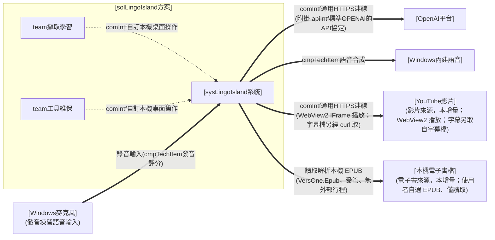

> 圖例（三線通則）：粗 `==>`＝運行關聯（系統／裝置間，線上標 comIntf 契約名，apiIntf 並列附掛）／虛 `-.->`＝人員操作（team 經桌面操作系統）。

組態架構圖（modTechStack 以文字標於建置單元方框）：

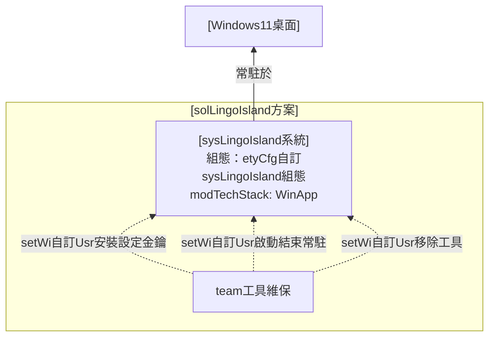

> 圖例（沿三線通則）：細 `-->`＝部署設定關聯／虛 `-.->`＝人員操作（配置作業，線上標 setWi）；modTechStack 選型以文字標記。

* **sol 下屬 sys**：[sysLingoIsland系統]——實現常駐熱鍵、遮罩框選截圖、vision 查詢與結果呈現朗讀之單一系統；內部 module 見 ＜II.C＞。
  * **對外保證**（機制見 ＜II.C.(A).1＞）：喚起即時且零輸入干擾（spec#1）、選區對位正確（spec#1）、查詢結果三欄齊備或明確錯誤降級（spec#1）、隨時可逃（spec#1）、金鑰不落地（spec#1）、查詢歷史本機留存與可回顧（spec#3）、查詢結果可收藏為我的筆記並分類管理（spec#3）、可自訂單一情境提示輔助翻譯（spec#1）、可管理多個命名主題並擇一注入查詢（spec#1）；影片擷取到句暫停點字查詢並加入筆記（spec#2）。
* **管線契約（pipeline contract；本案擴充機制，取代核／殼契約之位置）**：三段各以資料契約銜接、責任不互滲——
  * 〔capture〕輸入＝熱鍵事件／滑鼠拖曳；輸出＝選區影像（實際像素對位）。不認查詢語意。
  * 〔query〕輸入＝選區影像；輸出＝[datIntf自訂查詢結果格式]（原文／音標／中譯）。供應商、模型、prompt 走組態抽換，不動 capture／present。
  * 〔present〕輸入＝[datIntf自訂查詢結果格式]；輸出＝獨立字典視窗與 TTS 播放（#135 曾改為主視窗分頁、v1.0.1 回滾為獨立視窗，見 ＜II.A.(B).3＞）。不認辨識來源。
* **異常降級一致**：金鑰缺失、網路失敗、逾時、回應不合格式，一律於 present 段顯示明確可讀錯誤與下一步指引（[runWi自訂Sys辨識翻譯選區]），程式續存活。

#### 2. 單位組織

> 收 ＜(A).1 架構圖＞ 之 team 型別。

**方案外單位人員關聯**（本層 sys 與方案外之關聯對象）：

* [OpenAI平台]：vision 辨識翻譯與音訊發音評分（使用者自備金鑰）。
* [Windows內建語音]：OS 內建英文語音包（朗讀）。
* [YouTube影片]：影片擷取來源（本增量；僅取字幕文字）。
* [本機電子書檔]：電子書擷取來源（本增量；使用者自選 `.epub`、僅讀取解析、原檔複本落地藏書資料夾、不改寫原檔）。
* [遊戲畫面]：螢幕擷取查詢對象。

**方案內單位人員編組**（Org 下屬 team 編成；單人方案：兩 team 皆由 [Org使用者] 本人擔任——角色分工、非多人）：

| team | 上級／編成位置 | 職責 |
| --- | --- | --- |
| team擷取學習（#1／#2／#3／#5） | Org使用者（遊戲中/回顧/整理時） | 熱鍵喚起、框選查詢、查看聆聽結果；回顧查詢歷史；收藏並整理我的筆記；建立管理主題並擇一使用；設定擷取快捷鍵、手動擷取並整理截圖清單；就地錄音練習發音；匯入解析本機 EPUB 電子書並於書櫃整理；翻開藏書逐段導讀閱讀、TTS 朗讀、逐字查詞加筆記、依說話人上色 |
| team工具維保（#4） | Org使用者（維保時） | 程式放置、金鑰設定、常駐啟動結束、移除 |

#### 3. 作業程序

> 收 ＜(A).1 架構圖＞ 人員動作線→本高度 SOP 表（方案＝teamSop）。每條標**關聯 hmi**（方案高度＝sysHmi 之具體存取端點＋由哪個 sys 提供）。
> **derived 標記**：本層 teamSop 為 ＜II.C.(A).3＞ prsnSop 之上捲視圖（維護改 ＜II.C＞、此處重生），勿獨立增刪；編號全程上下對應。
> **介面併用（HMI 弧收斂）**：26 條 teamSop 收斂為 4 個具名 sysHmi——絕大多數共用 [sysHmi統一主視窗]；[sysHmi字典視窗]、[sysHmi選區遮罩] 與 [sysHmiOS標準設定] 為**強制分裂**（字典視窗＝查詢與筆記練習為兩件並行作業、併入分頁會互搶焦點〔v1.0.1〕；選區遮罩須覆蓋全虛擬桌面並置頂攔截輸入，無法內嵌於主視窗；OS 標準設定為 OS 提供、不在本系統 UI 內）。分裂理由見 ＜(B).3＞。

| team（承接 orgSop） | teamSop | 關聯 hmi |
| --- | --- | --- |
| **team擷取學習** （承 orgSop#0.1／orgSop#0.2／orgSop#0.3／orgSop#0.4） | teamSop#0.1.1-熱鍵喚起與框選擷取 | [sysHmi選區遮罩] |
|  | teamSop#0.1.2-辨識翻譯查詢 | [sysHmi字典視窗] |
|  | teamSop#0.1.3-結果查看與朗讀（逐字查/編輯重譯/打字查） | [sysHmi字典視窗] |
|  | teamSop#0.1.4-主題建立與編輯（含圖片自動解釋、12 色色盤、自動屏蔽字串） | [sysHmi統一主視窗] |
|  | teamSop#0.1.5-主題擇一使用 | [sysHmi統一主視窗] |
|  | teamSop#0.1.6-擷取快捷鍵設定與手動觸發擷取 | [sysHmi統一主視窗] |
|  | teamSop#0.1.7-截圖清單瀏覽與整理（主題篩選/指派主題/放大預覽/刪除清空） | [sysHmi統一主視窗] |
|  | teamSop#0.2.1-影片選定與字幕預處理 | [sysHmi統一主視窗] |
|  | teamSop#0.2.2-導引播放到句暫停查詢 | [sysHmi統一主視窗] |
|  | teamSop#0.2.3-影片擷取加入筆記 | [sysHmi統一主視窗] |
|  | teamSop#0.3.1-收藏加入我的筆記 | [sysHmi字典視窗]／[sysHmi統一主視窗] |
|  | teamSop#0.3.2-筆記整理（資料夾/排序/檢視/刪除） | [sysHmi統一主視窗] |
|  | teamSop#0.3.3-開啟並瀏覽查詢歷史 | [sysHmi統一主視窗] |
|  | teamSop#0.3.4-查詢歷史清理 | [sysHmi統一主視窗] |
|  | teamSop#0.3.5-筆記發音練習（錄音→AI 評分→成績框回饋→清空練習紀錄） | [sysHmi統一主視窗] |
|  | teamSop#0.4.1-電子書匯入與解析（選/拖 .epub、批次、中繼/spine/目錄/封面） | [sysHmi統一主視窗] |
|  | teamSop#0.4.2-書櫃瀏覽與整理（封面縮圖/主題篩選/四鍵排序/去重/刪除清空） | [sysHmi統一主視窗] |
|  | teamSop#0.4.3-藏書持久化與備份（每本一資料夾、跨啟動還原、納入整包備份） | [sysHmi統一主視窗] |
|  | teamSop#0.4.4-電子書逐段導讀閱讀（開書/章節目錄/段落純文字/上一段·下一段·繼續/跳讀/進度記憶） | [sysHmi統一主視窗] |
|  | teamSop#0.4.5-電子書逐段 TTS 朗讀（唸當前段/唸完自動前進/續讀·重聽·調速） | [sysHmi統一主視窗] |
|  | teamSop#0.4.6-電子書閱讀中查詞加筆記（逐字點選查詞/加入我的筆記，複用既有） | [sysHmi統一主視窗] |
|  | teamSop#0.4.7-電子書段落說話人上色（Name: 前綴/依主題色/面板篩選/於指定說話人暫停） | [sysHmi統一主視窗] |
| **team工具維保** （承 orgSop#1.1） | teamSop#1.1.1-安裝與金鑰設定 | [sysHmiOS標準設定] |
|  | teamSop#1.1.2-常駐啟動與結束 | [sysHmi統一主視窗] |
|  | teamSop#1.1.3-工具移除 | [sysHmiOS標準設定] |
|  | teamSop#1.1.4-版本查閱、檢查更新與更新紀錄 | [sysHmi統一主視窗] |

#### 4. 軟硬實體

> 本層方案所依賴之平台與服務。

* **執行平台**：Windows 11 桌面（多螢幕、DPI 縮放），免安裝單一 exe 常駐。
* **外部服務**：OpenAI vision API（[comIntf通用HTTPS連線]＋[apiIntf標準OPENAI的API協定]，使用者自備金鑰；僅辨識翻譯使用）。
* **OS 內建能力**：Windows 內建語音（[cmpTechItem語音合成]，朗讀主路徑、離線可用免金鑰）、全域熱鍵、螢幕擷取、系統匣。
* **外部影片來源（本增量）**：YouTube 影片（使用者自選；本工具僅取其**字幕文字**供個人學習、不下載影片內容，來源由使用者自負，比照自備 OpenAI 金鑰）。
* **本機字幕工具（本增量；epic #178 增量6′-B「時間 pivot」定案）**：`curl`（CLI，經 `System.Diagnostics.Process` 呼叫取**字幕檔原文**；隨 Windows 10 1803+ 內建、非另裝，繞 Fandom／Cloudflare 之 TLS 指紋封鎖）。字幕檔自帶時間＋說話人直接解析；原 `yt-dlp` 取字幕已於增量6′-B 廢止、不再為前置需求。
* **OS 內建瀏覽器核心（本增量）**：WebView2（Win11 內建 runtime；內嵌 YouTube IFrame Player API 播放與控制）。
* **電子書解析元件（本增量）**：`VersOne.Epub` NuGet 套件（[cmpTechItem電子書解析]，import 進 WinApp、純受管、無外部行程；netstandard2.0 零相依、.NET 9 相容）——解析本機 EPUB 2/3 之容器/中繼/spine/目錄/封面；唯一新平台依賴僅此套件、無外部服務或行程。

### (B) 實作規劃

#### 1. 技術選型

> 本層宣告 sysTechType（系統類型，每 sys 一個），綁該類型之最低能力清單、介面 bar、標準 mod 組成與單一 release 部署組成，並得點名強制 cmpTechItem。sol 主軸見 ＜II.A.(B).1＞、各 mod 之 modTechStack 與元件版本見 ＜II.C.(B).1＞。

* **sysTechType（系統類型，每 sys 一個）＝ [sysTechType桌面App]**（Windows 桌面單機應用基底型；本方案落在其**「常駐即查工具」選配節**：常駐背景、熱鍵喚起、即查即走）：綁該契約之**桌面通則能力清單**（＜A節＞：明確錯誤降級、金鑰安全、多螢幕與 DPI 正確、關於與版本標示）、**安裝與更新機制**（＜B節＞）、**介面水準 bar**（＜C節＞），以及**「常駐即查工具」選配節**（＜E節＞：常駐輕量、喚起即時、零輸入干擾、隨時可逃、不干擾介面 bar），逐頁審查據以判讀；不在此複述。本方案僅一個 sys＝[sysLingoIsland系統]，故僅此一宣告。**沿革**：本契約 3.2 時名為「桌面查詢工具」（舊應用層前綴），4.1 canon 已更名並上收為基底型 `sysTechType桌面App`（原「常駐即查」能力降為其選配節），本檔隨之追平。
* **點名強制 cmpTechItem**（見 [sysTechType桌面App] ＜E節＞ 之「點名 cmpTechItem（依輸出型態）」，本方案輸出含發音朗讀）：[cmpTechItem語音合成]（原文朗讀）；具體版本／用法見 ＜II.C.(B).1＞。
* **本增量新增 cmpTechItem（功能驅動，非 sysTechType 點名）**：[cmpTechItem發音評分]——「我的筆記」發音練習之語音評分，沿用既有 OpenAI 金鑰之音訊輸入模型（與 [cmpTechItem語音合成] TTS 責任區隔）；具體選型於 ＜II.C.(B).1＞ 落地。另 [cmpTechItem桌面通知]（#101）——發音練習回饋以原生 Windows 通知呈現（可回看），與應用內自畫浮層責任區隔；具體選型於 ＜II.C.(B).1＞ 落地。
* **本增量新增 cmpTechItem（影片來源驅動，非 sysTechType 點名）**：[cmpTechItem影片播放]（WebView2＋YouTube IFrame Player API，導引播放到句暫停）、[cmpTechItem字幕擷取]（`curl` 取字幕檔原文，或本機自製字幕檔——自帶時間＋說話人，epic #178 增量6′-B「時間 pivot」定案）；皆 import 進 WinApp、不單獨成容器；唯一新平台依賴＝WebView2（Win11 內建 runtime），具體選型於 ＜II.C.(B).1＞ 落地。
* **本增量新增 cmpTechItem（電子書來源驅動，非 sysTechType 點名）**：[cmpTechItem電子書解析]（`VersOne.Epub`，解析 EPUB 2/3 之容器／中繼〔書名/作者/語言/dc:identifier〕／spine／目錄〔EPUB3 nav＋EPUB2 ncx〕／封面）——import 進 WinApp、不單獨成容器、純受管、無外部行程；唯一新平台依賴＝`VersOne.Epub` NuGet 套件，具體選型於 ＜II.C.(B).1＞ 落地。
* **modTechStack（構件技術疊層）**：本 sys 為單一 WPF exe 建置單元，各 mod 之 modTechStack 一律取封閉枚舉之 `WinApp`（.NET 9＋WPF、self-contained 單一 exe、Velopack 安裝式散佈）；逐 mod 條列見 ＜II.C.(B).1＞。**沿革**：3.2 版時家規四選一（StaticWeb／ReactWeb／NodeSvr／PythonSvr）無桌面選項，故另提一份 .NET／WPF 桌面候選契約待家規裁決；4.1 之封閉枚舉已納 `WinApp`，該候選契約就此收攏、不再另立。

#### 2. 關鍵組態

> 列本層關鍵參數／組態；列舉即可、不解釋。

* [etyCfg自訂sysLingoIsland組態]：`OPENAI_API_KEY`（Env、機密）、`paramHotkey`（appsettings 結構化喚起快捷鍵綁定，預設 `Alt+L`；可為鍵盤組合或滑鼠鍵，取代原硬編碼）、`paramModel=gpt-4o-mini`／`paramQueryTimeoutSec=15`／`paramQueryMaxRetries=2`／`paramTtsVoice=系統預設英文語音`（appsettings；`paramQueryMaxRetries` 為查詢暫時性錯誤之最大重試次數；語音朗讀改用 Windows 內建語音、不再有 TTS 供應商參數）。
* [etyCfg自訂sysLingoIsland組態]（查詢歷史）：`paramHistoryMax=200`（查詢歷史保留筆數上限；非正值 ≤0 於讀取邊界套用預設 200）；紀錄存 `%APPDATA%\LingoIsland\history.json`（使用者可寫、與 `ui-state.json` 同資料夾各自檔名）。
* [etyCfg自訂sysLingoIsland組態]（我的筆記）：筆記存 `%APPDATA%\LingoIsland\notes.json`（資料夾樹＋各夾條目＋順序；使用者可寫、與 `history.json`／`ui-state.json` 同資料夾各自檔名）；無筆數上限（使用者精選、長期保存、不受歷史清除影響）。
* [etyCfg自訂sysLingoIsland組態]（單一情境提示，#14 遺留、由 #36 命名清單取代）：`paramContextHint=`（appsettings；**參數鍵未隨 #148 更名、仍為 `paramContextHint`**，保留讀取以**相容遷移**為一則預設主題）。
* [etyCfg自訂sysLingoIsland組態]（主題）：命名主題存 `%APPDATA%\LingoIsland\themes.json`（清單〔id／名稱／描述／圖片檔名／使用中／12 色色盤／自動屏蔽字串〕），圖片存 `%APPDATA%\LingoIsland\themes\`；非機密、可刪、不含金鑰（spec#1）。**舊 `contexts.json`／`contexts\` 由 [AppDataMigration] 於首次啟動一次性非破壞遷移**（保留舊檔供回滾）。
* [etyCfg自訂sysLingoIsland組態]（電子書藏書，本增量）：書櫃清單存 `%APPDATA%\LingoIsland\ebooks.json`（各書〔id／dc:identifier／書名／作者／語言／章數／主題／封面檔名／加入時間〕＋排序態 `Sort`〔比照 `videos.json` 之 `VideoSort` 家規：每模式各自記方向〕）；每本書內容存 `%APPDATA%\LingoIsland\ebook\{yyyyMMdd 標題}\`（`info.json` 中繼＋原始 `.epub` 複本＋封面圖，比照影片 `video\{yyyyMMdd 標題}\` 每項一資料夾範式）；非機密、可刪、不含金鑰（spec#4–#6）。

#### 3. 人機介面

> 本層定 `sysHmi`——各形式之**具體存取端點與由哪個 sys 提供**，並定 IA 導覽。整體 look 見 ＜II.A.(B).3＞、各頁配置見 ＜II.C.(B).3＞。

**具名 sysHmi（端點＋提供之 sys）**：

* **[sysHmi統一主視窗]**（[sysLingoIsland系統] 提供）：Office 式頂部功能列分頁殼之桌面主視窗，承載主題／螢幕擷取／影片擷取／電子書／筆記／歷史／選項／關於各分頁與維運入口；工作列按鈕型、常顯可尋。功能列右端另置「字典」動作鈕（非分頁）喚出 [sysHmi字典視窗]。
* **[sysHmi字典視窗]**（[sysLingoIsland系統] 提供，v1.0.1 恢復）：獨立之桌面查詢結果視窗（`ShowInTaskbar`＋`Topmost`、與主視窗共存）。**強制分裂（並行作業不得互搶焦點）**：查詢結果若併入主視窗分頁（#135 曾如此），則於筆記分頁檢視單字時整個主視窗會跳頁、打斷進行中的發音練習——兩件作業同時進行、須各自持有視窗，非裝飾性分裂。
* **[sysHmi選區遮罩]**（[sysLingoIsland系統] 提供）：全螢幕 topmost 凍結畫格遮罩，只承載「選取」一件事。**技術強制分裂**：須覆蓋整個虛擬桌面並置頂攔截輸入，無法內嵌於主視窗。
* **[sysHmiOS標準設定]**（Windows 提供、非本系統 UI）：檔案總管（放置／移除程式）＋系統環境變數設定（金鑰）。**技術強制分裂**：安裝與金鑰落點在 OS 層。

**導覽三層（domain L1 → teamSop L2 → modHmi leaf）**：桌面常駐工具無網站式導覽樹，三層落於 Office 式分頁殼——`domain`＝頂部功能列之來源分群（domain#0 擷取學習：主題／螢幕擷取／影片擷取／電子書／筆記／歷史，＋功能列右端「字典」動作鈕喚出之字典視窗；domain#1 系統維運：選項／關於／系統匣選單／更新紀錄視窗），`teamSop`＝該域之作業分群（見下方導覽衍生），`modHmi`＝功能列具體頁（leaf，逐頁清單見 ＜II.C.(B).3＞）。`solHmi`（形式）與 `sysHmi`（存取端點）為高度 hmi、不入導覽樹。

**業界常規（IA，公開標準）**：桌面常駐工具無導覽樹（非管理網站，MD3 adaptive navigation 不適用——偏離見 ＜II.B.(A)＞）；查詢採 **hotkey-first 狀態流**（Windows tray app＋Snipping Tool 選取慣例）：常駐 → 熱鍵喚起（遮罩）→ 框選（橡皮筋）→ 查詢（進度）→ 結果（卡片）→ 關閉返回。**維運入口**由「僅系統匣選單」改為以**常駐主控頁（工作列按鈕型）為第一線可見入口**、系統匣選單為輔助——確保換版換路徑後仍穩定可尋（不受系統匣自動隱藏影響）。**NN/g progressive disclosure** 精神落於「查詢動線平時零 UI、按需現身；維運入口常顯但預設最小化、不擋遊戲」。

**導覽衍生（IA ⟵ SOP；硬規則④之桌面對應）**：`teamSop#0.1.1→選區遮罩頁`、`teamSop#0.1.2／#0.1.3→字典視窗`、`teamSop#0.1.4／#0.1.5→主視窗主題分頁`、`teamSop#0.1.6／#0.1.7→主視窗螢幕擷取分頁`（快捷鍵設定與手動擷取／截圖清單）、`teamSop#0.2.1／#0.2.2／#0.2.3→主視窗影片擷取分頁`（與螢幕擷取頁並列之擷取來源頁；AI 抽取與批次加入之費用確認走 AI 動作確認頁）、`teamSop#0.4.1／#0.4.2／#0.4.3→主視窗電子書擷取分頁【獲得】`（第三個並列之擷取來源頁；書櫃＋匯入）、`teamSop#0.4.4／#0.4.5／#0.4.6／#0.4.7→主視窗電子書擷取分頁【內容】（電子書內容頁·逐段閱讀器：導讀/朗讀/查詞筆記/說話人上色，增量2）`、`teamSop#0.3.1→（字典視窗底部「加入我的筆記」/「自動加入筆記」＋歷史分頁「＋筆記」）`、`teamSop#0.3.2→主視窗筆記分頁`、`teamSop#0.3.3／#0.3.4→主視窗歷史分頁`、`teamSop#0.3.5→主視窗筆記分頁（卡片內就地錄音練習）`、`teamSop#1.1.2→統一主視窗（選項分頁；系統匣選單頁為輔助鏡像）`、`teamSop#1.1.4→統一主視窗關於分頁＋更新紀錄頁`；`teamSop#1.1.1／#1.1.3`（安裝金鑰、移除）走 OS 標準設定、不在本系統 UI 內。

**反擁擠定調**：遮罩只做選取、結果視窗只做呈現與朗讀（含底部「加入我的筆記／自動加入筆記」）、統一主視窗以分頁分工（筆記／歷史／選項／關於）；嚴禁把設定、歷史、筆記塞進查詢動線。統一主視窗與系統匣選單為同一組維運/檢視動作之兩個入口鏡像，動作來源單一、不各寫一份。歷史與筆記為主視窗**各自分頁、按需切換**，與即查即走動線分離、不擋遊戲；歷史分頁只做回顧（瀏覽／詳情／重聽／刪除清除）、筆記分頁只做收藏管理（多層資料夾＋條目），職責分離（歷史＝自動流水帳、筆記＝手動精選分類）；收藏動作以右下角 toast 輕量回饋、不打斷。

版面設定示意圖（涵蓋遊戲查詢與工具維保兩域之互動面；設計期參考稿、以文字為準）：

#### 4. 部署作法

> 描述本層部署作法。

* **首版實作範圍（MVP）**：單次查詢一圈（常駐→熱鍵→框選→查詢→顯示朗讀→關閉）做深做透，過逐頁審查後才擴充。
* **方案層（e2e 環境）**：於 Windows 11 實機以 Velopack 安裝之發佈版執行 README 全走驗收（劇本＝README 產品手冊）與契約 invariant 驗證。
* 各建置單元之建置／測試／部署指令見 ＜II.C.(B).4 部署作法＞。

## C. 系統設計（sysLingoIsland系統）

> 視角＝prsn。自 ＜II.B＞ 的 team／teamSop 解析出一線操作者（prsn）與其工作指導（wi），並界定模組（mod）與模組間介面。系統＝[sysLingoIsland系統]。

### (A) 運作想定

[sysLingoIsland系統] 為單一 WPF exe，內部由三模組構成（單一 csproj、以資料夾＋namespace 分模組）：[modCapture模組] **常駐與擷取**——常駐主控入口（工作列按鈕型可見主控視窗，承載金鑰狀態／設定／結束、關視窗僅收合不結束）＋系統匣輔助入口、`RegisterHotKey` 全域熱鍵、全螢幕變暗遮罩與橡皮筋框選、實際像素對位截圖；[modQuery模組] **辨識翻譯查詢**——依 [apiIntf標準OPENAI的API協定] 單次 vision 呼叫、解析為 [datIntf自訂查詢結果格式]、異常降級；[modPresent模組] **呈現與朗讀**——浮動結果視窗、[cmpTechItem語音合成] TTS 播放。模組間以 C# interface（in-process）銜接，邊界對齊 ＜II.B＞ 管線契約；模組內部留白歸 code。本增量新增本機查詢歷史：[modQuery模組] 增查詢歷史儲存（`HistoryStore`——成功查詢後追加、依上限環形截汰、讀寫失敗降級）、[modPresent模組] 增獨立查詢歷史視窗（依日期回顧、詳情、重聽、刪除清除）與結果視窗「展示歷史紀錄」入口；結果卡片之三欄詳情/發音渲染抽為**共用組件**、供結果視窗與歷史檢視共用。本增量再加我的筆記：[modQuery模組] 增筆記儲存（`NotesStore`——資料夾＋條目＋順序、加入去重、失敗降級），[modPresent模組] 增獨立筆記視窗與右下角 toast 提示（`ToastNotifier`），並於結果視窗與歷史條目掛「加入我的筆記」入口；檢視重用同一三欄詳情/發音共用組件。本增量再整合維運/檢視為**單一 Office 式主視窗**（`MainWindow`）：以頂部功能列分頁（筆記／歷史／選項／關於）取代 `DockWindow`／`HistoryWindow`／`NotesWindow`／`SettingsWindow` 各獨立視窗；筆記改**多層資料夾樹**（標準 `TreeView`、可拖曳移動節點）；結果視窗入口改置底並新增「自動加入筆記」、移除歷史/筆記入口。淺粉底＋小女孩 logo 背景為統一美術。本增量再加**主題**（#148 前稱「應用情境」）：[modQuery模組] 增 `ThemeStore`（命名主題 CRUD／使用中／相容遷移；`themes.json`）與 `QueryService.DescribeImageAsync`（vision 圖片主題解釋），[modPresent模組] 增主視窗「主題」分頁 `ThemeManagementPage`；查詢注入來源改為使用中主題之描述文字（沿 spec#1 機制、取代 #14 單一 `paramContextHint`）。主題其後升格為跨媒體（截圖／影片／電子書／筆記）之共同歸屬單位，另承載 12 色色盤與自動屏蔽字串。本增量再加**筆記發音練習**（spec#3）：[modPresent模組] 增麥克風錄音（`IAudioRecorder`：按住錄音／放開停止、**即時音量回報**、可測邊界）與筆記卡片播音鈕旁之**麥克風鈕＋成績框（五態、含即時音量條/評分轉圈）**、頂部「清空練習紀錄」（取代原「清除全部」批次刪除入口）；[modQuery模組] 增發音評分（`IPronunciationAssessor`：送 OpenAI 音訊輸入模型回分數，沿用金鑰／重試／降級）；`NoteEntry` 增 `PracticeScore`（`-1`＝未練、相容舊 `notes.json`），`NotesStore` 增 `SetPracticeScore`／`ResetFolderPractice`（重置某夾練習）；[modPresent模組] `OptionsPage` 增可調及格門檻。發音評分與 TTS（[cmpTechItem語音合成]）責任區隔、沿用既有 OpenAI 端點、不新增外部介接。本增量再加**影片擷取來源**（spec#2）：新增 [modVideoCapture模組]——以 `curl`（[cmpTechItem字幕擷取]，`System.Diagnostics.Process` 呼叫）取得**字幕檔原文**（或讀本機自製字幕檔）、其自帶之時間＋說話人直接解析為逐句英文字幕（文字＋起始時間；epic #178 增量6′-B「時間 pivot」定案，已廢止 `yt-dlp`），以 WebView2 內嵌 YouTube IFrame Player API（[cmpTechItem影片播放]）導引播放、`DispatcherTimer` 輪詢 `getCurrentTime` 到句暫停；[modPresent模組] 增**影片擷取頁**（貼片／字幕逐句／導引播放／暫停句字幕），暫停句點字沿用 [modQuery模組] 既有 `QueryService` 查詢、加入筆記沿用既有 `NotesStore`（去重／資料夾／發音練習）。影片為與螢幕並列之**可插拔擷取來源**、下游查詢/筆記/練習完全共用不另造；唯一新平台依賴＝WebView2（Win11 內建 runtime）、字幕文字即查詢來源免 OCR；字幕不可用（無字幕／取得失敗）明確告知並中止該片、不當機。本增量再加**電子書擷取來源**（spec#4–#6）：新增 [modEbook模組]——以 `VersOne.Epub`（[cmpTechItem電子書解析]，純受管、無外部行程）解析本機 EPUB 2/3 之容器/中繼（書名/作者/語言/dc:identifier）/spine（`ReadingOrder`）/目錄（`Navigation`：EPUB3 nav＋EPUB2 ncx 統一遞迴樹）/封面（`CoverImage: byte[]?`），書櫃清單以 `EpubReader.OpenBookAsync` 回 `EpubBookRef` 惰性載入（只取 Title/AuthorList/CoverImage、用完 Dispose）、壞檔以 `EpubReaderOptions` 容錯；[modQuery模組] 增 `EbookStore`（書櫃清單 `ebooks.json`＋每本書一資料夾 `ebook\{yyyyMMdd 標題}\` 落地〔`info.json` 中繼＋原始 `.epub` 複本＋封面圖〕，比照 `VideoStore`／`ScreenshotStore` 每項一資料夾範式；加入依 dc:identifier 去重、四鍵排序、主題歸屬、刪除清空皆純函式抽可測、讀寫失敗退空/降級）；[modPresent模組] 增**電子書擷取頁**（`EbookPage`，比照 `VideoCapturePage` 之【獲得】/【內容】雙子頁：增量1【獲得】＝左書櫃清單｜右匯入卡片、增量1【內容】僅閱讀骨架），並將藏書納入既有 `BackupService` 整包備份（辨識並涵蓋 `ebooks.json` 與 `ebook\` 藏書資料夾）。電子書為與螢幕、影片並列之**可插拔擷取來源**；增量1 僅交付「獲得＋書櫃」地基，章節閱讀渲染/逐段導讀/TTS 朗讀/逐字查詞/加入筆記/依說話人變色由**增量2**交付（見下段）、完全複用 query/present/notes 既有後段、不另造；唯一新平台依賴＝`VersOne.Epub`（NuGet、受管、無外部行程）；壞檔／非 EPUB／解析失敗明確告知並略過該檔、不中斷整批、不當機、原檔唯讀不改寫。**說話人規則（供後續增量，本增量僅落地保留段落原文）**：只認段落開頭 `Name:` 前綴、沿用既有行首抽取（比照 `ExtractInlineSpeakers`）、免 AI。**電子書增量2「內容閱讀」（spec#7–#10）**於增量1 地基上長出**內容側閱讀器**：[modEbook模組] 增**章節段落解析**（`ExtractParagraphs`——以 `VersOne.Epub` `ReadBookAsync` 取章節 XHTML、剝標籤取 `
` 段落純文字、段首 `Name:` 抽說話人〔比照 `ExtractInlineSpeakers`〕、每段投影為 `SubtitleCue{Text, StartSec=null, Speaker}`，純函式抽可測）；[modPresent模組] `EbookPage`【內容】自骨架擴為**三欄逐段閱讀器**（左章節目錄｜中閱讀區逐段高亮＋控制列〔上一段/下一段/繼續/朗讀/語速/主題〕｜右逐段清單＋說話人面板），逐段導讀採 **line-stepped**（`PauseDecider` 概念平移——cue＝段落、無時間軸以段序前進判當前段/暫停），TTS 逐段朗讀由 `SpeechService`（[cmpTechItem語音合成]，`System.Speech`）之 `SpeakCompleted` 驅動自動前進；暫停段之逐字點選查詞（沿用 `EnglishWordTokenizer`＋`QueryService`）、加入筆記（沿用 `NotesStore`）、段落說話人依主題色上色（沿用 `RebuildSpeakerColors`）**完全複用螢幕/影片既有 query/present/notes 後段、不另造**；閱讀進度存 `EbookStore`（每本書 `LastReadChapter`/`LastReadParagraph`、跨啟動還原）。**MVP 取捨**：章節渲染僅段落純文字自繪、EPUB 內嵌圖與複雜排版列後續增量、遇之以純文字段落呈現不當機、原檔唯讀不改寫。

#### 1. 架構圖

> 先圖後條列，描述本層系統與其組成（sys 下屬 mod）；圖＝正本，圖後不複述節點與邊。

運作架構圖（sys 下屬 module）：

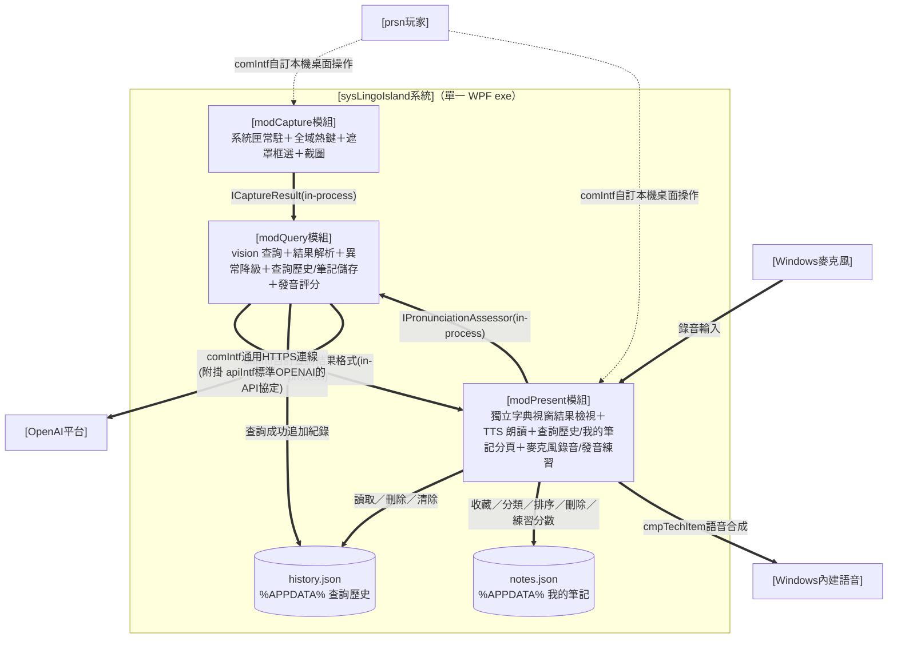

> 圖例（三線通則）：粗 `==>`＝運行關聯（通訊／呼叫，線上標契約名；模組間為 in-process C# interface，機器可驗全文歸 code）／虛 `-.->`＝人員操作。

組態架構圖：

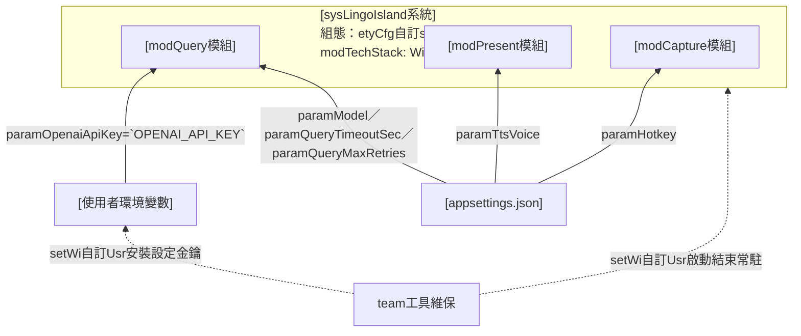

> 圖例（沿三線通則）：細 `-->`＝部署設定關聯（參數相依，標 param）／虛 `-.->`＝人員操作（配置作業，標 setWi）；modTechStack 選型以文字標記。

* **sys 下屬 module**：[modCapture模組]、[modQuery模組]、[modPresent模組]（皆隸屬單一 WPF exe；modTechStack ＝ WinApp）。
  * **[modCapture模組] 選區對位契約**（spec#1）：遮罩喚起當下即截取整個虛擬桌面為**凍結畫格快照**（不透明鋪滿遮罩背景、畫面靜止、輸入被遮罩攔截不達背後遊戲，Issue #90）；遮罩視窗覆蓋全部螢幕（含多螢幕虛擬桌面）；框選座標以**實際像素**（physical pixels）換算（Per-Monitor DPI aware），選區與雙擊標記皆**自凍結快照裁切／繪製**（非實時螢幕，故不必先隱藏遮罩再截）。**雙擊自動判斷模式（Issue #54）**：於遮罩上**左鍵雙擊**＝不框選、改截取整個虛擬桌面（physical px）並於游標處畫**紅色圓圈十字標記**（`ScreenCapture.CaptureWithMarker`），`CaptureResult.IsPointMode=true`，交查詢層依標記處辨識該句（非矩形選區）；**過小/誤點之單擊不再取消遮罩、僅復位提示**（唯 ESC 取消，以容雙擊之首擊）。**invariant**：框選模式選區影像與使用者所見框選範圍 0px 偏移（任一螢幕/DPI 皆同）；雙擊模式標記落於游標實際像素處、截圖含標記；單擊不誤觸取消。
  * **[modCapture模組] 喚起快捷鍵契約**（spec#1）：喚起快捷鍵可自訂，依綁定型別選後端——**鍵盤組合**（修飾鍵＋主鍵）以 `RegisterHotKey` 註冊（**鍵盤仍禁低階鍵盤 hook**，維持零延遲）；**滑鼠鍵**（中鍵、側鍵 `XButton1`／`XButton2`、左右鍵同按）以低階滑鼠 hook `WH_MOUSE_LL` 偵測——**放寬原「禁低階 hook」限制、僅限滑鼠**。低階滑鼠 hook callback **僅比對當前綁定、其餘事件即刻 `CallNextHookEx` 放行**，不阻塞、不改寫輸入；程式結束時 `UnhookWindowsHookEx`／`UnregisterHotKey` 釋放。設定期以獨立**監聽模式**（同時擷取鍵盤與滑鼠事件、`Esc` 取消）擷取綁定，與執行期註冊為兩條獨立路徑；**監聽期間暫停（`Unregister`）全域喚起熱鍵服務（含直接點選鍵），擷取完成或 `Esc` 取消後依現行組態重新註冊（`RegisterHotkeyOrWarn`，Issue #89）**——由選項頁對外拋監聽開始／結束訊號、`App` 訂閱後暫停／恢復（選項頁不直接持有 `HotKeyService`、維持模組邊界），既避免改鍵時按現行鍵誤觸喚起，亦使鍵盤組合不被 `RegisterHotKey` 攔截吞鍵而得正確擷取。兩後端對外統一以 `HotKeyPressed` 事件呈現，喚起接線不變。**單一喚起熱鍵（Issue #90 起）**：移除 Issue #86 之第二熱鍵（直接點選擷取鍵 `paramHotkeyPoint`／`ScreenCapture.CaptureAtCursor`）——凍結畫格使遮罩內雙擊已不干擾背後遊戲，第二熱鍵之存在理由消失；點選判斷改回於遮罩內雙擊（見選區對位契約），單一 `HotKeyService` 實例、狀態列與 tray 只顯喚起鍵。**invariant**：鍵盤路徑對全系統輸入零延遲影響；滑鼠低階 hook 對滑鼠移動/點擊無可感延遲（callback 輕量放行）且確保釋放不外洩；綁定被占用或無法註冊時明確提示；喚起流程同時至多一個（`_busy` 守衛）；**滑鼠低階 hook 之連續命中以觸發閘（`FireGate`）收斂**——handler 未跑完前不重複派工，與前景程式共用同一滑鼠鍵時不致觸發風暴（Issue #32）；**指定（監聽）期間全域喚起熱鍵暫停——監聽中按現行鍵不誤觸喚起（僅擷取綁定）、監聽結束（擷取／`Esc`）後熱鍵必恢復可再觸發，不得暫停後回不來（Issue #89）**。
  * **[modCapture模組] 常駐主控入口契約**（spec#1）：程式常駐時提供一個**工作列按鈕型**可見主控視窗（`ShowInTaskbar=true`，即統一主視窗），以 **Office 式頂部功能列分頁（筆記／歷史／選項／關於）** 承載維運與檢視（金鑰狀態列、選項＝設定、關於＝版權/聯絡、歷史/筆記檢視）；**啟動時建立**，可經 Alt+Tab／點工作列還原。**關閉（✕）＝結束整個程式**（v1.0.1 現行；原制「✕＝收合」已撤回，背景常駐改以**最小化**達成），系統匣「結束」亦然——**兩入口與 `Alt+F4` 同走 `App.ExitApp()` 匯流點**；`ShutdownMode` 仍為 `OnExplicitShutdown`。**結束前須先過未存變更離開守衛**（spec#11，見 ⑥）。系統匣圖示與右鍵選單保留為**輔助入口**，與主控視窗共用**同一組維運動作來源**（單一事實、不各寫一份）。**invariant**：常駐期間主控入口恆可經工作列／Alt+Tab 尋得（不依賴 Win11 系統匣顯示設定，換版換路徑後仍可尋）；關主控視窗不結束常駐、熱鍵續有效；明確結束才釋放熱鍵與系統匣、無殘留；單一實例下不重複建立主控視窗。
  * **[modQuery模組] 查詢契約**（spec#1）：單次 vision 呼叫附結構化輸出要求，回應以 JSON schema 驗證為 [datIntf自訂查詢結果格式]（JSON 三欄位皆必要：`original` 英文原文／`phonetic` KK 音標／`translation` 繁中翻譯，型別皆 string；缺一即判不合格式、走降級；選區無可辨識英文時三欄皆回空字串、呈現層顯示「未偵測到英文文字」）；金鑰僅自環境變數讀取、不寫任何檔案與日誌。**暫時性錯誤重試（retry/backoff）**：對**暫時性**失敗（連線中斷、逾時、HTTP 429、HTTP 5xx）以有限次數指數退避自動重試（`paramQueryMaxRetries` 次、預設 2，退避約 1s／2s）；**永久性**失敗（401 金鑰無效、400／其他 4xx 請求錯誤、回應格式解析失敗）**不重試**、立即走降級；使用者主動取消（`CancellationToken`）不視為暫時性錯誤。**invariant**：三欄齊備或走異常降級（[runWi自訂Sys辨識翻譯選區]）；暫時性錯誤於次數上限內自動恢復、永久性錯誤不因重試拖長等待；查詢逾時秒數恆為正（不當組態於 [etyCfg自訂sysLingoIsland組態] 讀取邊界淨化，見 ＜II.C.(B).2＞），逾時機制不因非正值即刻取消而失效；程式檔／設定檔／日誌掃描無金鑰。**主題描述注入（spec#1）**：text prompt 由純函式組裝，注入來源非空時附加「參考、非指令」片段、空時等同原固定提示（來源＝使用中主題之描述；`paramContextHint` 為 #14 遺留之單一提示鍵、僅供相容遷移）；注入不覆蓋「回三欄 JSON」主指令、structured output 三欄 schema 不變。**雙擊自動判斷提示（Issue #54）**：`QueryAsync(pointMode)` 於雙擊模式改用 `PointPrompt`（要求辨識/翻譯整螢幕中**紅色標記處最接近的那一句**、仍回三欄），框選模式沿用 `BasePrompt`；`pointMode` 貫穿 `BuildPayload`/`BuildPrompt`。**智能配色注入（Issue #55／#69）**：`BuildPrompt` 另接受配色規則（#69 起來源＝**使用中主題各色描述** `ThemeStore.ActiveColorRules`，取代 #55 之全域 `NoteDefaults.ColorRules`）——非空時追加要求回一 `color` 欄（**epic #178 增量6′-D 起改回十六進位色碼**：來源改**使用中主題之 12 色可編輯色盤描述**〔`ThemeStore.BuildColorRulesText` 輸出 `#hex = "描述"`〕，AI 回符合描述之盤上 hex、照抄，都不符合回空＝白）、schema 隨之多一 `color` 欄；`Parse` 填入 `QueryResult.SuggestedColor`，筆記底色以 `ColorMath.LightenForBackground`（HSL 調亮 L≈0.90、降飽和 S≤0.55）把飽和字型色轉為淡底色——同一 12 色**雙軌**：影片頁說話人**字型**用原飽和色、筆記**底色**用調淡色。**invariant**：主題描述/配色規則皆空＝現行行為（回歸保護，三欄 schema 不變）；規則非空時提示含規則且仍強制三欄；金鑰不隨主題/規則入 prompt；`color` 欄選填、缺欄不致命。**單字/整段文字查詢（複查回饋 v0.39.0）**：`QueryWordAsync(word)`（查單字字義）與 `QueryTextAsync(english)`（整段重譯，修正明顯拼寫）皆走純文字 chat 呼叫、共用 `BuildTextPayload`（`json_schema` 三欄 `text_query`、`WordPrompt`/`TextPrompt` 決定語意）、沿用金鑰/重試/降級與既有 `Parse`；供結果視窗點單字查詢與編輯重譯用。**invariant**：仍回三欄或明確降級；金鑰不落地。
  * **[modPresent模組] 呈現契約**（spec#1）：結果視窗為**標準表單**（`WindowStyle=SingleBorderWindow` 標準標題列＋`ResizeMode=CanResize` 標準邊框拖拉縮放＋`ShowInTaskbar=True` 工作列按鈕，字型比照主視窗系統預設；取代原 `WindowStyle=None`＋`AllowsTransparency` 自訂卡片與自訂標題列/關閉鈕/縮放握把，Issue #59）；topmost（浮於遊戲上「一直存在」）；首次置中、之後記住使用者擺放的位置與大小（跨啟動、存 `%APPDATA%\LingoIsland\ui-state.json`）；以標準標題列拖曳移動、標準邊框拖拉縮放；TTS（Windows 內建語音 SAPI，語音可於設定選擇）非同步播放、中英可各自播放與自動播放、重複觸發先停再播；`ESC`／標題列關閉鈕／下一次查詢或自歷史/筆記「檢視」開卡取代／選項儲存後（語音服務重建而）關閉（**失焦（Deactivated）不自動關閉、不隱藏；點選主視窗／經 tray 開主視窗分頁亦不關閉——與主視窗共存，Issue #105**，切換視窗對照時結果保留、且有工作列按鈕可尋回）；**同時至多一個結果視窗——下一次查詢開始或自歷史/筆記「檢視」開卡時，前一結果視窗由單一守衛關閉取代（無孤兒卡）**。**喚回入口（Issue #107）**：主視窗功能列 `Result` 鈕與 tray 選單 `Result` 項（兩入口鏡像）→現有卡**先還原（最小化中 `WindowState`→`Normal`）再 `Activate()`** 帶前景（不新開）、無卡則以查詢歷史最新一筆走「檢視」路徑重開（同守衛）、**無任何歷史**（含清除全部後、檔毀損退空）toast 提示；**喚回語意＝重開最新查詢、非最後顯示內容**（自歷史舊筆/筆記「檢視」開的卡不在此列）；[MainWindow] 僅發 `ResultRequested` 事件、三態決策在 [App] 組合根（不新增裸開卡點）。**逐字發音**：英文原文以逐字可點呈現，點選任一單字即以 `en-US` 單獨朗讀（重複觸發先停再播），整句播放鈕與自動播放並存；單字切分依空白分詞、剝除前後標點、保留原詞內部撇號／連字號與大小寫（切分為不依賴 UI 之純函式、可單元測試）。**收藏入口**：結果卡片**底部工具列**置「加入我的筆記」按鈕與「自動加入筆記」勾選（`AutoAddNote`，類比自動播放：勾選後查詢成功即去重加入並 toast）；**其下另置「加入至 [資料夾▾]」與「底色」色塊列（Issue #55）**——資料夾可選「（使用中主題）」（以使用中主題名為夾、不存在則建，無主題則預設夾）或既有頂層夾，底色列＝無＋粉彩盤；此列兼作**設定預設**（`NoteDefaults` 記憶）與**加入前臨時調整**，智能配色下以 `SuggestedColor` 自動預選（仍可改）；加入請求（`NoteAddRequest`：結果＋夾名＋色）交 `App` 以 `NotesStore.AddToNamedFolderAndSave` 加入解析後之夾並套色。**不再置歷史／我的筆記入口**（改由統一主視窗）。**invariant**：UI 執行緒不阻塞；自動加入筆記勾選時查詢成功即去重加入、未勾不加；加入目標夾/底色依當下選擇（智能建議可覆寫預設、使用者可再覆寫）、加入後仍可經筆記右鍵底色選單調整；關閉後無殘影視窗；切換視窗對照（失焦）時結果視窗保留、不自動關閉；同一時間至多一個結果視窗（下一次查詢或「檢視」開卡取代前一個、無殘留堆疊）；變更設定（重建語音服務）時前一結果視窗一併關閉、不續用已釋放之語音服務；點選之單字即為朗讀之詞（前後標點不誤入、原詞不變形）、整句朗讀不受逐字互動影響；**結果視窗之關閉集中於單一守衛（`App.CloseResult`）——先解參考、不對已進入關閉序列（`IsClosing`）之視窗重複 `Close`**，共用滑鼠鍵情境下多路徑關閉不重入崩潰（Issue #32）。**複查回饋改制（v0.39.0）**：① 英文原文**逐字點選改為查詢該單字**（`WordQueryRequested`→`App.QueryWordAsync`→`PushWordResult`；原逐字發音移除），查詢中 `Mouse.OverrideCursor=Wait` 並以 `_wordBusy` 擋連點；② 頂部工具列置**往前/往後導航**（`_history`/`_pos` 堆疊：主查詢重置為單一、查單字 push、可返回原句；導航與單字結果**不自動加入筆記**）與**編輯鈕**（改原文→`TextReQueryRequested`→`ReplaceCurrentResult`）；③「加入至資料夾」下拉移至頂部工具列；④ 基準字級讀 `ResultDisplaySettings`（選項頁可調、音標−4/中譯−2、下限 12）；⑤ 失焦行為改為**可選**——`ResultDisplaySettings.HideOnBlur`（預設 false 維持 #105 不隱藏）為真時 `Deactivated` 即 `Hide`（`_closing`/`_wordBusy` 時不隱藏、下次查詢再現）；⑥ **未存變更離開守衛（spec#11 起不綁頁面型別；原為選項頁專屬）**：守衛由 [modHmi統一主視窗] 持有，對「**目前承載之頁**」求值，**不得出現任何具名頁面型別判斷**。**攔截範圍含分頁切換、同頁改選編輯對象、與結束程式三入口**（主視窗 ✕／`Alt+F4`／系統匣「結束」，皆匯流於 `App.ExitApp()`）。受保護之頁實作**四成員契約**——`未存自陳`／`嘗試儲存`（成功／失敗；失敗即不得離開）／`捨棄還原`／`頁面顯示名`（供對話文案指名該頁，如「選項頁有未儲存的變更」，免退化為「目前的頁面」而使既有頁之文案變樣）。`OptionsPage` 之未存自陳仍為 `Gather()` 對上次儲存 `Config` 結構比對＋未套用金鑰、`捨棄還原` 仍為 `RevertChanges`，**對使用者之既有行為不變**；`ThemeManagementPage` 另行實作同一契約。**invariant**：單字查詢/重譯進行中不隱藏；導航不重查不自動加入；未存變更離開前必提示、還原不遺失他頁狀態；**撥回不得反噬**——取消後不得重跑該頁進場動作、不得再次觸發選取事件。**C# 形狀（normative，免實作者各猜各的）**：介面 `IUnsavedGuardPage`（置 `sysLingoIsland/modPresent/IUnsavedGuardPage.cs`）——`bool IsDirty { get; }`／`bool TrySave()`〔true＝已存可離開，false＝失敗須留原處〕／`void RevertChanges()`／`string PageDisplayName { get; }`〔如「選項頁」「主題頁」〕。三個標記 attribute（`[EditablePage]`／`[NoUnsavedState]`／`[UnsavedStateOutOfScope(string reason)]`）同置該檔。**守衛接線**：`MainWindow` 曝一個標 `[LeaveGuard]` 之公開方法（如 `bool ConfirmLeaveCurrentPage()`），分頁切換由 `Tab*.Checked` 呼叫（**含 `TabOptions.Checked`**——一般化後它不再豁免，靠「目標頁＝目前頁即放行」避免誤觸）；**結束程式由 `App.ExitApp()` 於 `AllowClose()` 之前呼叫該方法，回 false 即不 `Shutdown`**（放 `MainWindow.OnClosing` 會漏掉系統匣「結束」——`ExitApp` 先 `AllowClose()` 令 `_exiting` 為真，`OnClosing` 屆時直接放行）。**頁呼叫守衛之方式**：頁**不得認識視窗型別**，改由建構子注入 `Func<bool>`（同頁改選編輯對象時呼叫）。**對話本文模板**：`{PageDisplayName}有未儲存的變更。

是 — 儲存並離開
否 — 捨棄變更並離開
取消 — 留在{PageDisplayName}`——第三行亦須代入顯示名，否則選項頁文案仍會變樣、第四成員即失去存在理由。**內部改選不觸發守衛**：守衛僅對**使用者發起**之改選求值；程式內部之 `SelectById`／`Reload`／`BuildList`／刪除後重載須抑制守衛，且**刪除當前主題時須同步清除未存狀態**（否則刪除豁免後之 `Reload→SelectById→OnSelect` 會拿已刪主題的殘留 dirty 跳提示）。**比較語意**：文字欄位比較前一律 `Trim()`、色值以大寫 `#RRGGBB` 正規化、貼圖以 `_pending is not null` 判定；儲存成功後基準值須重新載入。機檢判準與可執行斷言見 ＜(A).4＞。**未存離開三選＋輕量存檔提示（#125）**：未存變更守衛由 `OKCancel` 兩選改 `YesNoCancel` **三選**——存後離開（`Yes`：走既有存檔路徑 `OnSave`，含 `ApplyKeyIfProvided`／`SettingsChanged`，**存檔成功才離開、失敗留頁報錯**）／不存還原離開（`No`＝原 `RevertChanges` 行為）／取消留頁（`Cancel`）〔**以上為 #125 當時字面；現行 canonical 字面見 spec#11**〕；另**儲存成功回饋由模態 `MessageBox("Saved.")` 改狀態列輕量閃示「Saved ✓」**（`AppStatusText` 單源、數秒後回原狀，不打斷操作、不搶焦）。**invariant**：存後離開之存檔失敗**不離開、以持續性通道報錯**（頁內 inline 或不自動消失之提示，非成功那款數秒閃示、免一閃即逝）；三選取消＝留頁還原分頁選取；儲存不再彈模態框。**spec#11 起本組 invariant 之適用對象自選項頁擴及所有受保護之頁**（現為選項頁與主題頁），判準逐字不變、不得因一般化而放寬——尤其「持續性通道報錯」不得降格為數秒閃示。**副作用聲明**：『存後離開（Yes）』＝與按『儲存』同等重之副作用（`ApplyKeyIfProvided` 寫使用者環境金鑰、重建語音服務、依既有規則關閉當前結果視窗），非純捨棄——為 [USR] 明示所欲之路徑。 **Dictionary 分頁改制（#135）**：結果呈現面自浮動 `ResultWindow` 移入主視窗 **Dictionary 分頁**（`DictionaryPage` 宿共用 `ResultView`——三欄渲染/逐字查字/編輯重譯/播放/收藏/底色抽為此組件）；**移除** topmost 浮窗、`ui-state` 位置記憶、失焦自動隱藏、`ESC`／關閉鈕關窗、單一守窗 `App.CloseResult`、「至多一個結果視窗」、`Result` 喚回三態。喚起（`RunQueryAsync`）、歷史/筆記「檢視」（`ShowDetail`）、查單字（`LookupWordAsync`）、編輯重譯（`ReTranslateAsync`）改渲染至 `DictionaryPage`；擷取完成 `PresentDictionary` 切分頁並將主視窗**前景＋暫置頂（約 2s 後解除）**疊於無邊框遊戲；`Result` 鈕/tray「Result」（`SummonResult`）改切至分頁（分頁有結果→帶前景、否則最新歷史檢視、無歷史 toast）；分頁頂 `ManualQueryRequested`＝可編輯下拉手動查詢（單 token 查字義／否則整句翻譯；`SetHistory` 以查詢歷史填入、`HistoryRequested` 開啟時取得）；分頁維持透明底、控制項採全域半透明白（`#66FFFFFF`）透出浮水印（與各分頁一致）；設定變更以 `UpdateSpeech` 換語音服務（播放鈕讀欄位、免用已釋放服務）。 **獨立字典視窗回滾契約（v1.0.1，現行；#135 之分頁制已撤回）**：`DictionaryPage`（含 `ResultView` 共用組件）不再宿於主視窗分頁，改宿於獨立 `DictionaryWindow`（`WindowStyle=SingleBorderWindow`＋`ResizeMode=CanResizeWithGrip`＋`ShowInTaskbar=True`＋`Topmost=True`，Title「字典」）。**病因裁決**：分頁制下於筆記分頁檢視單字會令主視窗跳頁、**打斷進行中的發音練習**——查詢與練習為兩件並行作業，須各自持有視窗。**恢復**：`ui-state` 位置大小記憶（`UiStateStore`，位置落在虛擬桌面外則置中）、`ESC`／✕ 關閉入口。**未恢復**：失焦自動隱藏（`paramResultHideOnBlur` 仍停用、無 `Deactivated` 掛勾）。**改為隱藏語意**：`OnClosing` 於非結束流程 `e.Cancel=true` 後 `Hide()`、`ESC` 亦 `Hide()`——狀態保留可再喚出，程式結束時由 `App` 呼 `AllowClose()` 才真正關閉；**單一實例**（`App` 持有唯一 `DictionaryWindow`）故「同時至多一個」由結構保證、不需守衛。喚起／檢視／查單字／編輯重譯皆 `ShowAndActivate()`（隱藏中先 `Show`、最小化先還原、置頂帶焦點）；**擷取前先 `Hide()`**（免遮罩凍結畫格截到字典視窗自身）；主視窗「字典」鈕與 tray「Result」項改喚出本視窗（三態同上）。**invariant**：結果面唯一（單一視窗實例）、無殘留浮窗堆疊；✕／`ESC` 後再喚出時前次結果與位置大小保留；字典視窗關閉不影響主程式、主視窗 ✕ 才結束程式（見 ＜II.A.(B).3＞）；遮罩凍結快照不含字典視窗自身。
  * **[modQuery模組] 查詢歷史儲存契約**（spec#3）：成功查詢之結果（時間戳＋[datIntf自訂查詢結果格式] 三欄）由 `HistoryStore` 追加寫入 `%APPDATA%\LingoIsland\history.json`（與 `ui-state.json` 同資料夾、各自檔名）；保留筆數上限 `paramHistoryMax`（預設 200、非正值於讀取邊界套用預設），達上限時**環形截汰最舊**；讀取失敗（缺檔／格式毀損）退空清單、寫入失敗（權限等）靜默降級——皆不影響查詢主流程；金鑰不寫入歷史。序列化與截汰為不依賴 UI 之純函式、可單元測試。**條目內容更新（複查回饋 v0.39.0）**：`UpdateContent(id, QueryResult)` 依 Id 換置三欄（保留 Id/時間戳），供歷史條目編輯原文後重譯回填。**invariant**：查詢成功即新增一筆且順序正確（新在前）；筆數恆不超過上限、超限截汰最舊；歷史檔毀損／不可寫時退空清單且查詢與呈現不中斷；歷史內容與金鑰隔離（掃描歷史檔無金鑰）。
  * **[modPresent模組] 查詢歷史檢視契約**（spec#3）：統一主視窗『歷史』分頁（**非結果視窗**、不受「至多一個結果視窗、下一次查詢取代」規則約束）；左側依**本地日期分組**、右側該日條目垂直堆疊（新在上、最舊在下）；**單擊＝選取（Issue #110，同筆記款）**：框厚恆定 2px（未選＝淡粉 `#F4C2D0`、選中＝深粉 `#B0578D`）、單選、右鍵亦設選取、僅視覺回饋；**條目字級加大（#110）**：原文 13.5→**15.5**、時刻 11→**12**；**單筆操作比照筆記機制**（Issue #77）（**#106 補註**：筆記選單其後已收斂為色塊平鋪＋刪除、歷史維持原制——「比照」指互動機制〔右鍵/雙擊/行尾鈕〕非逐項相同）——**右鍵選單**（`▶ 播音`／`檢視`／`加入筆記`／`刪除`）＋**行尾播音鈕**＋**雙擊＝檢視**；差異：以「加入筆記」取代筆記之「底色」、**無拖曳移動**（歷史不排序/不移動）。頂部「清除全部」。入口：統一主視窗『歷史』分頁（自主視窗或系統匣切至該分頁）。結果卡片之三欄詳情與發音渲染**抽為共用組件**、供結果視窗與本視窗共用、不各寫一份。**invariant**：歷史視窗開關不影響查詢動線與結果視窗生命週期；刪除／清除即時反映於清單並落地 `history.json`；檢視詳情與重聽行為與即時結果一致（同一組件）；UI 執行緒不阻塞。**條目顯示偏好與編輯（複查回饋 v0.39.0）**：條目原文之字級/粗體/自動換行讀 `EntryDisplaySettings`（選項頁「條目顯示」可調、取代 #110 固定 15.5/16）；右鍵「Edit text」就地編輯原文→`EntryEditRequested`→`App` 以 `QueryTextAsync` 重譯後 `HistoryStore.UpdateContent` 並 `Reload`；選單項改直接捕捉卡片（`MenuItem.Parent` 對 ContextMenu 頂層項回 null）。**時間顯示統一（#123）**：登記時刻改共用 `EntryTimeCell`——與筆記頁同款**兩行**（`yyyy-MM-dd` 上、`HH:mm` 下、日期縮小右對齊），取代原單行 `HH:mm`。
  * **[modQuery模組] 我的筆記儲存契約**（spec#3）：`NotesStore` 以 `System.Text.Json` 讀寫 `%APPDATA%\LingoIsland\notes.json`（與 `history.json`／`ui-state.json` 同資料夾、各自檔名）；結構＝**資料夾樹**（各含 `Id`／名稱／**子資料夾清單**／有序條目清單；多層），**向後相容**舊平面 `notes.json`（無子資料夾即單層）。**加入去重**：以英文原文正規化（去頭尾空白、大小寫折疊）為 key，同 key 已存在即不重複加入（呈現層回「已在筆記中」）；新加入預設置頂於預設資料夾。**資料夾 CRUD**：新增（含子夾）／更名／刪除（刪夾連其子孫與條目）；**節點移動**：資料夾或條目可拖曳移動至他夾（**防移入自身或其子孫、避免成環**）；**排序**：**資料夾同層一律依名稱自然排序**（`NaturalCompare`／`SortFolders`，Issue #42——移動只改歸屬、無手動夾序、存序隨顯示歸一為名稱序）；**同夾條目**可手動調整順序並持久化，另可**依原文順向/反向排序**（`SortEntries`：沿 `NaturalCompare` 大小寫不敏感、數字段依數值；順向 A→Z／反向 Z→A、重排即落地，Issue #52）；**加入至具名夾**：`EnsureTopFolderByName`（取/建頂層同名夾）＋`AddToNamedFolderAndSave`（加入指定夾並套底色、跨全樹去重；空名退預設夾，Issue #55）；**清除**：`ClearEntries` 清空指定夾條目（子夾不動）；**條目底色**：`NoteEntry.Color`（hex 字串、空＝預設白）隨檔留存，色盤集中於 `NoteColors`（單一來源，#55），`SetEntryColor` 跨全樹依 Id 換置（record `with`）、舊檔缺欄位＝預設（相容）。**條目練習分數（本增量 spec#3）**：`NoteEntry.PracticeScore`（int、`-1`＝未練、隨檔留存、舊檔缺欄位＝ `-1` 相容）；`SetPracticeScore` 跨全樹依 Id **以「取最佳」語意換置**（新分數高於現值才更新、`PracticeScore`＝歷來最佳分；record `with`）、`ResetFolderPractice` 將指定夾所有條目分數歸 `-1`（清空練習紀錄，取代原 `ClearEntries` 之 UI 入口——`ClearEntries` 本身保留供相容/內部）。讀取失敗（缺檔／毀損）退空結構、寫入失敗靜默降級——皆不致命；金鑰不入筆記。去重／排序／資料夾操作為不依賴 UI 之純函式、可單元測試。筆記**不受** `paramHistoryMax`／歷史清除影響（獨立長期保存）。**條目內容更新（複查回饋 v0.39.0）**：`UpdateEntryContent(d, id, QueryResult)` 跨全樹依 Id 換置三欄（`with`），**保留 Id/AddedAt/Color、`PracticeScore` 歸 `-1`**（原文變更＝練習失效），供筆記條目編輯原文後重譯回填；純函式可單元測試。**invariant**：同一則不重複收藏、「已在筆記中」判定於結果／歷史兩入口一致；**資料夾順序恆為名稱自然排序（不可手調）**、條目順序調整後持久化、重啟沿用；毀損／不可寫退空且主流程不中斷；筆記與歷史資料分離、互不影響；樹之移動不成環（不移入自身或子孫）、舊平面 `notes.json` 升級單層樹不失資料；**最佳分**≥門檻＝通過（曾達標即持久顯示）、隨檔留存重啟沿用、清空練習紀錄後該夾分數全歸 `-1`、舊檔無 `PracticeScore` 欄或舊「最後分」值皆以最佳分語意沿用不失資料；掃描 `notes.json` 無金鑰。**非破壞式排序投影＋自訂順序（#126）**：字母／日期排序由**破壞式落地改為檢視投影**——`f.Entries`（拖曳手動序）成為**「自訂順序」SSOT、不再被字母/日期排序覆寫**；新增 `ProjectView(entries, mode, ascending)` 純函式產顯示序（`mode`∈{`Manual`自訂／`Alpha`字母／`Time`日期}），破壞式 `SortEntries`／`SortEntriesByTime` 落地廢止（掃殘四鈕接線）；per-folder 排序態（作用中 `mode`＋**每模式各自方向** `AlphaAsc`/`TimeAsc`/`ManualAsc`）存於 `NoteFolder.Sort`（`FolderSort`、隨夾入 `notes.json`、舊檔無鍵＝預設：Manual／字母 A→Z／日期 New→Old／自訂正向）。**invariant**：切字母/日期＝檢視轉換、手動序不毀；自訂順序＝手動序正/反；**投影模式（字母/日期）下啟動拖曳重排 → 作用中模式自動切為『自訂』並套用該次拖曳（檔案總管慣例、拖曳即時可見不彈回），故拖曳恆有意義**；排序態 per-folder 各記、跨重啟沿用。
  * **[modPresent模組] 我的筆記檢視契約**（spec#3）：統一主視窗『筆記』分頁（**非結果視窗**）：左側**多層資料夾樹**（標準 `TreeView`＋`HierarchicalDataTemplate`，新增子夾／更名／刪除、**拖曳移動節點如檔案總管、防自我或子孫巢狀**、選取切換右側）、右側該夾條目垂直堆疊（新在上，前端拖曳握把可上下排序、放開即持久化；**每卡於原文下以小字標示登記時間**（`AddedAt` 本地時間 `yyyy-MM-dd HH:mm`、`InvariantCulture` 格式、tooltip 顯完整時刻含秒；**無值判準＝`AddedAt == default`**（極舊資料反序列化預設值）→不顯示、不佔位，Issue #104）；卡片底色套 `NoteEntry.Color` 粉彩盤——**十色（Issue #109）**：粉紅 `#FBE4EC`/粉藍 `#E1EFFB`/粉綠 `#E4F5E9`/粉黃 `#FBF3D9`/淺灰 `#E9E9E9`（原五色，Issue #75 去粉紫改淺灰）＋淡紫 Violet `#EEDBFF`/天藍 Sky `#B4EBFF`/薄荷 Mint `#B8EDDE`/萊姆 Lime `#D1EAC7`/淡橙 Orange `#FFD9B8`（新五色；**量化驗收：任一涉新色之兩兩配對 ΔE(Lab) ≥ 9**——高於 #75 剔除案之 7.58，經計算全數通過、原五色間既有 7.85 不追溯；L*≈89–90 同粉彩帶、對 `#333` 文字對比 ≥9.5:1；英文名首字母 V/S/M/L/O 不撞既有以利選單鍵盤跳選）、預設白；色盤單一來源 [NoteColors.Palette]，右鍵選單/結果頁色塊列/主題配色規則/AI 建議色全數隨盤自動沿用），**單擊＝選取（Issue #110；#118 未選框改制）**：點卡片即選中——**框厚恆定 2px**（未選＝**該卡底色×0.80 加深框**〔#118：色彩身份延伸到框、白卡/無底色退白→淺灰框；`NoteCardBrush.BorderFor` 單一來源、Freeze＋快取；歷史頁維持淡粉 `#F4C2D0`〕、選中＝深粉 accent 框 `#B0578D`，任意底色上可辨、不跳版；[CardSelector] 於選取當下**快取該卡現行框刷、還原用快取**——未選框每卡各異、不還原常數；**invariant**：(i) `Clear()` 同時棄快取刷（與 `_selected` 同生同滅）、(ii) **框刷與 passed 態無關**（過關只換底刷、不換框）——此為快取還原正確性前提，同卡重複 Select 早退防「把深粉快取成 idle」之自污染）、每頁單選、點另一卡移轉、**右鍵亦設選取**（Windows 慣例）、按住拖曳握把亦設選取（同 Explorer 慣例）、重繪/切夾即清；選取僅承載視覺回饋（不掛新行為）、不設 `e.Handled`（雙擊首擊即選取、再擊開檢視相容）；**條目字級加大（#110）**：原文 14→**16**、登記時間小字 10.5→**11.5**；單筆操作循 Windows 清單慣例：**右鍵選單（#106 收斂為單層）**＝**色塊選項平鋪**（無底色＋粉彩盤、色塊圖示、目前色打勾）＋分隔線＋`刪除`——播音走行尾鈕、檢視走雙擊，**不再入選單**（原 `▶ 播音`/`檢視`/`底色 ▸` 子選單制廢止）；**雙擊＝檢視**（開三欄中英詳情、重用結果卡片共用組件）；**行尾置播音鈕**（Segoe MDL2 Play，最高頻動作一鍵可達，其餘操作仍走右鍵；Button 自處理點擊不冒泡、單擊播音不觸發雙擊檢視或拖曳，Issue #56）。**行尾另置麥克風鈕＋成績框（本增量 spec#3；取代原燈泡、拆為動作＋狀態）**：**麥克風鈕**（Segoe MDL2 麥克風字圖、**與播音鈕同款圓鈕以示可按；閒置態亦同播音之藍——藍圖示／淡藍底／藍框**）＝錄音觸發，**按住錄音（鈕轉紅、顯錄音中）／放開送 AI 評分**；`_busy` 守衛同時至多一個練習、不重入；Button 自處理指標事件不冒泡（不觸發播音／雙擊檢視／拖曳）。**成績框**＝狀態指示、**五態**：〔未練〕灰底顯「—」；〔一般〕顯**最佳分**（<門檻**紅**、≥門檻**綠**）；〔錄音中〕框內**藍色音量條依即時麥克風音量由下而上**（`IAudioRecorder` 即時音量事件驅動、UI 執行緒更新，回饋收音）；〔評分中〕**spinner 轉圈**（與錄音態區分）；〔得分〕先閃**該次分數**（依其及格上色）再回落最佳分（刷新最佳則留新值）。**評分結果與失敗態之文字回饋改以系統通知呈現**（#101，見 [modPresent模組] 發音回饋通知契約——標題含目標句、內文含分數/門檻/建議、進通知中心可回看；未安裝/dev 降級 `ToastNotifier` 浮層）、**成績框回落**——太短＝「錄音太短」、無麥克風＝「找不到麥克風」、OS 隱私未授權＝「請於 Windows 隱私權設定允許麥克風」、無網/評分失敗＝「評分失敗，請檢查網路」。**通過卡透明底（Issue #111 星紋制→#118 廢止改制，[USR] 實測回饋）**：最佳分 ≥ 門檻之卡片**底色改 `Transparent`**（保持命中測試之透明刷、非 null）——透出主視窗小公主浮水印作為成就獎勵；該卡之底色分類身份由 **×0.80 加深外框**（#118、見上）保留——通過與否為**導出態**（`PracticeScore ≥ paramPronPassThreshold`，不另存旗標防漂移）、判定時點＝卡片重繪與**評分完成當下就地點亮**（**判定資料源＝store 現值 `CurrentScore(entry.Id)`**——`NoteEntry` 為 record、`SetPracticeScore` 以 `with` 換置，`cell.Entry` 快照恆舊值、誤用即「首次通過漏亮」；就地換刷僅於 `IsBoxLive`，樹已重建走既有 `RenderFolder` 分支）；未通過/未練/清空練習後回素色、門檻調整隨 `Reload` 重判、拖曳排序重繪後透明底天然保留；底刷/框刷集中 [NoteCardBrush] 單一來源（Freeze＋hex 快取）、與 #110 選取外框層次不衝突；**右欄頂工具列排序鈕四顆（Issue #104）**：`A→Z`／`Z→A`（原文自然排序，#52；標籤自 `Sort A→Z`/`Sort Z→A` 收斂）＋`Old→New`／`New→Old`（依登記時間 `AddedAt` 正反排序、**穩定排序**（同時刻維持相對順序；穩定性條款限本時間排序、不追溯 #52 名稱排序）、**無值（`default`）條目視為最舊**——`Old→New` 排最前／`New→Old` 排最後、`SortEntriesByTime` 純函式、落地 `notes.json`）；**排序皆為一次性動作**（排序後新收藏仍插頂「新在上」、可拖曳微調，同 #52 語義）；**工具列以可換行佈局（WrapPanel）承載**——右欄最小寬（240px）或 GridSplitter 壓窄時五鈕換行、全可視可點（invariant）；**右欄頂工具列原「Clear All（清除全部筆記）」改為「Clear Practice（清空練習紀錄）」**——一鍵將目前夾所有筆記**最佳分歸零、成績框回未練**（`ResetFolderPractice`、附確認、空夾停用），**不再於此提供批次刪除筆記**（逐筆／整夾刪除另循右鍵／`Del`）。**收藏入口**：結果視窗底部工具列「加入我的筆記」與「自動加入筆記」（`AutoAddNote`）、歷史條目「＋筆記」，共用**同一收藏動作來源**（不各寫一份），加入即以 `ToastNotifier`（右下角、不搶焦、淡入短暫顯示後淡出自動消失）回饋「已加入」／「已在筆記中」。**invariant**：筆記視窗開關不影響查詢與結果視窗生命週期；拖曳排序後順序立即落地 `notes.json`；檢視/重聽與即時結果一致（同一組件）；toast 不奪焦、不擋遊戲、自動消失；成績框顯**最佳分**（<門檻紅／≥門檻綠／未練灰「—」）、隨 `notes.json` 留存重啟沿用、清空練習紀錄後回未練；**錄音中音量條即時反映收音、評分中 spinner、得分先閃該次分再回落最佳分**；`_busy` 同時至多一個練習不重入；**成績框尺寸五態恆定（可容三位數＋音量條/spinner、不變形）；通過除綠色外另以填滿底＋✓ 標記、未達以空心紅框（非僅以顏色分辨，色盲友善）；低於 `MinRecordMs` 之放開→成績框直接回前態（不進評分中、不閃分）**；無麥克風／未授權／空錄音／識別失敗各以 toast 明訊、成績框不誤判通過；UI 執行緒不阻塞。**條目顯示偏好、編輯與版型（複查回饋 v0.39.0）**：條目原文之字級/粗體/自動換行讀 `EntryDisplaySettings`（選項頁「條目顯示」可調、取代 #110 固定 16/11.5）；**筆記條目改歷史款版型**（單行、登記時間 inline 靠右欄、內距/列高比照歷史條目，更省空間）；右鍵「Edit text」就地編輯原文→`EntryEditRequested`→`App.QueryTextAsync`→`NotesStore.UpdateEntryContent`→`Reload`（練習分數隨原文變更歸零）；選單項改 `MakeEntryMenu(entry, card)` 閉包直接捕捉卡片（`MenuItem.Parent` 對 ContextMenu 頂層項回 null、致點擊無反應之修正）。**排序鈕收為三顆 toggle（#126）**：右欄頂原四排序鈕（`A→Z`/`Z→A`/`Old→New`/`New→Old`）收為**三顆**——**字母／日期／自訂** 各一鈕，點一下切自己的**升／降**（`▲`/`▼` MDL2 字圖）、再點翻向；**作用中鈕以 highlight＋僅作用中鈕顯示 `▲`/`▼` 方向字圖**區分（非作用鈕不顯方向、不單靠顏色——比照成績框色盲友善原則）；顯示序＝`ProjectView` 投影（**非破壞**、見儲存契約），per-folder 記作用中模式＋**每模式各自方向**於 `NoteFolder.Sort`（notes.json）跨重啟沿用；沿用 `WrapPanel` 承載（窄欄換行全可視）、空夾三鈕停用。**invariant**：字母/日期不毀手動序；自訂鈕＝手動序正/反；**投影模式下啟動拖曳→自動切『自訂』並套用（不彈回，見儲存契約）**；作用中鈕以 highlight＋方向字圖與另二鈕可辨（非僅顏色）；重啟沿用上次模式與各模式方向。**拖曳邊緣自動捲動（#128）**：**右欄條目清單**拖曳中（本增量範圍限右欄 `ScrollViewer`；左樹資料夾另議、不在本增量），指標進入可視區**上/下緣感應帶（≈16px）**→`ScrollViewer` 自動朝該向捲動（**速度隨貼近程度遞增**、約 1 tick 捲 1–3 行高、`DispatcherTimer` 驅動；到頂/底鉗制不再捲；停止＝放開/`Drop`/`Esc`/指標離開控制項——**以 `DragOver` 之視口 Y 判感應帶、非靠 `DragLeave` 邊緣抖動**、免最需要時誤停；不殘留計時器），與插入位置指示線並存不衝突；長清單重排免中斷。**invariant**：僅拖曳中作動、離開感應帶或放開即停；**插入指示線每 tick 依捲動後視口重算（新捲入位置可被 drop）、drop 落點取放開當下指標處**；歷史頁無拖曳、不適用。**拖曳握把 Mouse.Capture＋加大（#130／#131）**：條目拖曳握把**按下即 `Mouse.Capture`**——指標離開窄握把後仍收 `PreviewMouseMove`，修「直接往左橫移至左樹資料夾時因離開握把、事件停觸致拖曳無效、須先上下才生效」（#130）；跨門檻起拖前釋放 capture 再 `DoDragDrop`、放開/取消釋放；**任一方向**跨門檻即起拖。握把圖示 `≡` **加大**（字級調大或改明確握把字符如 MDL2 `GripperBar`，更好抓、不擠壓行尾鈕群，#131）。**invariant**：直接往左拖曳即生效；上下排序與拖入資料夾迴歸不受影響。：① 未選外框改 `NoteCardBrush.BorderRgb`＝**先拉高飽和（`SaturationBoost` ×1.6，各通道相對三通道均值）再加深（`DarkenFactor` ×0.62）**——由 #118 純加深 `0.80`「太淺」→ 更明顯且**有色卡框更鮮明**（[USR] 回饋「飽和度調高」；白/灰無彩僅加深＝`#9E9E9E`）；② 十色盤之 **Gray 由 `#E9E9E9`（讀來偏粉）改 `#DCE0E3`**（冷中性灰）；③ **過關卡透明底改為可選**（`EntryDisplaySettings.PassedCardTransparent`／`paramPassedCardTransparent`、選項頁「條目顯示」開關，預設 true 維持 #118；false 時 `NoteCardBrush.For(...,passedTransparent:false)` 回素底）；④ **登記時間統一改共用 `EntryTimeCell`**——日期字形縮小、改**兩行**（第一行 `yyyy-MM-dd`、第二行 `HH:mm`、右對齊），與歷史頁同款、避免單行過寬。
  * **[modPresent模組] 麥克風錄音契約**（spec#3）：`IAudioRecorder` 以**按住錄音／放開停止**之模式擷取使用者語音為 WAV（單聲道、適於送評分）；錄音期間對外提供「錄音中」狀態、並**即時回報音量位準**（每擷取緩衝算 RMS/峰值、正規化為 0–1，以事件對外拋出，供成績框藍色音量條即時顯示；於 UI 執行緒更新）供 UI 回饋；**邊界**：（a）**無擷取裝置**→提示「找不到麥克風」；（b）**OS 隱私權未授權**（Win10/11 麥克風隱私設定封鎖）→提示「請至 Windows 設定→隱私權→麥克風，允許桌面應用存取」（與（a）**分別訊息**、皆不當機、各附下一步）；**太短（低於最短時長 `MinRecordMs`≈300ms、誤點即放）之錄音不送出**、逾時長上限（`MaxRecordMs`≈15s）自動停止、放開即停並回傳緩衝；錄音僅存記憶體供當次上傳、不落地。錄音擷取抽介面（`IAudioRecorder`）、可由測試以假錄音注入攔截（不實際佔用麥克風）。**invariant**：無麥克風與未授權**各自明訊**（訊息有別、各附下一步）、明確降級不誤啟錄音；放開即停、低於 `MinRecordMs` 不送；**即時音量位準隨收音更新（0–1）、錄音結束即止**；錄音緩衝不落地、程式續存活；UI 執行緒不阻塞。
  * **[modQuery模組] 發音評分契約**（spec#3、[cmpTechItem發音評分]）：`IPronunciationAssessor` 將錄音（WAV）與目標英文文字送 OpenAI 音訊輸入模型（`paramPronModel`＝`gpt-audio-mini`，chat completions `input_audio`；**`gpt-audio-*` 音訊模型不支援 structured outputs（`json_schema`／`json_object` 皆回 400）**，故 payload **不帶 `response_format`**、以提示要求 JSON，回發音分數 0–100 與可選建議，`ExtractJsonObject`＋`Parse` 穩健解析〔容忍 markdown 圍欄/贅字〕；**提示（`BasePrompt`）先判定音訊是否含對目標句之真正朗讀嘗試——靜音／只有背景雜訊／與目標無關（無真正朗讀）一律 `score=0` 並於 `note` 註明「未偵測到朗讀」，只有確有朗讀才評發音正確度（移除舊「不因雜訊過度扣分」寬容、杜絕無聲/雜訊得中庸分）**），沿用既有金鑰（`OPENAI_API_KEY`、環境變數不落地）與查詢層之逾時／有限次指數退避重試／降級（暫時性 429/5xx/逾時重試、永久性 4xx/解析失敗不重試、使用者取消不重試）；分數與 `paramPronPassThreshold` 比較得「通過／未通過」。評分呼叫抽介面、可由測試注入假評分攔截（不打真網路、不實際發聲）。**invariant**：達門檻＝通過、未達＝未通過；**無真正朗讀（靜音／只有背景雜訊／與目標無關）評為 0、不誤給及格分**（提示明示先判定有無朗讀）；無金鑰／無網／空錄音明確降級不當機、不誤判通過；**回應含 markdown 圍欄或贅字仍能解析（`ExtractJsonObject` 取第一個 `{…}` 物件）、`score` 缺或非數即降級為評分失敗（不從自由文字猜數字）、缺欄/非 JSON 明確降級**；金鑰與錄音不入日誌；UI 執行緒不阻塞。
  * **[modPresent模組] 發音回饋通知契約**（spec#3、[cmpTechItem桌面通知]）：`INotificationService` 將發音練習之**評分結果與各失敗態**以**原生 Windows 通知**呈現（進通知中心可回看，取代原對發音回饋使用之 [ToastNotifier] 浮層）：通知**標題含目標英文句**（明載在練哪一句）、**內文含分數／門檻／過不過＋AI 建議**；各態文案有別——通過「{score} / {threshold} ✓ passed」、未達「{score} / {threshold} — try again」、未偵測到朗讀／錄音太短／找不到麥克風／未授權／評分失敗／無網各自明訊。以 `CommunityToolkit.WinUI.Notifications` 之 `ToastNotificationManagerCompat`／`ToastContentBuilder` 送出（TFM `net9.0-windows10.0.19041.0` 取用 WinRT；**未封裝桌面 App 首次顯示時自動註冊 AUMID＋開始功能表捷徑**——安裝版沿用、dev 裸跑亦可發真通知）；**不掛 `OnActivated`（不實作點擊動作；compat 之 COM 註冊屬其內部基建）**。**未安裝／dev 裸跑／無 AUMID／WinRT 送出失敗 → 降級為 [ToastNotifier] 浮層、不崩潰**。通知**內容組裝（標題／內文文案）抽純函式、可單元測試**；送出抽介面、測試以假實作注入、不實際彈通知。既有 [ToastNotifier] 保留供**非發音回饋**（加入筆記等——常於全螢幕遊戲發生、需覆於其上且不受勿擾抑制，故續用浮層）。**invariant**：發音回饋以系統通知呈現、進通知中心可回看（已安裝態）／dev 降級浮層不崩潰；通知內文明載練習目標句與分數/門檻/建議；系統通知受 OS 勿擾/專注與全螢幕獨佔抑制橫幅（仍進中心）屬 OS 行為、非缺陷；金鑰不入通知；UI 執行緒不阻塞。
  * **[modQuery模組] 主題儲存契約**（spec#1；**#148 起「情境(Context)」更名升級為「主題(Theme)」**——資料模型、儲存與 UI 標籤一併更名，主題為跨媒體〔截圖／影片／電子書／筆記〕之共同歸屬單位）：`ThemeStore` 讀寫 `themes.json`（命名主題清單：id／名稱／描述／圖片檔名／使用中／**12 色可編輯色盤** `Colors`〔`{Hex, Description}`〕／**自動屏蔽字串** `BlockedWords`），圖片存 `%APPDATA%\LingoIsland\themes\{id}.png`；CRUD、**單一使用中**、`ActiveText()` 為查詢注入來源（沿 spec#1 之 `BuildPrompt`）；讀寫失敗退空／降級、金鑰不入主題；**相容遷移**兩層——(a) 舊 `paramContextHint`（清單空且 hint 非空→建預設主題設使用中）、(b) **舊 `contexts.json`／`contexts\` 由 [AppDataMigration] 於首次啟動一次性非破壞複製為 `themes.json`／`themes\`**（保留舊檔供 Velopack 回滾）、(c) `ThemeColors.Ensure` 將舊色名式 `ColorRules` 遷為 hex 式 `Colors` 並補足 12 槽預設（舊 `ColorRules`／`Keywords` 欄僅存相容、不再讀寫）。CRUD／使用中／注入／遷移為不依賴 UI 之純函式、可單元測試。**invariant**：至多一則使用中；無使用中＝查詢回歸現行；`themes.json` 毀損退空且不影響查詢；主題與金鑰隔離；遷移為非破壞（不刪舊檔）、重複啟動不重覆遷。
  * **[modQuery模組] 圖片主題解釋契約**（spec#1／#53）：`QueryService.DescribeImageAsync` 以單次 vision 呼叫（**structured output**：`{name, description}`）回 `ImageContext`——`name`＝可明確辨識之具名作品（遊戲／影集／電影／應用名，無法辨識回空字串、不臆測）、`description`＝一兩句繁中主題描述；`ParseImageContext` 解析、容錯（模型偶未遵循 schema 之非 JSON 回應退為 name 空、description＝整段文字，仍可用）。沿用金鑰／重試／降級；**僅於使用者為主題加入圖片時呼叫、非每次查詢**，查詢仍只注入文字（成本/延遲不變）。**invariant**：回名稱＋描述或明確錯誤降級；名稱無法辨識時為空（呈現層據以決定是否自動填名）；金鑰不隨圖入日誌。
  * **[modPresent模組] 主題管理分頁契約**（spec#1／#53／#69／#148／#189／#217）：統一主視窗『主題』分頁（`ThemeManagementPage`，**功能列第一個分頁**；#148 自原混合之 Capture 頁拆出、與 [modHmi螢幕擷取頁] 各自獨立）：左主題清單（名稱＋縮圖＋使用中標記；「＋ 新增主題」置頂、**右鍵選單「Delete」或 `Delete` 鍵**刪除〔共用 `ListDeleteSupport`〕、無編輯區刪除鈕），右編輯區內容卡片（**圖片區塊置最上**：貼上剪貼簿圖片／上傳檔／**拖放圖片檔**〔圖片卡 `AllowDrop`，Issue #69〕＋「🔎 從圖片自動解釋」→`DescribeImageAsync` 填描述供手動補充；名稱；**主題描述**多行〔作為查詢參考注入〕；**自動屏蔽字串**〔#217，逗號分隔，匯入字幕時移除，見 ＜(B).2＞〕；**顏色（12）色票區**〔#189，點按色票即改色、各槽一個描述格〕；「設為使用中」與「儲存」）；**切至本頁預設選中使用中主題**（非第一項）。**版面（#69）**：貼上/上傳兩鈕各半填滿寬度、「從圖片自動解釋」獨立一列填滿。**圖片自動解釋時，名稱欄尚未填（空白或仍為預設佔位 `New Theme`）且可辨識出作品名 → 自動填入名稱**（`ThemeStore.ShouldAutoFillName` 純函式判定）；使用者已鍵入實際名稱則不覆寫（#53）。**12 色色盤之雙軌用途（#189；正本見 ＜II.A.(B).3＞ 影片擷取頁）**：同一色供影片／電子書之**說話人字型色**（原飽和色）與筆記**卡片底色**（`ColorMath.LightenForBackground` 調淡）兩用；查詢以**使用中主題**之各色描述（`ThemeStore.BuildColorRulesText` 輸出 `#hex = "描述"`）注入，AI 依「台詞符合哪格描述就套該色、都不符合＝白」回建議底色（取代 #55 之選項頁全域單一規則與 `NoteDefaults.ColorRules`）。查詢注入來源＝使用中主題之描述文字＋各色配色規則。**invariant**：主題變更即落地 `themes.json`；使用中切換即改變後續查詢注入、說話人配色與字幕屏蔽；vision 解釋非同步、UI 執行緒不阻塞；自動填名不覆寫使用者已鍵入之名稱；配色規則全空＝不啟用智能配色（回歸）；主題為跨媒體共同歸屬單位——截圖／影片／電子書清單之主題篩選（`ThemeFilter`）與說話人配色皆讀同一份 `themes.json`、無第二份主題來源。
  * **[modPresent模組] 螢幕擷取分頁契約**（spec#1／#133／#148／#173）：統一主視窗『擷取』分頁（`ScreenCapturePage`，#148 自原混合之 Capture 頁拆出、主題管理另立為 [modHmi主題管理頁]）：分**【內容】／【獲得】兩子頁籤**（疊放同格、以可見性互斥切換，同影片／電子書頁族）。**【獲得】＝擷取管理卡片**——「擷取螢幕」鈕（**手動觸發**，按下重用 `App.OnHotKey` 動線；freeze 前先收合主視窗免截到自身）＋**喚起快捷鍵顯示與「變更」鈕**（監聽鍵鼠擷取綁定；**#133 自選項頁移入、擷取設定單一落點**）。**【內容】＝截圖庫**——左截圖清單（「全部清除」置頂＋**主題篩選圖文下拉**〔共用 `ThemeFilter`〕；**右鍵選單「Delete」或 `Delete` 鍵**刪單張〔`ListDeleteSupport`〕、無底部刪除鈕）｜右**所屬主題指派下拉**（#173）＋**放大預覽**＋空清單提示。快捷鍵變更經 **App 單一 config 擁有者**存檔／重註冊／`SetConfig` resync 選項頁（避免兩頁各存 `AppConfig` 互相覆寫）。**invariant**：擷取設定僅此一處可改（選項頁不再提供、免兩處寫入互覆）；手動觸發與熱鍵喚起共用同一動線與 `_busy` 守衛、不另闢路徑；主視窗收合後才 freeze，凍結快照不含本程式視窗；截圖清單之主題篩選與指派讀寫同一份 `themes.json`。
  * **[modPresent模組] AI 動作確認視窗契約**（spec#2；commit `8c44b65`）：`AiActionWindow`（Title「AI 動作」、`ShowDialog` 模態、`Owner`＝觸發頁之視窗）為**所有付費 AI 動作之單一進度與費用揭露 surface**——三處觸發：以 AI 抽取字幕、批次加入影片、說話人整批台詞加入筆記。版面：`HeaderText` 動作標題｜`MsgText` 逐步進度（可捲、`Append` 追加並捲到底）｜`CostText` **估算費用**｜`ActionBtn` 單鈕（進行中＝「取消」、結束後＝「確定」）。**費用揭露**：動作回傳每次呼叫之 `AiUsage{InputTokens, OutputTokens, Model, WebSearch}`，視窗彙總為「Tokens：N 輸入 + N 輸出，共 N 次呼叫」＋「估算 AI 費用 ≈ 約 NT$X」（含網搜工具費時標明；**任一模型無單價即顯 `+` 並註明「部分模型無單價」**，不假裝精確）＋匯率與「實際請以 OpenAI 現價與匯率為準」之免責句。**免費動作**（如純進度提示）以 `showCost:false` 隱藏費用列、`autoCloseOnSuccess:true` 成功即自動關（失敗／取消仍留「確定」供閱讀）。**invariant**：**取消必真取消**——按「取消」或以標題列 ✕ 關閉時皆 `CancellationTokenSource.Cancel()`，不得令 `ShowDialog` 提早返回而背景 async 管線續跑續花費（增量5′ 審查修）；動作失敗以人類可讀訊息呈現於 `MsgText`、不吞例外；模態期間訊息迴圈續泵故 async 照跑、UI 即時更新；未回報用量時明示「未回報用量」而非顯示 0 元。
  * **[modPresent模組] 更新紀錄視窗契約**（#79／#159／#199／#216）：`ChangeLogWindow`（Title「更新紀錄」、`ShowDialog` 模態、`CenterOwner`、`ResizeMode=CanResizeWithGrip` 與主視窗／字典視窗一致）：唯讀可捲文字區＋「關閉」鈕；內容＝**建置時嵌入為資源之 `CHANGELOG.md`**、執行期讀出顯示（不另維護第二份版本說明）。由 [modHmi關於分頁] 之「更新紀錄（Change Log）」鈕開啟（#159 自常駐佔頁區改按鈕跳出）。**invariant**：內容單一來源＝repo 之 `CHANGELOG.md`（不手抄、不漂移）；唯讀不可編輯；讀取失敗明訊不當機；關閉不影響主程式。
  * **應用自動更新契約**（Issue #51）：Velopack 整合——自訂 `Program.Main` 首句 `VelopackApp.Build().Run()` 承接安裝/更新 hooks；啟動後背景由 `UpdateService` 檢查更新源（預設 GitHub Releases；`LINGOISLAND_UPDATE_URL` 可覆寫為 URL/本地路徑 feed，測試縫）→ 有新版即**靜默下載** → 底部狀態列與關於分頁顯示「新版已就緒」、**主視窗 OS 標題列於「LingoIsland」後追加「— 新版 vX 已就緒」**（工作列按鈕同步可見；USR 回饋）、關於分頁提供「立即重啟更新」→ 重啟即套用（新進程標題自然回復）；未按者於程式結束時掛起套用（下次啟動即新版）。關於分頁另提供手動「檢查更新」。**dev 裸跑（未安裝形態，`IsInstalled=false`）更新流程整段跳過**；檢查/下載失敗（離線、來源不可達）靜默略過、不打擾。**設定檔遷居**：`appsettings.json` 改存 `%APPDATA%\LingoIsland\appsettings.json`（與三 store 同居；Velopack 更新會換置版本目錄，設定不得存 exe 旁），首啟自 exe 旁一次性遷移既有檔。**invariant**：更新流程任何失敗不影響查詢主動線；套用更新後筆記/歷史/主題/設定（`%APPDATA%`）全數留存；金鑰仍僅在環境變數、不隨更新流程落地。**錯誤細分類＋重試＋下載回饋（#122）**：`UpdateService.Classify`（純函式、走例外鏈依 `HttpRequestException.StatusCode`／型別／訊息判因）把失敗分為 `Offline`（離線/DNS）／`RateLimited`（GitHub API 403/429）／`ServerError`（5xx）／`Timeout`（逾時）／`SourceError`（feed 解析/資產缺失）／`Unknown`——**手動檢查各給對應訊息**（不再一律「檢查你的網路」；限流＝「查詢過於頻繁，請稍後再試」）；**暫時性（Offline/Timeout/ServerError）以指數退避重試**（`IsRetriable`；比照 [modQuery] 查詢契約之退避），限流/來源異常不重試（重試無益）。**下載階段**經 `DownloadStarted`／`DownloadProgress` 事件對外報「Downloading update… X%」，與「Checking…」明確區分。**invariant**：不同失敗因給不同訊息（離線才提連線）、暫時性抖動經重試自動恢復、限流不重試；自動檢查仍全程靜默（只 Ready 才提示）；訊息字串歸 `AppStatusText`。
  * **[modVideoCapture模組] 影片擷取契約**（spec#2；本增量新模組）：承載影片擷取來源之前端，下游查詢/筆記完全複用既有模組。**獲得入口（epic #178 增量6′「輸入 pivot」；#193 擴為雙來源）**：單一輸入框貼**具體影片網址＋字幕檔網址**之自然語言文字，程式純字串抽兩網址（要求具體 URL、**不做關鍵字搜尋**——避免不穩 AI 配片與鬼打牆；已砍原 finder〔web_search 配片〕＋結果表；`ExtractUrls` 純函式可測）。**另可改給本機自製字幕檔（#193）**：「選擇字幕檔…」（`OpenFileDialog`，`Multiselect`）或**拖放檔案至輸入框**（`AllowDrop`＋`DataFormats.FileDrop`，可多檔）；字幕檔**得於檔內自帶影片網址**——以同一組 `ExtractUrls`／`ExtractVideoId` 純函式取首個可解出 YouTube ID 者（**不新造解析規則、不引入 AI**），抽到即免於輸入框輸入。**掃描範圍限縮於檔頭區**（第一個 `-->` 時間行之前）：台詞、字幕組署名、逐字稿頁「相關影片」等處之連結不得被誤採為主角，且與「檔頭註解」之使用者心智模型一致。**不限定註解前綴**（`SubtitleParser.Parse` 僅認含 `-->` 之時間行、其餘一律略過，故 `;`／`#`／裸網址皆可）——刻意不硬性要求某種前綴，以免建立只有本 app 讀得懂之私有格式，亦免受上游產檔工具（如 `/4.admin-getVideoSrt`）之註解慣例漂移影響。**來源優先序**：本機檔存在即以檔為字幕來源（不再連網撈檔內其他網址，如逐字稿出處註記）；影片網址則**檔內優先**、檔內無者單檔模式退回輸入框所抽、多檔模式標該檔缺件。**優先序不得靜默生效**——「檔內有 A、輸入框有 B」時須明示採用與忽略項（「已採用檔內網址 A；輸入框的 B 未使用」），且**單檔摘要確認須顯示將綁定之影片 ID／URL**（否則使用者無從察覺綁錯片；多檔彙總表本已逐列顯示 ID），並允許於該摘要改採輸入框之值。**字幕來源（epic #178 pivot·增量5′→增量6′-B「時間 pivot」定案）**：唯一來源＝**字幕檔本身**——其**自帶之時間＋說話人直接採用**，**不聲音對齊、不跑 Whisper、不抓 YouTube 字幕**（增量5′ 原設計之「Whisper 取時間軸→AI 逐句對齊」經實測會把句序弄亂、已於增量6′-B 廢止；`WhisperTranscriber`／`ITranscriptAligner.ParseTranscriptAsync`／`AlignAsync` 於生產路徑已無呼叫點，**死碼移除另立工單、不夾帶於本增量**）。字幕檔可來自**網址或本機自製檔（#193）**，兩者取得後之處理完全相同；說話人來自字幕檔本身（非推斷、非 YouTube）。解析不出時間之句時間未知＝`StartSec` null（增量4 已合法化）。**已完全移除 yt-dlp auto/manual 抓字幕**（屬 commodity〔Chrome 套件已有〕且限制載入〔需 YouTube 字幕、grey-screen 卡死之根因〕）。字幕檔取得失敗（網址不可連線／本機檔不可讀）回明確錯誤、中止該片、不當機。**管線元件**：**取得端二選一（#193）**——`TranscriptFetch`（**curl 子行程**取字幕檔原文——Fandom/Cloudflare 以 TLS 指紋擋 `HttpClient`〔即使帶完整瀏覽器標頭仍 403〕，curl 獲放行；隨 Win10 1803+ 內建）**或**本機讀檔端（與 `TranscriptFetch` 責任對稱之純 IO：編碼判斷、大小上限、檔案不存在／無權限／被佔用回人類可讀錯誤；不做快取、不掃描目錄、**唯讀存取——不修改、不回寫、不移動使用者原檔**）——來源以「是否 `http(s)` 開頭」單點分流→**免費解析**（**直接吃 raw 原文**）`SubtitleParser.Parse`（VTT／SRT 之 `-->` 箭頭）→`ParseTimedTranscript`（fandom 式 `HH:MM:SS` 逐字稿）→`ExtractInlineSpeakers`（`NAME:` 行首前綴；**#193 名字字元類補入 `/` 與 `&`**，使合唸說話人〔`Peppa/Suzy:`〕得以抽出、交既有 `PauseDecider.SplitSpeakers` 拆為原子說話人〔連接詞正則本已含 `/`〕；`≤3` 詞、`≤24` 字之防誤判限制保留不放寬）→`SubtitleParser.NormalizeOrder`（依起點穩定排序，使句序單調）。**免費解析抽不到時間才** fallback：`TranscriptAlign.StripToPlainText`（去 HTML/實體、純函式）→`ITranscriptAligner.ExtractTimedCuesAsync`（AI 讀整頁照抄其原有時間戳、非推算對齊，故不亂序；**會花費、跑前確認**）。**invariant（硬性）：`StripToPlainText` 僅得用於 AI fallback 之前，免費解析路徑一律直吃 raw、不得先做標籤剝除／實體解碼**——其 `AnyTag` 會連 VTT 語音標記 `<v 名字>` 一併刪除，而 `SubtitleParser.Parse` 正是靠該標記取說話人（先 Strip 再 Parse＝VTT 檔說話人全滅，砸掉本方案差異化能力）；行內樣式與 `&amp;` 實體亦同理。解析層（`SubtitleParser`／`SubtitleYaml`）與來源無關、為不依賴 UI/網路之純函式、可單元測試；HTTP／檔案 IO 僅 smoke。

    **檔案受理規則（#193）**：**副檔名白名單（`.srt`／`.vtt`／`.txt`）僅用於檔案對話框篩選與拖放初篩**，非格式判斷——能否解析仍由 `SubtitleParser` 決定（本機 fandom 式 `HH:MM:SS` 純文字逐字稿亦受支援，不得因白名單自我閹割），解析不出即回「這個檔看不出字幕格式」。拖放套同一初篩：含非白名單檔或資料夾時該項標「不支援的檔案類型」、不中斷其餘。**單檔大小上限 5 MB、單批檔數上限 50**（逾限明訊拒收，不默默截斷）。**編碼**：BOM 優先；無 BOM 依 UTF-8 解讀，**替代字元（U+FFFD）佔比 ≥1%、或連續出現 ≥20 個，即判「疑似編碼不符」**（門檻於此定值，設計與測試同引一處、不各訂各的）並於該檔狀態標明（非擲例外——以 UTF-8 解 Big5 位元組通常不擲例外、只產生替代字元，故以替代字元比例為判準才可驗證），使用者仍可由摘要／彙總表一眼看出亂碼而取消。**選檔預掃描（契約一步，非另立第二套 IO）**：選檔／拖放當下即以**同一讀檔元件**非同步只讀**檔頭區**（第一個 `-->` 時間行之前）取影片網址供清單顯示；單檔失敗只影響該列並顯錯、不阻塞 UI、不影響其餘檔。

    **狀態儲存語意擴張（#193，不動 JSON schema）**：`VideoSubtitleStatusStore.Entry.TranscriptUrl` 語意由「字幕檔原始 URL」擴為「**字幕來源指標**」——`http(s)` URL **或**本機絕對路徑；`WebSource` 記來源別（`Direct input`／`本機字幕檔`）以資區別；讀取端以「是否 `http(s)` 開頭」單點分流，與取得端同一判準。**來源失效**（本機檔被移動／刪除／不可讀）時之文案須切合本機語意——「找不到原字幕檔 `X.srt`——請重新選檔或改貼網址」，**不得**沿用「還沒有字幕檔網址」（檔案曾存在、只是不見了，語意錯置）。**隱私**：UI 一律只顯**檔名**、完整路徑僅存內部並於 tooltip 顯示（絕對路徑含使用者名稱與資料夾結構，而本 repo README 須嵌真實截圖）；AI fallback 會將**該檔全文**送至 OpenAI，跑前確認對話須明示此事（批次不觸發 AI，故批次不上傳任何檔案內容）。**載入語意**：已存字幕（`SubtitleStore`）直接載入＝免費；首次載入才跑管線——**自帶時間戳者（標準 SRT／VTT、含使用者自製檔）走免費解析、零 API 花費**，僅無時間戳者才落 AI 抽取＝**跑前確認費用**（約 NT$1–3／頁，一次性），建立後存檔、重載免重花。**來源別不改變費用規則**：本機檔**並非恆免費**——單檔本機檔若無時間戳，與網址來源走同一路徑落 AI 抽取（會花費、跑前確認）；免費與否取決於「檔內有無時間戳」而非「來自本機或網路」，對外文案不得簡化為「給檔就免費」。**單檔 vs 多檔（#193）**：單檔沿用「摘要確認→載入播放」不變；**多檔＝批次加入而非批次載入播放**——逐檔跑同一解析管線、彙總一次確認、逐檔存檔並加入影片清單，完成後切【內容】頁**不自動播放**（播放仍走既有 `LoadVideoAsync`、不另造載入流程）。**同手勢異結果須前置揭露**：主鈕文案隨已選檔數變化（1 檔＝「加入並播放」／N 檔＝「批次加入 N 部」），使用者按下前即知會不會播。

    **批次處置（#193）**：彙總確認表為**可操作**而非唯讀告示——逐列可選「加入／覆寫／略過」（**批次亦得覆寫**：重匯修正版整季字幕不必退回單檔逐支做），「需 AI 抽取」列得勾選後**一次性合併費用確認**（未勾即不觸發、不上傳）。逐檔異常**不中斷整批**，狀態欄涵蓋全部失敗類型：已有字幕（預設略過）／無時間戳·需 AI 抽取（預設略過、不自動觸發）／缺影片網址／不支援的檔案類型／檔案不存在或無權限／超出大小上限／疑似編碼不符／解析不出字幕格式。**清單層去重**：同一完整路徑不重複入列；兩檔解出同一影片 ID 時後者標「與前一檔指向同片」由使用者裁決。**進度與取消**：逐檔解析期間顯「處理中 N/M：檔名」進度並提供取消——取消＝**已完成者保留、未完成者不建立**（不做部分回滾、語意明確）；彙總表取消＝**一檔不建立、已選檔清單保留**（不必重選）。**事後結果摘要**：批次完成後回報「成功 N／略過 M／失敗 K」，失敗可展開看逐檔原因（含存檔階段之磁碟寫入失敗）；被略過者於摘要標明補救動線（「可單獨選此檔以單檔模式處理」），不讓使用者誤以為該檔無法使用。**導引播放**（[cmpTechItem影片播放]）：WPF `WebView2` 內載 YouTube IFrame Player API（`loadVideoById`/`playVideo`/`pauseVideo`/`seekTo`），`DispatcherTimer`（≈100ms）輪詢 `getCurrentTime`，`PauseDecider` 純函式（currentTime＋cue 清單→應否暫停/當前句 index）判到句暫停即 `pauseVideo` 並顯該句字幕。**點字查詢**：暫停句以既有 `EnglishWordTokenizer` 切詞、點詞呼叫 [modQuery模組] `QueryService`（與螢幕來源共用、來源改字幕文字、免辨識誤差）。**加入筆記**：擷取之字/句經既有 `NotesStore`（去重/資料夾/發音練習）加入、與螢幕來源筆記無差別共存。**invariant**：字幕不可用明確中止不當機；到句暫停以純函式判定（±0.2s 內、不漏句不早停、可測）；點字查詢與加入筆記完全複用既有後段、不另造；WebView2 Runtime 缺失明確降級提示；**不下載影片影像內容、亦不再抽取音檔**（增量6′-B 廢止 Whisper 對齊後，本模組不再呼叫 `yt-dlp` 取字幕或音檔）；本機字幕檔**唯讀存取、不回寫使用者原檔**。`SubtitleParser`／`PauseDecider`／`TranscriptAlign` 為不依賴 UI/網路/瀏覽器之純函式、以假 cue/時間/JSON 注入可單元測試。
  * **[modEbook模組] 電子書解析契約**（spec#4；本增量新模組）：承載電子書擷取來源之解析前端，比照 [modVideoCapture模組] 之責任分工（解析/取得端純函式、下游查詢/present/notes 後段留待後續增量複用）。**匯入入口**：「選擇 EPUB 檔…」（`OpenFileDialog`、`Multiselect`、記憶上次目錄）或**拖放 `.epub` 至【獲得】卡片**（`AllowDrop`＋`DataFormats.FileDrop`，可多檔）。**解析（[cmpTechItem電子書解析]＝`VersOne.Epub`）**：書櫃清單以 `EpubReader.OpenBookAsync` 回 `EpubBookRef` **惰性載入**（只取 `Title`／`AuthorList`／`CoverImage`、用完 `Dispose`，避免整本載入記憶體）；封面 `EpubBook.CoverImage: byte[]?`（缺封面回 null→呈現層以佔位圖示、不當機）；spine 走 `ReadingOrder`；目錄走 `Navigation`（EPUB3 nav 與 EPUB2 ncx 由套件統一為遞迴樹、章數＝樹之葉節點計數）；`dc:identifier` 走 `Schema.Package.Metadata.Identifiers`（作去重 key，缺識別碼時退以「書名+作者」正規化為 key）；壞檔容錯用 `EpubReaderOptions`（放寬解析、遇畸形 XML/缺項不擲例外）。**批次**：逐檔跑同一解析、彙總一次確認表（逐本可選 匯入／略過、已在書櫃者〔同 dc:identifier〕預設略過）、逐檔異常不中斷整批（非 EPUB／容器解不出／檔案不可讀各標明狀態）、完成後回報成功/略過/失敗數。**唯讀**：僅讀取解析使用者原檔，原檔複本另落地藏書資料夾（見 `EbookStore` 契約）、不修改/不回寫/不移動使用者原檔。**invariant**：EPUB 2（ncx）與 EPUB 3（nav）目錄皆解析；封面缺漏以佔位呈現不當機；壞檔/非 EPUB/解析失敗明確降級並略過該檔、不中斷整批、不當機；依 dc:identifier 去重；使用者原檔唯讀不改寫。解析（容器/中繼/spine/目錄/去重 key/章數）為不依賴 UI 之純函式、以假 `EpubBookRef`／小型測試 `.epub` 注入可單元測試；檔案 IO 僅 smoke。**下游複用（增量2 交付）**：章節閱讀渲染、逐段導讀、TTS 朗讀、暫停段/句之單字點選（沿用 `EnglishWordTokenizer`＋`QueryService`）與加入筆記（沿用 `NotesStore`）由**電子書增量2**之 [modEbook模組] 段落閱讀解析契約與 [EbookPage] 內容閱讀器契約交付（見下二契約）；增量1【內容】僅落地保留段落原文骨架、說話人只認段落開頭 `Name:` 前綴、沿用既有行首抽取（比照 `ExtractInlineSpeakers`）、免 AI。
  * **[EbookStore] 書櫃儲存契約**（spec#5／#6；[modQuery模組]，比照 `VideoStore`／`ScreenshotStore`）：`System.Text.Json` 讀寫**書櫃清單** `%APPDATA%\LingoIsland\ebooks.json`（各書 `Id`／`dc:identifier`／`Title`／`Author`／`Language`／`ChapterCount`／`ThemeId`／`ThemeName`／`CoverFile`／`AddedAt`；根結構含排序態 `Sort`＝`EbookSort { Mode: Added|Title|Author|Theme, AddedAsc, TitleAsc, AuthorAsc, ThemeAsc }`，比照 `videos.json` 之 `VideoSort` 家規、**每模式各自記方向**、隨檔留存跨啟動沿用、舊檔無鍵＝預設 Added 新→舊）；每本書內容落地**一資料夾** `%APPDATA%\LingoIsland\ebook\{yyyyMMdd 標題}\`（比照影片 `video\{yyyyMMdd 標題}\` 每項一資料夾範式；**同日同書名撞名時以書卡 `Id` 短碼綴尾消歧、避免不同 dc:identifier 之同名書同日匯入互相覆寫**）——含 `info.json`（書名/作者/語言/dc:identifier/spine 順序/目錄樹/章數等中繼）＋原始 `.epub` **複本**（來源原檔落地、供重解析/追溯）＋封面圖（`cover.png`／`cover.jpg`）。**加入去重**：以 `dc:identifier` 正規化為 key、跨全櫃去重（同書已存在即不重複入櫃、呈現層回「已在書櫃」）。**書櫃操作**：主題歸屬（`ThemeId`/`ThemeName` 快照、共用 `ThemeFilter` 篩選）、四鍵排序投影（`SortEbooks` 純函式：加入時間/書名/作者/主題各正反向、主題未歸屬排末、呈現層投影不動存序）、`Remove`（刪單本連其資料夾）、`Clear`（清空書櫃）。讀取失敗（缺檔/毀損）退空結構、寫入失敗靜默降級——皆不致命、不影響其他分頁；金鑰不入藏書。清單增刪/去重/排序為純函式（可單元測試、不觸檔案）。**跨啟動還原**：重啟以 `ebooks.json`＋各書 `info.json`/封面還原書櫃清單、主題歸屬與排序偏好。**閱讀進度（增量2 spec#7）**：書櫃項增 `LastReadChapter`（spine 章索引）／`LastReadParagraph`（章內段索引），純函式 `SetReadingProgress(id, chapter, paragraph)`／`GetReadingProgress(id)` 跨全櫃依 Id 換置（舊檔無鍵＝0/0＝從頭）、隨 `ebooks.json` 留存跨啟動還原（讀寫失敗退 0/0、不致命）；閱讀位置更新不動排序態與插入序。**納入整包備份**：`ebooks.json` 與 `ebook\` 藏書資料夾納入既有 `BackupService`（`CreateBackup` 整包 zip 涵蓋、`IsLingoBackup` 辨識、匯入還原後書櫃一致）。**invariant**：同一本書（dc:identifier）不重複入櫃；每本一資料夾（中繼/原始 .epub/封面）完整落地；重啟後書櫃清單、主題歸屬、排序偏好原樣還原；四鍵排序為呈現層投影、不毀存序；`ebooks.json`/藏書資料夾毀損/不可寫退空/降級不致命、不影響其他分頁；藏書納入整包備份且匯入還原一致；掃描 `ebooks.json`/藏書無金鑰。
  * **[modEbook模組] 章節段落解析契約**（spec#7；增量2；比照 [modVideoCapture模組] `SubtitleParser`/`ExtractInlineSpeakers` 之純函式分工）：承載電子書**內容側**閱讀之解析——把章節 XHTML 拆成可導讀之段落 cue。**取章節內容**：以 `VersOne.Epub` 之 `EpubReader.ReadBookAsync`（非增量1 惰性 `OpenBookAsync`——閱讀需整本內容）取 `EpubBook`，依 `EbookInfo.SpineHrefs`（spine 閱讀順序）逐章取其 XHTML（`Content.Html` 對應檔）。**段落萃取（`ExtractParagraphs` 純函式）**：剝 XHTML 標籤→取**內文純文字**。**區塊來源＝逐區塊判定、非整章二選一**（原「優先 `
`；章內無 `
` 時才退回區塊層」之**互斥**規則已於 spec#7 混排修正廢止——該規則令旁白 `
` 與對白 `<ul><li>` 混排之章丟失全部清單項內文）：**① 本文集合＝ `
` ∪ `<li>` ∪ `<blockquote>` 依文件位置合流**（與 `<h1>`–`<h6>` 標題同軸排序，見下）；**② `
` 僅在章內無 `
` 時才納入**（判準與修正前一致、不動——`
` 常包住 `
`，與之併用會重複計段；`
` 包住 `<ul>` 之情形由 ③ 巢狀規則處理）；**③ 巢狀取內層**（區塊範圍被另一區塊完全包含者只取內層——`<li>` 內含 `
` 取 `
`、巢狀清單取葉節點，不重複計段）；**④ 純導覽清單項不成段**（`<li>` 剝標籤後僅剩單一 `<a>` 之連結文字者＝目錄／導覽項，略過不朗讀；判準為結構、不靠 class 名猜測）。續解 HTML 實體、折疊空白、丟空段；表格/複雜排版**本階段略過為純文字**、不渲染——MVP 取捨。每段投影為 `SubtitleCue{Text, StartSec=null, Speaker}`（**沿用/擴充影片之 `SubtitleCue`**——`StartSec=null` 表無時間軸〔增量4 已合法化『時間未知』〕，閱讀以段序而非時間推進）。**段首說話人（spec#10）——兩段式、語意標記優先**：① 區塊內具**語意說話人標記**（`class="speaker"` 之 `<strong>`／``／`<b>`，容尾冒號）者直接取其文字為 `Speaker`、自 `Text` 移除該前綴；② 無標記者才退回既有行首 `Name:` 抽取（比照 `ExtractInlineSpeakers`、合唸交 `PauseDecider.SplitSpeakers` 拆原子、`≤3` 詞/`≤24` 字防誤判）；③ 皆無則 `Speaker=null`。免 AI。**界線（硬性）**：語意標記擷取為 [modEbook模組] **內部私有純函式**，**不得改動 [modVideoCapture模組] 之 `SubtitleParser.ExtractInlineSpeakers`**（影片來源共用、不為電子書需求改其行為）。**invariant**：章節依 spine 順序解析、段落切分穩定（同書同輸出）；**`
` 與清單項混排之章，兩者皆成段且保持文件原順序**（對白零遺漏）；**純導覽清單項不成段**（目錄章不朗讀內部連結）；真正空章退空段清單不當機（無 `
` 但有區塊層文字之章仍依上述 ② 取得段落、不整章空白）；`ExtractParagraphs`／段首說話人抽取為不依賴 UI 之純函式、以假 XHTML 字串注入可單元測試；EPUB 內容讀取（`ReadBookAsync`）僅 smoke；使用者原檔唯讀不改寫（讀藏書資料夾之 `.epub` 複本）。
  * **[EbookPage] 內容閱讀器契約**（spec#7–#10；增量2；[modPresent模組] `EbookPage`【內容】子頁，比照 `VideoCapturePage`【內容】三欄）：承載電子書逐段導讀之呈現與互動，下游查詢/朗讀/筆記/上色**完全複用既有子系統**。**版面**（#235／#236／#256／#257 整併後現況）：最左常駐書目清單｜中欄自上而下＝**場景圖塊**（隨閱讀位置換圖、高度跨章固定、純文字書整塊收起）→**可拖拉分隔線**→**閱讀內容塊**（「顯示：」說話人顯示篩選列＋閱讀區〔當前章之段落 cue 逐段呈現、**當前段放大高亮**、逐字可點〕）→控制列（`主題`/`語速`/`上一段`/`播放·繼續`/`下一段`/`朗讀單段`/`加入筆記`/`朗讀範圍`/`暫停`）｜右欄章節清單（多層可收合、點章跳該章開頭）＋說話人勾選面板（比照影片頁）。**分隔線之調整對象恆為「場景圖塊」與「閱讀內容塊」兩整塊**——閱讀內容塊須為**單一容器**（篩選列與閱讀區同進退），使日後於閱讀區上方增列不致改變分隔線之調整目標（此為結構要求、非實作細節）。**逐段導讀（line-stepped；spec#7）**：`PauseDecider` **概念平移**——cue＝段落、無時間軸（`StartSec=null`），以**段序游標**（當前段 index）前進；`上一段`/`下一段`/`繼續` 移游標，雙擊章節目錄或段落即設游標跳讀（沿用 `PauseDecider.SplitSpeakers`/`SpeakerMatches`/`PauseMatchesSet` 之說話人判定於「於指定說話人暫停」——導讀前進時跳過非勾選說話人之段、停在符合者）。**閱讀進度記憶（spec#7）**：游標（章 index/段 index）存 `EbookStore`（`SetReadingProgress`）、切書/翻章即存、重開以 `GetReadingProgress` 還原。**TTS 逐段朗讀（spec#8）**：朗讀鈕（Segoe MDL2 喇叭字圖）以 `SpeechService`（[cmpTechItem語音合成]、`System.Speech` SAPI、離線免金鑰）唸當前段之 `Text`；**唸完自動前進**——`SpeechService` 之 `SpeakCompleted`（本增量於 `ISpeechService` 增完成回呼）驅動游標進下一段續唸（連續導讀），`續讀`/`重聽本段` 控制、`語速` 沿用既有發音/語速設定（`SpeechRateSettings`）；切書/跳讀/暫停即 `SpeakAsyncCancelAll` 止、不誤讀。**逐字查詞與加入筆記（spec#9）**：段落逐字可點（沿用 `EnglishWordTokenizer` 切詞、比照影片 `RenderClickable`）→點詞呼叫 [modQuery模組] 既有 `QueryService`（來源改內文文字、免辨識誤差、結果於獨立字典視窗呈現與朗讀）、加入筆記沿用既有 `NotesStore`（去重/資料夾/發音練習、toast 回饋）；右鍵複製段落原文。**段落說話人上色（spec#10）**：段首 `Name:` 說話人（來自解析契約之 `Speaker`）依**使用中主題之 12 色**（描述含該說話人名、比照影片 `RebuildSpeakerColors`／`_speakerColorHex`）套為**字型色**、無前綴段不標、主題下拉切換即重算；說話人面板篩選（只看某些說話人）/於指定說話人暫停沿用影片頁面板。**【內容】頁快速鍵（#6／#240／#247／#267；比照影片頁之逐句導航）**：`←`／`↑`＝上一段、`→`／`↓`＝下一段（**只在本章內**，章首／章末即止不跨章）；`PageUp`／`PageDown`＝上／下一章（隨處可用、跳至該章開頭）；`Space`＝播放/繼續。輸入框（`TextBox`）／下拉（`ComboBox`）聚焦時**整段不劫持**。**章界雙擊換章（#267）**：游標已在**章末**時，於門檻內（`400ms`）連按兩下同一鍵 `Space` 或 `↓` → 進**下一章**；游標已在**章首**時，連按兩下 `↑` → 回**上一章**。判定抽為 `[modEbook模組]` `ChapterHopDecider` 純函式（`AtBoundary` 依鍵向與游標判是否在章界；`Decide` 輸入＝本次鍵／上次鍵／間隔毫秒／本次是否在章界／上次是否在章界，輸出＝`None`／`PrevChapter`／`NextChapter`；不讀時鐘、由呼叫端傳入間隔，可單元測試），按鍵記錄由 `ChapterHopState` 持有（呼叫端以 `Environment.TickCount64` 單調時鐘餵刻度），`GoToChapter` 內一律 `Reset`（涵蓋雙擊／`PageUp`·`PageDown`／點章節樹所有換章路徑），換章沿用既有 `GoToChapter`＋`NextNonEmptyChapter`／`PrevNonEmptyChapter`。**invariant**：逐段導讀以段序前進（不依賴時間軸）、上/下一段/繼續/跳讀游標正確、當前段高亮與朗讀游標同步；閱讀進度跨啟動還原（章/段）；`SpeakCompleted` 驅動自動前進、切書/跳讀/暫停即止不誤讀、**手動導航（上/下一段）亦作廢待觸發之 `SpeakCompleted` 自動前進（generation-token／僅當完成段仍＝當前游標才前進，比照影片 #208 導航 override）、不雙重跳段**、無語音包明確降級不當機；點字查詞與加入筆記完全複用既有後段、不另造；說話人上色依主題 12 色、主題切換重算、無前綴不標、免 AI；EPUB 內嵌圖/複雜排版以純文字段落呈現不當機（MVP 取捨）；使用者原檔唯讀不改寫；**場景圖分隔線拖曳語意**——拖曳即在場景圖塊與閱讀內容塊之間分配高度、**兩者互為消長**（圖縮則閱讀區長、反之亦然），中間之「顯示：」篩選列高度**恆定不受拖曳影響**、**不得出現被撐大之空白帶**；拖拉後之圖塊高度跨章保留（切章不跳動）、純文字書則整塊與分隔線一併收起；**章界雙擊換章之語意邊界**——**只在章界生效**（章中連按兩下 `↓`／`Space` 一律維持既有單擊語意、不換章），**兩下都須在章界**（只驗第二下會出現漏洞：自倒數第二段連按兩下 `↓` 時第一下走到章末、第二下即跳章，**末段被整段跳過**；要求兩下皆在章界等同「按第一下前就已停在章界」），**單擊行為一律不變、零延遲**（不採「等雙擊窗過了才動作」），**換鍵即中斷**（前一下與這一下非同鍵即不成雙擊），**換章後立即重置雙擊狀態**（防第三下被判為第二次雙擊而連跳兩章），換章一律 `keepReading: false`（與 `PageUp`／`PageDown` 同、不因來源是雙擊而異），無下一章／上一章時為 no-op。line-stepped 段序前進與說話人判定為純函式（沿用 `PauseDecider` 家族）、可單元測試；WebView2 無涉（純 WPF `TextBlock` 自繪、無瀏覽器依賴）；`ReadBookAsync` 內容讀取僅 smoke。
  * **單一實例 invariant**：重複啟動偵測既有實例並提示，不重複註冊熱鍵。
* **模組間介面（in-process）**：[modCapture模組]→[modQuery模組]＝`ICaptureResult`（選區影像＋來源螢幕資訊）；[modQuery模組]→[modPresent模組]＝[datIntf自訂查詢結果格式]（成功）或錯誤描述（降級）；[modPresent模組]→[modQuery模組]＝`IPronunciationAssessor`（發音練習：錄音＋目標英文文字→發音分數，spec#3）。C# interface 簽章歸 code。
* **對外介面**：[modQuery模組]→OpenAI＝[comIntf通用HTTPS連線]＋[apiIntf標準OPENAI的API協定]；[modPresent模組]→Windows 語音＝[cmpTechItem語音合成]。

#### 2. 單位組織

> 收 ＜(A).1 架構圖＞ 之 prsn 型別。

**方案外單位人員關聯**（本層 mod 與方案外之關聯對象）：

* [OpenAI平台]（[modQuery模組] 對外）：vision 查詢與音訊發音評分。
* [Windows內建語音]（[modPresent模組] 對外）：SAPI 朗讀。
* [YouTube影片]（[modVideoCapture模組] 對外）：僅 WebView2 導引播放（增量5′ pivot 後不再抓 YouTube 字幕；增量6′-B 廢止 Whisper 對齊後**亦不再以 yt-dlp 抽音檔**——本模組已無 yt-dlp 呼叫）。
* [本機電子書檔]（[modEbook模組] 對外）：僅以 `VersOne.Epub` 讀取解析使用者自選之本機 `.epub`（受管、無外部行程/服務）；原檔唯讀不改寫，複本另落地藏書資料夾。
* [GitHub Releases]（自動更新對外）：Velopack 更新源。

**方案內單位人員編組**（逐 team 列一線人員 prsn）：單人方案，prsn玩家＝[Org使用者] 本人；**執行（`.1`）與督核（`.2`）同為本人先後承擔**（先操作、後自檢確認結果），非多人分權，詳 ＜(A).3 作業程序＞。

| team | prsn（執行） | 備註 |
| --- | --- | --- |
| team擷取學習（#1／#2／#3／#5） | prsn玩家 | 遊戲中即查即走（螢幕／影片／筆記複習／電子書匯入整理） |
| team工具維保（#4） | prsn玩家 | 維保時段自行操作 |

#### 3. 作業程序

> 收 ＜(A).1 架構圖＞ 人員動作線→本高度 SOP 表（系統＝prsnSop，五段作業項制 `#域.序.款.項.目`）。每條標**關聯 hmi**（系統高度＝modHmi 之具名頁或具名工具）。
> **五段制**：(域.序.款) 承接 ＜II.B.(A).3＞ 之 teamSop、**項**＝作業項（本方案各 teamSop 皆為單一連續作業，故項恆為 1）、**目** ∈ {1 執行, 2 督核}。**單人方案**：兩目同為 [prsn玩家] 本人先後承擔（先執行、後自檢），督核持獨立之自檢 wi（`ackWi…`），與執行 wi 分離——執行紀錄完整獨立、不受自檢與否約束。
> `wi`＝各 prsnSop 引用之工作指導（最小可獨立驗證之操作單元）；`prsnSop`↔`wi` 多對多、一 wi 只屬一 modHmi。系統間介面動作歸 ＜(B).3 人機介面＞ 節末。

| team／prsn | teamSop | prsnSop（五段作業項制） | 關聯 hmi |
| --- | --- | --- | --- |
| **team擷取學習** prsn玩家 | teamSop#0.1.1 | prsnSop#0.1.1.1.1〔prsn玩家·執行·選區遮罩頁〕熱鍵喚起並框選〔[runWi自訂Usr熱鍵喚起框選]〕 | [modHmi選區遮罩頁] |
| | | prsnSop#0.1.1.1.2〔prsn玩家·督核·選區遮罩頁〕自檢確認上列執行結果符合預期〔[ackWi自訂Usr自檢熱鍵喚起框選]〕 | [modHmi選區遮罩頁] |
|  | teamSop#0.1.2 | prsnSop#0.1.2.1.1〔prsn玩家·執行·字典視窗〕確認查詢進行與結果送達〔[runWi自訂Sys辨識翻譯選區]〕 | [modHmi字典頁] |
| | | prsnSop#0.1.2.1.2〔prsn玩家·督核·字典視窗〕自檢確認上列執行結果符合預期〔[ackWi自訂Usr自檢辨識翻譯選區]〕 | [modHmi字典頁] |
|  | teamSop#0.1.3 | prsnSop#0.1.3.1.1〔prsn玩家·執行·字典視窗〕查看聆聽、逐字查、編輯重譯、打字查〔[runWi自訂Usr查看聆聽結果]〕 | [modHmi字典頁] |
| | | prsnSop#0.1.3.1.2〔prsn玩家·督核·字典視窗〕自檢確認上列執行結果符合預期〔[ackWi自訂Usr自檢查看聆聽結果]〕 | [modHmi字典頁] |
|  | teamSop#0.1.4 | prsnSop#0.1.4.1.1〔prsn玩家·執行·主題分頁〕建立／編輯主題（名稱、描述、自動屏蔽字串、12 色色盤；輸入文字或貼圖/上傳由 vision 自動解釋、手動補充）**並儲存；帶未存變更離開時經三選守衛**（spec#11）〔[runWi自訂Usr管理主題]〕 | [modHmi主題管理頁] |
| | | prsnSop#0.1.4.1.2〔prsn玩家·督核·主題分頁〕自檢確認上列執行結果符合預期〔[ackWi自訂Usr自檢管理主題]〕 | [modHmi主題管理頁] |
|  | teamSop#0.1.5 | prsnSop#0.1.5.1.1〔prsn玩家·執行·主題分頁〕擇一設為使用中之主題（注入查詢、驅動說話人配色與字幕屏蔽）〔[runWi自訂Usr選用主題]〕 | [modHmi主題管理頁] |
| | | prsnSop#0.1.5.1.2〔prsn玩家·督核·主題分頁〕自檢確認上列執行結果符合預期〔[ackWi自訂Usr自檢選用主題]〕 | [modHmi主題管理頁] |
|  | teamSop#0.1.6 | prsnSop#0.1.6.1.1〔prsn玩家·執行·螢幕擷取頁〕於【獲得】設定喚起快捷鍵（顯示綁定＋「變更」監聽鍵鼠）並以「擷取螢幕」鈕手動觸發擷取〔[runWi自訂Usr設定擷取快捷鍵與手動擷取]〕 | [modHmi螢幕擷取頁] |
| | | prsnSop#0.1.6.1.2〔prsn玩家·督核·螢幕擷取頁〕自檢確認上列執行結果符合預期〔[ackWi自訂Usr自檢設定擷取快捷鍵與手動擷取]〕 | [modHmi螢幕擷取頁] |
|  | teamSop#0.1.7 | prsnSop#0.1.7.1.1〔prsn玩家·執行·螢幕擷取頁〕於【內容】瀏覽整理截圖清單（主題篩選／指派所屬主題／放大預覽／右鍵或 `Delete` 刪除／全部清除）〔[runWi自訂Usr瀏覽整理截圖]〕 | [modHmi螢幕擷取頁] |
| | | prsnSop#0.1.7.1.2〔prsn玩家·督核·螢幕擷取頁〕自檢確認上列執行結果符合預期〔[ackWi自訂Usr自檢瀏覽整理截圖]〕 | [modHmi螢幕擷取頁] |
|  | teamSop#0.2.1 | prsnSop#0.2.1.1.1〔prsn玩家·執行·影片擷取頁〕於【獲得】給定影片與字幕來源（貼網址，或選檔／拖放本機自製字幕檔〔得自帶影片網址〕；單檔載入播放、多檔批次加入）、取得字幕並預處理為逐句；需 AI 抽取或批次加入時於對話視窗確認估算費用後執行或取消〔[runWi自訂Usr選片取字幕]·[runWi自訂Usr確認AI動作費用]〕 | [modHmi影片擷取頁]／[modHmiAI動作確認頁] |
| | | prsnSop#0.2.1.1.2〔prsn玩家·督核·影片擷取頁〕自檢確認上列執行結果符合預期〔[ackWi自訂Usr自檢選片取字幕]〕 | [modHmi影片擷取頁] |
|  | teamSop#0.2.2 | prsnSop#0.2.2.1.1〔prsn玩家·執行·影片擷取頁〕導引播放到句暫停顯字幕、於暫停句點字查詢〔[runWi自訂Usr導引播放點字查詢]〕 | [modHmi影片擷取頁] |
| | | prsnSop#0.2.2.1.2〔prsn玩家·督核·影片擷取頁〕自檢確認上列執行結果符合預期〔[ackWi自訂Usr自檢導引播放點字查詢]〕 | [modHmi影片擷取頁] |
|  | teamSop#0.2.3 | prsnSop#0.2.3.1.1〔prsn玩家·執行·影片擷取頁〕將擷取之字／句加入我的筆記；整批加入某說話人台詞時於對話視窗確認估算費用後執行或取消〔[runWi自訂Usr影片擷取加筆記]·[runWi自訂Usr確認AI動作費用]〕 | [modHmi影片擷取頁]／[modHmiAI動作確認頁] |
| | | prsnSop#0.2.3.1.2〔prsn玩家·督核·影片擷取頁〕自檢確認上列執行結果符合預期〔[ackWi自訂Usr自檢影片擷取加筆記]〕 | [modHmi影片擷取頁] |
|  | teamSop#0.3.1 | prsnSop#0.3.1.1.1〔prsn玩家·執行·字典視窗／歷史分頁〕按「加入我的筆記」收藏（去重＋toast、含自動加入筆記）〔[runWi自訂Usr收藏加入筆記]〕 | [modHmi字典頁]／[modHmi歷史分頁] |
| | | prsnSop#0.3.1.1.2〔prsn玩家·督核·字典視窗／歷史分頁〕自檢確認上列執行結果符合預期〔[ackWi自訂Usr自檢收藏加入筆記]〕 | [modHmi字典頁]／[modHmi歷史分頁] |
|  | teamSop#0.3.2 | prsnSop#0.3.2.1.1〔prsn玩家·執行·筆記分頁〕管理資料夾、排序、檢視、重聽、刪除筆記〔[runWi自訂Usr管理我的筆記]〕 | [modHmi筆記分頁] |
| | | prsnSop#0.3.2.1.2〔prsn玩家·督核·筆記分頁〕自檢確認上列執行結果符合預期〔[ackWi自訂Usr自檢管理我的筆記]〕 | [modHmi筆記分頁] |
|  | teamSop#0.3.3 | prsnSop#0.3.3.1.1〔prsn玩家·執行·歷史分頁〕開啟並依日期瀏覽查詢歷史、查看詳情與重聽〔[runWi自訂Usr回顧查詢歷史]〕 | [modHmi歷史分頁] |
| | | prsnSop#0.3.3.1.2〔prsn玩家·督核·歷史分頁〕自檢確認上列執行結果符合預期〔[ackWi自訂Usr自檢回顧查詢歷史]〕 | [modHmi歷史分頁] |
|  | teamSop#0.3.4 | prsnSop#0.3.4.1.1〔prsn玩家·執行·歷史分頁〕刪除單筆或清除全部歷史〔[runWi自訂Usr清理查詢歷史]〕 | [modHmi歷史分頁] |
| | | prsnSop#0.3.4.1.2〔prsn玩家·督核·歷史分頁〕自檢確認上列執行結果符合預期〔[ackWi自訂Usr自檢清理查詢歷史]〕 | [modHmi歷史分頁] |
|  | teamSop#0.3.5 | prsnSop#0.3.5.1.1〔prsn玩家·執行·筆記分頁〕按住麥克風鈕錄音、放開送 AI 評分、達門檻成績框轉綠並記錄最佳分；清空練習紀錄〔[runWi自訂Usr筆記發音練習]〕 | [modHmi筆記分頁] |
| | | prsnSop#0.3.5.1.2〔prsn玩家·督核·筆記分頁〕自檢確認上列執行結果符合預期〔[ackWi自訂Usr自檢筆記發音練習]〕 | [modHmi筆記分頁] |
|  | teamSop#0.4.1 | prsnSop#0.4.1.1.1〔prsn玩家·執行·電子書擷取頁〕於【獲得】選檔或拖入本機 `.epub`（單本/批次）、解析容器/中繼/spine/目錄/封面、彙總確認後匯入落地藏書〔[runWi自訂Usr匯入電子書]〕 | [modHmi電子書擷取頁] |
| | | prsnSop#0.4.1.1.2〔prsn玩家·督核·電子書擷取頁〕自檢確認上列執行結果符合預期〔[ackWi自訂Usr自檢匯入電子書]〕 | [modHmi電子書擷取頁] |
|  | teamSop#0.4.2 | prsnSop#0.4.2.1.1〔prsn玩家·執行·電子書擷取頁〕於書櫃瀏覽整理（封面縮圖/主題篩選/四鍵排序/依 dc:identifier 去重/右鍵刪除清空）〔[runWi自訂Usr瀏覽整理書櫃]〕 | [modHmi電子書擷取頁] |
| | | prsnSop#0.4.2.1.2〔prsn玩家·督核·電子書擷取頁〕自檢確認上列執行結果符合預期〔[ackWi自訂Usr自檢瀏覽整理書櫃]〕 | [modHmi電子書擷取頁] |
|  | teamSop#0.4.3 | prsnSop#0.4.3.1.1〔prsn玩家·執行·電子書擷取頁〕確認藏書每本一資料夾持久化、跨啟動還原並納入整包備份〔[runWi自訂Sys藏書持久化備份]〕 | [modHmi電子書擷取頁] |
| | | prsnSop#0.4.3.1.2〔prsn玩家·督核·電子書擷取頁〕自檢確認上列執行結果符合預期〔[ackWi自訂Usr自檢藏書持久化備份]〕 | [modHmi電子書擷取頁] |
|  | teamSop#0.4.4 | prsnSop#0.4.4.1.1〔prsn玩家·執行·電子書內容頁〕開書、依章節目錄逐段閱讀（段落純文字/當前段高亮/上一段·下一段·繼續/雙擊章節或段落跳讀/閱讀進度記憶）〔[runWi自訂Usr逐段導讀閱讀]〕 | [modHmi電子書內容頁] |
| | | prsnSop#0.4.4.1.2〔prsn玩家·督核·電子書內容頁〕自檢確認上列執行結果符合預期〔[ackWi自訂Usr自檢逐段導讀閱讀]〕 | [modHmi電子書內容頁] |
|  | teamSop#0.4.5 | prsnSop#0.4.5.1.1〔prsn玩家·執行·電子書內容頁〕逐段 TTS 朗讀（喇叭唸當前段/唸完自動前進/續讀·重聽·調速）〔[runWi自訂Usr逐段朗讀]〕 | [modHmi電子書內容頁] |
| | | prsnSop#0.4.5.1.2〔prsn玩家·督核·電子書內容頁〕自檢確認上列執行結果符合預期〔[ackWi自訂Usr自檢逐段朗讀]〕 | [modHmi電子書內容頁] |
|  | teamSop#0.4.6 | prsnSop#0.4.6.1.1〔prsn玩家·執行·電子書內容頁〕閱讀中逐字點選查詞並加入我的筆記（複用既有查詢/筆記）〔[runWi自訂Usr閱讀查詞加筆記]〕 | [modHmi電子書內容頁] |
| | | prsnSop#0.4.6.1.2〔prsn玩家·督核·電子書內容頁〕自檢確認上列執行結果符合預期〔[ackWi自訂Usr自檢閱讀查詞加筆記]〕 | [modHmi電子書內容頁] |
|  | teamSop#0.4.7 | prsnSop#0.4.7.1.1〔prsn玩家·執行·電子書內容頁〕段落 `Name:` 說話人依主題色上色、以面板篩選/於指定說話人暫停〔[runWi自訂Usr段落說話人上色]〕 | [modHmi電子書內容頁] |
| | | prsnSop#0.4.7.1.2〔prsn玩家·督核·電子書內容頁〕自檢確認上列執行結果符合預期〔[ackWi自訂Usr自檢段落說話人上色]〕 | [modHmi電子書內容頁] |
| **team工具維保** prsn玩家 | teamSop#1.1.1 | prsnSop#1.1.1.1.1〔prsn玩家·執行·OS 標準設定〕放置程式並設定金鑰〔[setWi自訂Usr安裝設定金鑰]〕 | [modHmi檔案總管與環境變數設定] |
| | | prsnSop#1.1.1.1.2〔prsn玩家·督核·OS 標準設定〕自檢確認上列執行結果符合預期〔[ackWi自訂Usr自檢安裝設定金鑰]〕 | [modHmi檔案總管與環境變數設定] |
|  | teamSop#1.1.2 | prsnSop#1.1.2.1.1〔prsn玩家·執行·統一主視窗〕啟動、尋得、收合與結束常駐（**分頁切換與結束前，若目前頁有未存變更則經三選守衛**，spec#11）〔[setWi自訂Usr啟動結束常駐]〕 | [modHmi統一主視窗] |
| | | prsnSop#1.1.2.1.2〔prsn玩家·督核·統一主視窗〕自檢確認上列執行結果符合預期〔[ackWi自訂Usr自檢啟動結束常駐]〕 | [modHmi統一主視窗] |
|  | teamSop#1.1.3 | prsnSop#1.1.3.1.1〔prsn玩家·執行·OS 標準設定〕移除程式與金鑰〔[setWi自訂Usr移除工具]〕 | [modHmi檔案總管與環境變數設定] |
| | | prsnSop#1.1.3.1.2〔prsn玩家·督核·OS 標準設定〕自檢確認上列執行結果符合預期〔[ackWi自訂Usr自檢移除工具]〕 | [modHmi檔案總管與環境變數設定] |
|  | teamSop#1.1.4 | prsnSop#1.1.4.1.1〔prsn玩家·執行·關於分頁／更新紀錄視窗〕查閱版本與版權資訊、按「檢查更新」並於就緒時「立即重啟更新」、按「更新紀錄」查閱本版與歷版變更〔[setWi自訂Usr查閱版本與檢查更新]·[setWi自訂Usr查閱更新紀錄]〕 | [modHmi關於分頁]／[modHmi更新紀錄頁] |
| | | prsnSop#1.1.4.1.2〔prsn玩家·督核·關於分頁／更新紀錄視窗〕自檢確認上列執行結果符合預期〔[ackWi自訂Usr自檢查閱版本與更新紀錄]〕 | [modHmi關於分頁]／[modHmi更新紀錄頁] |

#### 4. 軟硬實體

> 本層部署所需之具體元件；資料契約與 invariant 細則接表後，**cfgTest 組態符規測試併入本項**（對象限 etyCfg）。

* **Windows 原生 API**：`RegisterHotKey`／`UnregisterHotKey`（鍵盤全域熱鍵）、`SetWindowsHookEx(WH_MOUSE_LL)`／`UnhookWindowsHookEx`／`CallNextHookEx`（滑鼠鍵綁定，僅比對後放行）、GDI＋螢幕擷取（實際像素）、系統匣（NotifyIcon，輔助入口）、WPF 常駐主控視窗（`ShowInTaskbar=true`；**✕＝結束整個程式**〔v1.0.1 現行〕，背景常駐以最小化達成）、Per-Monitor DPI awareness。
* **語音合成**：`System.Speech.Synthesis`（SAPI，離線免金鑰）；語音以 `GetInstalledVoices()` 列舉供選擇。
* **麥克風錄音（本增量）**：NAudio `WaveInEvent`（擷取麥克風 PCM→WAV 記憶體串流，按住錄音／放開停止；無裝置／未授權明確降級）——.NET 生態主流錄音庫、免升 TFM。
* **發音評分（本增量）**：OpenAI 音訊輸入模型（chat completions `input_audio`，HTTPS，沿用 vision 之金鑰／重試／降級）。
* **本機查詢歷史**：`System.Text.Json` 序列化之 `%APPDATA%\LingoIsland\history.json`（與 `ui-state.json` 同資料夾、各自檔名；讀寫失敗退空清單、不致命）。
* **本機我的筆記**：`System.Text.Json` 序列化之 `%APPDATA%\LingoIsland\notes.json`（資料夾樹＋條目＋順序；讀寫失敗退空結構、不致命）。
* **自動更新**：Velopack（`Update.exe`＋版本目錄結構、差量 nupkg；更新源＝GitHub Release 資產 `releases.win.json`）。
* **外部端點**：OpenAI vision API 與音訊輸入模型（HTTPS，發音評分沿用同金鑰／端點）；GitHub Releases（HTTPS，更新檢查與下載）。
* **電子書解析（增量1／增量2）**：`VersOne.Epub` NuGet（[cmpTechItem電子書解析]；增量1 以 `EpubReader.OpenBookAsync` 惰性載入書櫃清單、`CoverImage`／`ReadingOrder`／`Navigation`／`Schema.Package.Metadata.Identifiers`／`EpubReaderOptions` 容錯；**增量2 以 `EpubReader.ReadBookAsync` 取整本章節內容供內容頁段落渲染**〔`ExtractParagraphs` 剝 XHTML 取內文純文字，段落 `
` 與清單項 `<li>` 依文件位置合流〕；netstandard2.0 零相依、.NET 9 相容、純受管、無外部行程/服務）。
* **電子書逐段朗讀（增量2）**：`System.Speech.Synthesis`（SAPI，[cmpTechItem語音合成]、離線免金鑰）——`SpeechService`／`ISpeechService` 增**朗讀完成回呼**（`SpeakCompleted`）以驅動逐段自動前進，沿用既有語音選擇與 `SpeechRateSettings` 語速；無語音包明確降級不當機。
* **中英雙語朗讀（#252）**：語言之決定權由「呼叫端硬編一個 culture」下放至 `SpeechService` **依文本內容**逐段判定——語言是文本的屬性、非呼叫點的屬性（原 12 處呼叫端有 10 處硬編 `en-US`，遇中文段落即由英文語音勉強拼讀或無聲，`spec#8`「唸完自動前進形成連續導讀」在中英混排書上實質中斷）。
  * **切段規則（純函式 `SpeechSegmenter.Split`，比照 `ParagraphStepper`／`ChapterHopDecider`／`PauseDecider` 之「判定本體抽純函式」家規）**：逐字元判 script——CJK 統一表意文字（含擴充區）與 CJK 標點歸 `cjkCulture`（`zh-TW`）、其餘歸 `defaultCulture`（呼叫端傳入，現況皆 `en-US`）；**連續同類合併**；**ASCII 標點與空白跟隨前一段**（否則 `Anna: 你好, Ben.` 會碎成七八片、每片換聲導致頓挫）。日韓等其他 script 本階段不分（列後續增量）。
  * **合成方式（invariant）**：切段結果以**單一 `PromptBuilder`** 逐段 `StartVoice(culture)`／`AppendText`／`EndVoice`，**一次 `SpeakAsync`**——**不得**改為逐段多次 `SpeakAsync`，否則 `SpeakCompleted` 會每段各觸發一次、[EbookPage] 之「唸完自動前進」將在段落中途誤進。**一次 `Speak` 恆對應一次完成事件**，`Cancelled` 語意不變。
  * **零回歸 invariant**：純英文（或純中文）文本之切段結果為**單一段**，產生之 `PromptBuilder` 與改版前等價——既有 10 處硬編 `en-US` 之呼叫端一行不改、行為不變。
  * **降級與告知**：以 `InstalledCultures()` 偵測系統已裝語音之 culture；某段之 culture 無對應語音時該段**不 `StartVoice`、以預設語音念**（不略過——略過會讓使用者誤以為程式壞了），並**一次性** toast 告知並指引「設定 → 語言 → 語音」加裝。最外層 `catch` 之整段退路保留為最後防線。
  * **驗收**：朗讀屬聲音、機判照不到「聽起來對不對」，故以三層把關——(a) 切段器全分支單元測試 `SpeechSegmenterTests`；(b) `BuildPrompt` 之 **`ToXml()` SSML 斷言** `SpeechPromptTests`（直接檢查 voice 切換標記與各段文字，即「換聲確實發生」之機器證據；一律傳入固定之 `availableCultures` 使結果不受執行機器已裝語音影響、可重播）；(c) 實機煙霧 `pwsh test/scripts/captureEbookBilingualSpeak`／`captureThemeUnsavedGuard.ps1`（植入三段皆中英夾雜之樣書，驗**App 存活**與**當前段自動前進**——後者即「`SpeakCompleted` 每段恰一次」之實地證據）。**實機聽感由 USR 確認**。與**朗讀範圍**（`#251`）正交：該處只決定念哪些段、本條只決定用什麼語音念。
* **本機電子書藏書（本增量）**：`System.Text.Json` 之 `%APPDATA%\LingoIsland\ebooks.json`（書櫃清單＋排序態）＋每本書資料夾 `%APPDATA%\LingoIsland\ebook\{yyyyMMdd 標題}\`（`info.json`＋原始 `.epub` 複本＋封面圖）；讀寫失敗退空/降級、不致命；納入 `BackupService` 整包備份。

**組態符合性測試（cfgTest；對象限 `[etyCfg…]` 軟硬體／組態實體）**：

| 代號 | 測試對象 | 通過判定 |
| --- | --- | --- |
| cfgTest#01 | [etyCfg自訂sysLingoIsland組態] | 實作與部署組態符合契約規範（金鑰僅環境變數、appsettings 預設值正確、`paramHistoryMax` 非正值套用預設、`paramContextHint` 預設空且可往返、`paramPronPassThreshold` 預設 80 且可往返、`paramPronModel` 預設音訊模型且可往返、`ebooks.json` 書櫃清單與排序態預設且可往返、藏書資料夾路徑於 `%APPDATA%\LingoIsland\ebook\` 之下、**每本書閱讀進度 `LastReadChapter`/`LastReadParagraph` 預設 0 且可往返**〔增量2〕、`paramReadingRate` 語速沿用發音/語速設定） |

**契約 invariant（機器面判準之家；code 段測試逐條兌現）**：選區影像與使用者所見框選範圍 0px 偏移（任一螢幕／DPI）、遮罩期間零輸入干擾（凍結快照攔截、不達背後遊戲）、`OPENAI_API_KEY` 不落地於程式／設定檔／repo 且不入日誌、UI 執行緒不阻塞、常駐單一實例、使用者原始 `.epub` 唯讀不改寫、錄音緩衝僅存記憶體不落地、**未存變更離開守衛不得綁定具名頁面型別**（spec#11 之機器面判準。**頁面契約恰四成員**——`未存自陳`〔是否有未儲存變更〕／`嘗試儲存`〔成功／失敗；失敗即不得離開〕／`捨棄還原`〔回上次儲存值〕／`頁面顯示名`〔供對話文案指名，使既有頁之文案一字不變〕。**三條可執行斷言**：①**標記完備**——**枚舉來源＝`MainWindow` 所承載之頁面欄位**（非掃 assembly 全部 `UserControl`，否則會掃進非主視窗承載之 `DictionaryPage`／`ResultView`）；每個型別**必須三者擇一標記**：`[EditablePage]`（須實作四成員契約）／`[NoUnsavedState]`（確無未存狀態）／`[UnsavedStateOutOfScope("理由")]`（**有未存狀態但本期不納入守衛，理由字串不得為空**），**未標記或理由為空即紅燈**。**三態而非二態**之理由：`VideoCapturePage` 之 Edit YAML 確有未存緩衝（`EnterYamlEdit`→`YamlBox.Text`→`CancelYamlEdit` 直書「丟棄編輯內容」），二態下標 `[NoUnsavedState]` 即寫下已知為假之宣告、標 `[EditablePage]` 又與 ＜IV＞ 範圍外互斥——**逼人寫假宣告的機制會把下一次同款缺陷再蓋一次**，與本增量所修之病灶同形。不採「反射找綁定至 store 之可編輯控制項」之推斷，因本 repo 不用 data binding，該謂詞無機器信號。②**守衛不認頁**——守衛方法**以 `[LeaveGuard]` 標記自我指名**（現行 `ConfirmLeaveOptions` 一般化後必然改名，靠名字定位會失效），以 IL／Roslyn 檢查該方法之型別參照不得含任何具名頁型別。③**撥回不得反噬**——行為斷言：使頁面 dirty → 觸發離開 → 選取消 → 斷言全部可編輯欄位仍為使用者輸入值、且頁面未重跑進場動作。**斷言③之可執行形式（否則無從自動化）**：三選提示**須抽為可注入委派**（`Func<string, MessageBoxResult>`，預設實作仍呼叫 WPF `MessageBox`、畫面不變），測試注入樁件回 `Cancel`；測試需 STA（測試專案須補 STA collection 或 `StaFact`）。**分工**：①②③ 皆落單元測試；UIA 腳本另負責端對端走查並產出實機截圖，不承擔本三條斷言。比照 #252 之 invariant＋斷言寫法）、**未存變更之儲存失敗須可被偵知**（spec#11 之前置：`ThemeStore.Save()` 現為 `catch {}` 吞例外且回傳 void、`WriteImage()` 無 try 會拋穿至 Click handler，故主題頁之「嘗試儲存」在現況架構下**恆不失敗**、失敗分支形同不存在。本增量對 [modQuery模組] 主題儲存契約之「讀寫失敗退空／降級」立**具名例外**：**讀取仍降級**，**寫回失敗須上報**——`Save`／`WriteImage` 改為可回報結果（回 `bool` 或由 `ThemeManagementPage` 包 try/catch 轉為 `TrySave()` 之 false），且**寫圖失敗不得拋穿造成當機**。失敗訊息載體與 [modHmi選項分頁] 一致採模態，符合「持續性通道、非數秒閃示」）、**主題變更之推送不得靠各頁自行記得訂閱**（spec#12 之機器面判準。#286 把模型改為推送，但**訂閱仍寫在各消費頁自己的建構式**——與 spec#11 所修之守衛同形：新頁面漏訂閱不會報錯、只會靜默顯示舊配色，且無任何測試抓得到。本增量把**訂閱與派送上收至 [MainWindow]**：主題存放區之變更通知**只有一個訂閱點**，由該處對所承載之頁逐一派送，**消費頁不得自行訂閱**。**消費端契約恰一成員**——`主題已變更`〔重算本頁一切主題衍生呈現：說話人字型色、主題篩選下拉、清單卡片之主題標籤〕。**契約載體＝C# 介面 `IThemeConsumerPage`，成員簽章固定為 `void OnThemesChanged()`**（無參數無回傳：呼叫端不挑要重算什麼，亦不因單頁結果改變派送行為）。**事件所有權與執行緒**：`ThemeStore.Changed` 為 **instance 事件**（非 static，隨存放區實體），由組合根注入之同一存放區實體發出；**[MainWindow] 於建構式訂閱、與視窗同生命週期故不退訂**（程序內僅一個主視窗、其終結即程序結束）；**通知須 marshal 至 UI 執行緒**（`Dispatcher.BeginInvoke`）——存放區寫回可能發生於非 UI 執行緒，直接碰控制項即當場擲例外。**派送須逐頁例外隔離**（單頁重算擲例外不得中斷 foreach，否則其後各頁靜默維持舊配色＝本件所修缺陷之再生），**尚未建立之頁面欄位（null）跳過**。**四條可執行斷言**：①**標記完備**——枚舉來源同 spec#11 斷言①（`MainWindow` 所承載之頁面欄位）；每個型別**必須三者擇一標記**：`[ThemeConsumer]`（須實作一成員契約）／`[NoThemeConsumption]`（確不呈現任何主題衍生資訊）／`[ThemeConsumptionOutOfScope("理由")]`（呈現主題衍生資訊但本期不納入推送，理由字串不得為空），**未標記或理由為空即紅燈**。②**宣告不得與實情相反**——**宣告任一具名 `ThemeStore` 型別之實例欄位者不得標 `[NoThemeConsumption]`**：該欄位即「本頁讀主題資料」之機器信號（口徑限定為**具名型別之實例欄位**，不含靜態取用與只傳不存之建構式參數；本產品各頁一律以唯讀欄位持有注入之存放區，故此信號當前為完備），`ScreenCapturePage` 之漏訂閱正是此型（持有存放區卻從未訂閱），故本條即為該缺陷之防再生機制。③**派送不認頁**——派送方法**以 `[ThemeChangeDispatch]` 標記自我指名**（靠方法名定位會因改名失效），`MainWindow` 恰有一個，且**其簽章不得參照任何具名頁面型別**（檢法逐字同 spec#11 斷言②，兩者共用同一種檢查以免兩套判準漂移）。④**契約恰一成員**——以反射列 `IThemeConsumerPage` 之成員名比對固定集合，形狀改動即為破壞性。**分工**：①②③④ 皆落單元測試，不需 STA。**已知不可機檢者三項**（明記而非佯稱涵蓋）：(i) 某消費頁之「重算」是否**重算完整**（`VideoCapturePage` 原本有訂閱卻漏呼叫影片清單重整，故清單卡片之主題標籤只是恰好成立）——反射看不出「該重算什麼」，以契約成員之語意界定〔一成員即「本頁全部主題衍生呈現」，不容部分重算〕＋＜IV＞ 逐頁列舉承接；(ii) 派送方法**體內**是否改回寫死頁面清單——斷言③ 只驗簽章，方法體之型別參照不入機檢（同 spec#11 之界線），以實作採欄位反射枚舉＋人工複查承接；(iii) 消費頁是否**又自行訂閱** `ThemeStore.Changed`——反射看不到事件訂閱，以「訂閱只有主視窗一處」之複查承接。**電子書／影片之【內容】為同頁子頁籤、非獨立承載頁**，機檢只到外層頁，內層重算由該頁 `OnThemesChanged` 自行涵蓋）。上述 invariant 與 cfgTest 全綠，即「系統設計可被工程驗證、對外保證成立」之門檻；各 spec 之長期成效量測沿用 ＜III 規格指標＞ 各條之「追蹤」，本節不另立指標（正本唯一、餘處引用）。

### (B) 實作規劃

#### 1. 技術選型

> 本層宣告每 mod 一個 modTechStack（值限封閉枚舉），並綁各 cmpTechItem 之版本／用法（承 ＜II.B.(B).1＞ 之 sysTechType 點名項、落地 ＜II.A.(B).1＞ 之 solTechStyle）。

* **modTechStack ＝ WinApp（每 mod 一個）**：[modCapture模組]／[modQuery模組]／[modPresent模組]／[modVideoCapture模組]／[modEbook模組] 同屬單一 WPF exe 建置單元（單一 csproj、以資料夾＋namespace 分模組），故各 mod 之 modTechStack 一律 `WinApp`（.NET 9＋WPF、self-contained 單一 exe、手動放置＋Velopack 安裝式散佈；target framework 正本＝`sysLingoIsland/LingoIsland.csproj` 之 `net9.0-windows10.0.19041.0`）；建置／測試／部署指令見 ＜(B).4 部署作法＞。

* [modCapture模組]：.NET 9 WPF＋Win32 P/Invoke（`RegisterHotKey`／`UnregisterHotKey`／`GetDpiForMonitor`；滑鼠鍵綁定另用 `SetWindowsHookEx(WH_MOUSE_LL)`／`UnhookWindowsHookEx`／`CallNextHookEx`）＋`System.Drawing.Graphics.CopyFromScreen`（截圖）＋`Hardcodet.NotifyIcon.Wpf`（或 WinForms `NotifyIcon`，系統匣）。喚起快捷鍵綁定以可序列化 model（修飾鍵集合＋鍵盤主鍵 或 滑鼠鍵）存 `paramHotkey`，[HotKeyService] 依綁定型別選 `RegisterHotKey`／`WH_MOUSE_LL` 後端、統一 `HotKeyPressed` 事件。
* [modQuery模組]：`HttpClient`（內建）＋`System.Text.Json`（解析與 schema 驗證）；OpenAI chat completions vision（structured output），模型預設 `gpt-4o-mini`；暫時性錯誤以自寫指數退避重試迴圈（不引入第三方套件），送出單次請求與退避延遲皆接縫化以供單元測試注入。另新增 `HistoryStore`：`System.Text.Json` 讀寫 `history.json`（仿 `UiStateStore` 存 `%APPDATA%\LingoIsland\`）、成功查詢後追加、依 `paramHistoryMax` 環形截汰最舊、讀寫失敗退空清單／靜默降級；序列化與截汰為純函式、抽可測。另新增 `NotesStore`：`System.Text.Json` 讀寫 `notes.json`（資料夾＋**條目順序**；**資料夾同層順序不入手動語意——一律 `NaturalCompare`/`SortFolders` 名稱自然排序**，Issue #42），加入去重（英文原文正規化為 key）、資料夾 CRUD、條目同夾排序/跨夾移動、`SortEntries`（依原文順向/反向自然排序，#52）、`ClearEntries`、`SetEntryColor`（`NoteEntry.Color` 底色換置）皆為純函式抽可測、讀寫失敗退空／靜默降級。`BuildPayload` 之 text prompt 組裝抽為純函式並接受 `paramContextHint`（`AppConfig.Context`）：非空時附加參考片段、空時回原提示，供單元測試涵蓋。另新增 `ThemeStore`（`themes.json`：命名主題清單、單一使用中、`ActiveText` 注入來源、12 色色盤、自動屏蔽字串；舊 `paramContextHint` 與舊 `contexts.json` 相容遷移〔後者走 `AppDataMigration` 一次性非破壞複製〕；純函式抽可測）與 `QueryService.DescribeImageAsync`（單次 vision structured output 回 `ImageContext{name, description}`、`ExtractContent`＋`ParseImageContext` 解析；`SendOnceAsync` 泛化收 payload 供三欄查詢與圖片解釋共用；名稱供主題自動填名 #53）。**本增量**：新增 `PronunciationService`（`IPronunciationAssessor`）——承載 `input_audio` payload 送 `paramPronModel` 音訊模型（`gpt-audio-mini`；**`gpt-audio-*` 不支援 structured outputs、payload 不帶 `response_format`、以提示要 JSON**）回發音分數（0–100）、`ExtractJsonObject` 穩健解析，沿用金鑰／重試／降級；解析、門檻比較與 JSON 擷取為純函式、抽可測。
* [modPresent模組]：WPF 視窗＋**語音合成**＝[cmpTechItem語音合成]：`System.Speech.Synthesis`（SAPI，離線、免金鑰、零外部依賴）朗讀，中英佇列循序播放；語音以 `SpeechSynthesizer.GetInstalledVoices()` 列舉、由設定選定並存 `paramTtsVoice`（`SelectVoice`）；語音缺失時明確提示、不當機。另新增 `HistoryWindow`（WPF 視窗：左日期分組清單、右條目堆疊；單筆重聽／檢視／刪除、頂部清除全部），重用抽出之三欄詳情/發音組件；結果視窗新增「展示歷史紀錄」入口按鈕。再新增 `ToastNotifier`（右下角無邊框 topmost 小視窗、`Storyboard` 淡入淡出、不搶焦、逾時自動關閉）；結果視窗與歷史條目新增「加入我的筆記」入口，共用同一收藏動作來源。本增量整合為 **`MainWindow`（Office 式分頁殼）** ＋ `NotesPage`／`HistoryPage`／`OptionsPage`／`AboutPage`（`UserControl`）取代各獨立維運/檢視視窗（`DockWindow`／`HistoryWindow`／`NotesWindow`／`SettingsWindow`）；`MainWindow` 為標準視窗（`ShowInTaskbar`、工作列還原；**v1.0.1 起 ✕＝結束整個程式**〔`OnClosing` 轉交 App 統一結束〕、背景常駐改以最小化達成，原「關閉＝收合」已撤回）。筆記分頁以標準 `TreeView`＋`HierarchicalDataTemplate` 承載**多層樹**、以 `DragDrop` 移動節點（防成環）。結果視窗改**底部工具列**（「加入我的筆記」＋「自動加入筆記」勾選，靜態 `AutoAddNote`）、移除歷史/筆記入口按鈕。淺粉底＋`assets/icon.png`（小女孩 logo）背景以**共用樣式資源**（`App.xaml` 資源字典）套用於主視窗與各分頁。再新增 `ThemeManagementPage`（主視窗「主題」分頁：命名主題清單＋縮圖＋編輯區；`Clipboard.GetImage` 貼圖、`OpenFileDialog` 上傳、「從圖片自動解釋」呼叫 `DescribeImageAsync`、設為使用中；#189 增 12 色可編輯色票、#217 增自動屏蔽字串欄）與 `ScreenCapturePage`（主視窗「擷取」分頁：【獲得】擷取管理〔手動擷取鈕＋快捷鍵變更〕／【內容】截圖清單＋主題指派＋放大預覽；#148 與主題管理自原混合 Capture 頁拆為兩獨立分頁）。**本增量**：新增 `IAudioRecorder`＝NAudio `WaveInEvent`（按住錄音／放開停止→WAV 記憶體串流、**每緩衝算 RMS/峰值即時回報音量位準 0–1**、可測邊界；`FakeAudioRecorder` 供測試注入）；`NotesPage` 卡片播音鈕旁加**麥克風鈕＋成績框**（`Func<IPronunciationAssessor?>` 供給、按住錄音之 `Preview` 指標事件、成績框五態：最佳分紅/綠、錄音中即時音量藍條、評分中 spinner、Button 不冒泡）、右欄頂 `Clear All`→`Clear Practice`（`ResetFolderPractice`）；`OptionsPage` 加發音及格門檻設定（`paramPronPassThreshold`）。**本增量（#101，[cmpTechItem桌面通知]）**：新增 `INotificationService`＝**原生 Windows 通知**（`CommunityToolkit.WinUI.Notifications` `7.1.2` 之 `ToastNotificationManagerCompat`＋`ToastContentBuilder`）——**TFM 上調 `net9.0-windows`→`net9.0-windows10.0.19041.0`**（相容 Win10 2004+ 與 Win11）以取用 WinRT（已實證建置與既有 WPF/WinForms/NAudio/Velopack/Win32 P-Invoke 相容、0 error；測試專案 TFM 同步上調）；**compat 層於首次顯示自動註冊 AUMID＋開始功能表捷徑**（未封裝桌面 App，dev 與安裝版皆可發真通知）、不掛 `OnActivated`；發音練習各回饋改走此服務、標題含目標句、內文含分數/門檻/建議；**任何送出失敗（無 AUMID／WinRT 不可用）降級為 `ToastNotifier` 浮層、不崩潰**；內容組裝抽純函式可測（`PronNotify`）、送出抽介面（`INotificationService`）可注入假實作。

* [modVideoCapture模組]（本增量）：**字幕擷取**＝[cmpTechItem字幕擷取]＝`curl`（`System.Diagnostics.Process` 啟動、擷 stdout 取**字幕檔原文**；隨 Win10 1803+ 內建、非另裝；VTT/SRT／fandom 式逐字稿→cue 之 `SubtitleParser` 純函式可測；逾時/非零離開碼/取得失敗明確降級。epic #178 增量6′-B「時間 pivot」定案已廢止 `yt-dlp`——字幕檔自帶時間＋說話人直接解析，無時間戳之網頁式逐字稿才落 AI 抽取）；**影片播放**＝[cmpTechItem影片播放]＝`Microsoft.Web.WebView2`（WPF `WebView2` 控制項內載 YouTube IFrame Player API HTML、`ExecuteScriptAsync` 下 `loadVideoById`/`playVideo`/`pauseVideo`/`seekTo`、`DispatcherTimer` 輪詢 `getCurrentTime`）；`PauseDecider`（currentTime＋cue→暫停判定/當前句；**#214 增 `IsRewind` 倒退偵測**——ended 後重播／使用者往回拉＝時間相對上輪 poll 大幅倒退〔閾值 1s〕，宿主 `OnPoll` 於導航 override 不生效時以 `CueAt(t)-1` 重算暫停游標、恢復逐句暫停）與 `SubtitleParser` 純函式抽可測、注入假 cue/時間不打真網路不起瀏覽器；點字沿用既有 `EnglishWordTokenizer`＋`QueryService`、加入筆記沿用 `NotesStore`。WebView2 Runtime 於 Win11 內建、缺失時提示引導安裝。
* [modEbook模組]（本增量）：沿用單一 WPF exe 之建置單元 modTechStack ＝ WinApp（modEbook 為 csproj 內一資料夾+namespace、不另立建置單元）；**電子書解析**＝[cmpTechItem電子書解析]＝`VersOne.Epub`（**NuGet id `VersOne.Epub`、版本 `3.3.6`、授權 Unlicense、目標框架 netstandard2.0 零相依、.NET 9 相容，附官方 WPF demo**）——用法要點：書櫃清單用 `EpubReader.OpenBookAsync` 回 `EpubBookRef` **惰性載入**（只取 `Title`／`AuthorList`／`CoverImage`、用完 `Dispose`）；**增量2 內容頁走 `ReadBookAsync` 取整本章節內容**（`ExtractParagraphs` 剝 XHTML 取內文純文字——`
`／`<li>`／`<blockquote>` 依文件位置合流、`
` 僅章內無 `
` 時納入、巢狀取內層、純導覽 `<li>` 不成段；說話人採「`class="speaker"` 語意標記優先、退回段首 `Name:` 抽取」兩段式、每段投影 `SubtitleCue{Text, StartSec=null, Speaker}`）；封面 `EpubBook.CoverImage: byte[]?`；spine `ReadingOrder`；目錄 `Navigation`（nav/ncx 統一遞迴樹）；`dc:identifier` 走 `Schema.Package.Metadata.Identifiers`；壞檔容錯用 `EpubReaderOptions`。import 進 WinApp、不單獨成容器、無外部行程；契約為本增量新引、隨 Draft PR 請 USR 裁決入庫。另 [modQuery模組] 新增 `EbookStore`（`ebooks.json` 書櫃清單＋每本書資料夾 `ebook\{yyyyMMdd 標題}\` 落地〔`info.json`＋原始 `.epub` 複本＋封面圖〕，比照 `VideoStore`／`ScreenshotStore` 每項一資料夾範式；加入依 dc:identifier 去重、`SortEbooks` 四鍵排序投影、`Remove`／`Clear`、主題歸屬皆純函式抽可測、讀寫失敗退空/降級；納入 `BackupService` 整包備份）；[modPresent模組] 新增 `EbookPage`（比照 `VideoCapturePage` 之【獲得】/【內容】雙子頁：增量1【獲得】＝左書櫃清單〔`EbookListView`〕｜右匯入卡片、增量1【內容】僅閱讀骨架）。**增量2（spec#7–#10）**：`EbookPage`【內容】自骨架擴為**三欄逐段閱讀器**（左章節目錄｜中閱讀區逐段高亮＋控制列〔上一段/下一段/繼續/朗讀/語速/主題〕｜右逐段清單＋說話人面板）——段落解析走新增之 `ExtractParagraphs`（[modEbook模組] 章節段落解析契約），逐段導讀 line-stepped 沿用 `PauseDecider`（cue＝段落、`StartSec=null`、以段序前進；含 `SplitSpeakers`/`SpeakerMatches`/`PauseMatchesSet` 之於指定說話人暫停），TTS 逐段朗讀走 `SpeechService` 之 `SpeakCompleted` 完成回呼自動前進，點字查詞沿用 `EnglishWordTokenizer`＋`QueryService`、加入筆記沿用 `NotesStore`、說話人上色沿用 `RebuildSpeakerColors`（依使用中主題 12 色）；閱讀進度存 `EbookStore`（`SetReadingProgress`/`GetReadingProgress`，每本書 `LastReadChapter`/`LastReadParagraph`）。純 WPF `TextBlock` 自繪、無 WebView2 依賴；EPUB 內嵌圖/複雜排版本增量以純文字段落呈現（MVP 取捨）。
* **自動更新（app 層，Issue #51）**：`Velopack` NuGet `1.2.0`（Squirrel 後繼、.NET 生態主流）——`VelopackApp.Build().Run()` 置自訂 `Program.Main` 首句（csproj `StartupObject` 指定、`[STAThread]`）；`UpdateService` 封裝 `UpdateManager`＋`GithubSource`（預設）或 `LINGOISLAND_UPDATE_URL` 指定之 URL/本地路徑 feed，`CheckForUpdatesAsync`→`DownloadUpdatesAsync`→`ApplyUpdatesAndRestart`（關於頁「立即重啟更新」）／`WaitExitThenApplyUpdates`（結束時掛起套用）；`IsInstalled=false`（dev 裸跑）整段跳過；UI 僅收事件、狀態字串歸 `AppStatusText` 單源。`AppConfig` 讀寫路徑改 `%APPDATA%\LingoIsland\appsettings.json`（`ResolveSettingsPath` 路徑解析＋exe 旁舊檔一次性遷移，純函式、可單元測試）。
* **相依安全治理（Issue #134）**：`CommunityToolkit.WinUI.Notifications 7.1.2`（[cmpTechItem桌面通知]）會帶入 transitive `System.Drawing.Common 4.7.0`（Critical `GHSA-rxg9-xrhp-64gj`／CVE-2021-24112，metafile RCE）。本專案 `System.Drawing` 僅用於自帶 `app.ico` 圖示載入（`App.xaml.cs`）與自身螢幕擷取（`modCapture`），未觸及惡意 metafile／`BinaryFormatter` 反序列化之易受攻擊路徑（型別來源仍為 Windows Desktop 框架）；惟仍於 `LingoIsland.csproj` 直接參照已修補版 `System.Drawing.Common 9.0.0`（對齊既有 `System.Speech 9.0.0`；NuGet 直接參照優先於 transitive）覆蓋 4.7.0，清除依賴安全之 Critical 告警。實證：`dotnet list package --vulnerable --include-transitive` 無 Critical、`dotnet build -c Release` 0 warning/0 error、#101 桌面通知與螢幕擷取功能不回歸。

#### 2. 關鍵組態

> 列本層關鍵參數／組態；列舉即可、不解釋。

* **appsettings.json 存放**（Issue #51 起）：`%APPDATA%\LingoIsland\appsettings.json`——Velopack 更新會換置版本目錄，設定不得存 exe 旁；首啟若 `%APPDATA%` 無檔而 exe 旁有舊檔則一次性遷移，exe 旁檔此後不再讀寫。
* **Env（更新測試縫）**：`LINGOISLAND_UPDATE_URL`（選填；覆寫更新源為 URL 或本地路徑 feed，僅供測試/自訂佈署，不設＝GitHub Releases）。
* **Env**：`OPENAI_API_KEY`（[modQuery模組]；僅此一機密；可經系統匣「設定…」寫入使用者環境變數，仍不落地於程式／設定檔）。
* **appsettings.json**：`paramModel=gpt-4o-mini`、`paramQueryTimeoutSec=15`（查詢逾時秒數；**非正值（≤0）於組態讀取邊界套用安全下限 15**，令逾時機制不致因不當組態即刻取消而失效）、`paramQueryMaxRetries=2`（查詢暫時性錯誤最大重試次數；0＝不重試）、`paramTtsVoice=`（空＝系統預設英文語音；值為 `GetInstalledVoices()` 列舉之語音名稱）、`paramContextHint=`（#14 遺留之單一情境提示鍵，**未隨 #148 更名**；預設空＝現行提示行為；非空時查詢注入為參考、並於主題清單為空時遷為一則預設主題）。
* **appsettings.json（喚起快捷鍵）**：`paramHotkey`＝可序列化綁定（預設 `Alt+L`）——鍵盤組合以修飾鍵集合＋主鍵表達、滑鼠鍵以中鍵／`XButton1`／`XButton2`／左右同按表達；於選項頁監聽擷取、`Esc` 取消，存回後重啟沿用。**Issue #90 起移除 `paramHotkeyPoint`**（第二熱鍵取消）——載入時忽略舊鍵（向後相容、不致失敗）。
* **appsettings.json（查詢歷史）**：`paramHistoryMax=200`（查詢歷史保留筆數上限；**非正值（≤0）於讀取邊界套用預設 200**）；紀錄檔 `%APPDATA%\LingoIsland\history.json`（非機密、使用者可刪）。
* **儲存（我的筆記）**：`%APPDATA%\LingoIsland\notes.json`（資料夾＋條目＋順序＋**條目練習分數 `PracticeScore`**；非機密、使用者可刪；無筆數上限、不受歷史清除影響）。
* **notes.json（筆記排序態，#126）**：per-folder 存於 `NoteFolder.Sort`＝`FolderSort { Mode: Manual|Alpha|Time, AlphaAsc, TimeAsc, ManualAsc: bool }`（隨夾留存、與 `Entries` 手動序同檔各欄；**每模式各自記方向**；預設 Mode=`Manual`、字母 A→Z、**日期 New→Old（順「新在上」慣例）**、自訂正向；舊檔無此鍵＝null→視為預設）——排序為非破壞式檢視投影之狀態記憶、不改手動序。（改存 notes.json 而非 ui-state.json：避免與結果視窗位置持有實例互相覆寫、且 per-folder 天然。）
* **儲存（影片清單，#207 擴充）**：`%APPDATA%\LingoIsland\videos.json`（非機密、使用者可刪）——影片項 `Id`／`VideoId`／`Title`／`ThemeId`／`ThemeName`／`AddedAt`；**#207 增 `DurationSec`**（double 可空、秒：載入字幕時以最後句起點推估先落、起播後以播放器 `getDuration()` 實測覆蓋；舊檔無值＝null）；根結構 **#207 增 `SortKey`**（`AddedNew`｜`Title`｜`Duration`｜`Theme`；**#219 起降為 legacy**——僅讀取遷移、不再寫）；**#219 增 `Sort`**＝`VideoSort { Mode: Added|Title|Duration|Theme, AddedAsc, TitleAsc, DurationAsc, ThemeAsc }`（比照筆記 `FolderSort` 家規：**每模式各自記方向**；預設 Added 新→舊；舊檔以 `EffectiveSort` 自 `SortKey` 遷移、皆無＝預設）。排序為呈現層投影、清單仍存插入序。
* **themes.json（#217 擴充）**：主題項增 `BlockedWords`（自動屏蔽字串；逗號分隔原字串、半形 `,`／全形 `，` 皆可；舊檔無此鍵＝空＝不過濾）——主題管理頁「主題描述」欄後新欄編輯；匯入字幕時以使用中主題之此欄過濾（見 ＜II.C.(B).3＞ 影片擷取頁）。
* **儲存（影片字幕資料夾，#189；#218 三件式）**：`%APPDATA%\LingoIsland\video\{yyyyMMdd 標題}\`——**三件式**＝`info.json`（中繼）＋`subtitle.yaml`（逐句 cue）＋`subtitle-source.txt`（**#218**：解析前之字幕來源原文 **verbatim**、可能含網址等原始資訊；單檔與批次載入路徑皆落、同片重載覆寫，供重解析／追溯／除錯；來源網址另由 `video-subtitle-status.json` 之 `TranscriptUrl` 追蹤）；另有時間偏移前備份 `subtitle-original.yaml`（#178）與 🌐 Script 逐字稿 `{日期} {來源}.txt`（#189）。
* **儲存（電子書書櫃，增量1 spec#5／#6）**：`%APPDATA%\LingoIsland\ebooks.json`（非機密、使用者可刪）——書櫃項 `Id`／`DcIdentifier`／`Title`／`Author`／`Language`／`ChapterCount`／`ThemeId`／`ThemeName`／`CoverFile`／`AddedAt`；根結構含 `Sort`＝`EbookSort { Mode: Added|Title|Author|Theme, AddedAsc, TitleAsc, AuthorAsc, ThemeAsc }`（比照 `videos.json` 之 `VideoSort` 家規：**每模式各自記方向**；預設 Added 新→舊；舊檔無鍵＝預設）。排序為呈現層投影，清單仍存插入序。
* **儲存（電子書閱讀進度，增量2 spec#7）**：書櫃項增 `LastReadChapter`（spine 章索引 int）／`LastReadParagraph`（章內段索引 int）——`EbookStore.SetReadingProgress`／`GetReadingProgress` 跨全櫃依 Id 換置、隨 `ebooks.json` 留存跨啟動還原；舊檔無此鍵＝0/0（從頭讀起）；讀寫失敗退 0/0、不致命。語速沿用既有發音/語速設定（`SpeechRateSettings`、`paramReadingRate` 復用朗讀語速），不另設閱讀專屬機密。
* **儲存（電子書藏書資料夾，本增量 spec#4／#6）**：`%APPDATA%\LingoIsland\ebook\{yyyyMMdd 標題}\`——比照影片 `video\{yyyyMMdd 標題}\` 每項一資料夾範式：`info.json`（書名/作者/語言/dc:identifier/spine 順序/目錄樹/章數等中繼）＋原始 `.epub` **複本**（來源原檔落地、供重解析/追溯；使用者原檔唯讀不改寫）＋封面圖（`cover.png`／`cover.jpg`）。納入 `BackupService` 整包備份（見「資料備份與搬遷」#206）。
* **appsettings.json（發音練習，本增量）**：`paramPronPassThreshold=80`（發音及格門檻，0–100 整數；於選項頁可調）、`paramPronModel=gpt-audio-mini`（發音評分用之 OpenAI 音訊輸入模型〔`gpt-audio` 系列、不支援 structured outputs〕；可調）；沿用 `OPENAI_API_KEY`（不另設金鑰）。錄音緩衝僅存記憶體、不落地；錄音最短時長 `MinRecordMs`≈300ms（低於＝誤點不送）、上限 `MaxRecordMs`≈15s（自動停止）為程式常數（非使用者組態）。
* **資料備份與搬遷（#206）**：選項頁「匯出資料…／匯入資料…」——匯出＝整包 `%APPDATA%\LingoIsland`（設定／筆記／歷史／主題／截圖／影片清單與字幕／**電子書書櫃與藏書資料夾**〔本增量〕）壓為單一 zip（`BackupService.CreateBackup`，System.IO.Compression 內建、零新依賴；先壓暫存再搬置、防目的地選在資料夾內 zip 吃到自己；預設檔名 `LingoIsland-backup-yyyyMMdd-HHmm.zip` 純函式）；匯入＝驗 zip 根層含核心資料檔（`IsLingoBackup` 純函式，防誤選任意 zip 灌垃圾）後解壓覆蓋同名檔（其餘保留；zip slip 由 .NET `ExtractToDirectory` 內建防護），完成即關閉程式、重啟套用。**不含 `OPENAI_API_KEY`**（金鑰在環境變數、本就不落地，另機須自設、對話與匯出提示皆明示）；`ui-state.json`（視窗位置）屬本機外觀狀態、程式關閉時可能被本機值覆寫，屬預期非缺陷。還原採兩階段（先解壓暫存、成功後逐檔搬入）——解壓失敗不碰本機資料；**已知邊界**：搬入階段非嚴格原子、且不設解壓總量上限（威脅模型＝使用者自選本機備份檔之個人 App，壓縮炸彈風險註明接受）。

#### 3. 人機介面

> 本層從 prsn 歸納出 `modHmi`——**具名頁**（web／桌面）或**具名工具**（CLI）。每頁以「領域+功能+頁」命名；版型循 [sysTechType桌面App] ＜C節＞ 介面水準 bar 與 ＜E節＞ 不干擾介面 bar（Windows 11 Fluent Design 基座）、配色循 ＜II.A.(B).1＞ 之 solTechStyle。**一 wi 只屬一 modHmi**（wi 編號依 modHmi 發放）；`prsnSop`↔`wi` 多對多。模組間介面動作細則附本節末。
> **桌面應用之「頁」含三種 surface**（命名一律以「頁」結尾、實際載體載於 surface 欄）：**主視窗分頁**（功能列切換）、**獨立視窗**（自有工作列按鈕、與主視窗共存，如字典頁）、**模態對話視窗**（`ShowDialog`、有 owner，如 AI 動作確認頁、更新紀錄頁）。**收錄判準＝使用者摸得到的獨立介面即須成列**——有自己的版面、自己的關閉語意、承載至少一條 wi 者，一律列頁；不得因「只是個小對話框」而留在追溯鏈外（＜II.C.(A).3＞ 之 prsnSop 與 Q3 驗收矩陣皆自本表反查，落表外＝驗收盲區）。

**業界常規（page，公開標準）**：遮罩選取循 Snipping Tool／PowerToys 慣例（變暗底＋橡皮筋＋十字游標）；浮動卡片循 Fluent acrylic 卡片（圓角、細邊框）；常駐主控頁循 Windows 常駐工具之工作列按鈕視窗慣例（`ShowInTaskbar`、最小化即收合；**v1.0.1 起主視窗 ✕＝結束程式**，改以最小化常駐）；模態對話視窗循 Windows 對話慣例（`CenterOwner`、單一主行動鈕、`ShowDialog` 期間 owner 不可操作）；主視窗各分頁循 ＜II.A.(B).3＞ 之 **Windows 桌面 HMI 慣例**（無重複標題、底部狀態列、標準樹右鍵選單／`F2` 原地更名、拖曳插入線與目標高亮、Segoe MDL2 Assets 字圖、**左右兩欄之分頁其左側欄寬以 `GridSplitter` 拖拉調整**，Issue #58）；系統匣選單頁循 Windows tray 慣例；鍵盤可近用性（`ESC` 一致取消）掛 WCAG 精神。

**本系統頁面清單**（MVP）：

| modHmi 具名頁 | 導覽（domain／teamSop） | 對應管線階段 | 版型＋主要元素 | 本頁 wi 清單 | 引用本頁 wi 之 prsnSop | surface |
| --- | --- | --- | --- | --- | --- | --- |
| [modHmi選區遮罩頁] | domain#0／teamSop#0.1.1 | capture | **凍結畫格快照**（喚起當下截整個虛擬桌面為不透明背景、畫面靜止）＋其上 45% 淡化＋十字游標＋accent 橡皮筋選框（差顯反白）＋頂部一行提示（`拖曳框選要查詢的文字，或雙擊直接翻譯游標處那句，ESC 取消`）；**拖曳＝框選矩形**、**雙擊＝自動判斷游標處那句**（於凍結快照標記游標交 AI 判斷，Issue #54／#90）——畫面凍結故點擊／雙擊不干擾背後遊戲 | [runWi自訂Usr熱鍵喚起框選] | #0.1.1.1.1 | 桌面 overlay（topmost） |
| [modHmi字典頁]（#135 曾併入主視窗分頁、**v1.0.1 回滾為獨立視窗**） | domain#0／teamSop#0.1.2·teamSop#0.1.3；domain#0／teamSop#0.3.1 | query＋present | **標準表單**（OS 標準標題列＋標準邊框拖拉縮放＋工作列按鈕，字型比照主視窗，Issue #59）、淺粉底大字（記住位置大小；預設約 560×400）：查詢中＝`辨識翻譯中…`；完成＝三區直排（原文→KK 音標→中譯，**不加欄目標示**、以字級/色彩/字體分層一望即知），英文原文逐字可點（點詞即單獨發音、游標呈可點狀），英文組與中文組各附獨立整句播放鈕與「自動播放」勾選；以**標準邊框**拖拉縮放（不再自訂右下握把）；**底部工具列**置「加入我的筆記」按鈕與「自動加入筆記」勾選（類比自動播放，勾選後查詢成功即去重加入並 toast）；**其下拆為上下兩列（Issue #93）：上＝「底色」色塊列（無＋粉彩盤十色，#109；過寬即換行、全可視可點）、下＝「加入至 [資料夾▾]」（Issue #55）**——資料夾選（使用中主題）/既有夾；此列兼設定預設與加入前臨時調整、智能配色自動預選建議色；**不再置歷史／我的筆記入口**（改由統一主視窗）；失敗＝錯誤訊息＋下一步指引。**v1.0.1 回滾要點**：本頁自主視窗分頁改回**獨立視窗**（Title「字典」、600×460、`Topmost`＋`ShowInTaskbar`、`CanResizeWithGrip`），**位置大小記憶恢復**（`UiStateStore`）、**✕／`ESC`＝隱藏可再喚出**（非銷毀，程式結束才真關）、**失焦自動隱藏未恢復**；**單一實例**故「同時至多一個」結構成立；喚出入口＝主視窗功能列右端「字典」鈕與 tray「Result」項（兩入口鏡像）；擷取前先 `Hide()` 免被凍結快照截入 | [runWi自訂Sys辨識翻譯選區]·[runWi自訂Usr查看聆聽結果]·[runWi自訂Usr收藏加入筆記] | #0.1.2.1.1·#0.1.3.1.1·#0.3.1.1.1 | **獨立視窗**（工作列按鈕＋`Topmost`、與主視窗共存；宿 `DictionaryPage`＝ResultView＋頂部可編輯下拉〔含查詢歷史〕，透明底＋半透明白控制項） |
| [modHmi統一主視窗]（Office 式殼） | domain#1／teamSop#1.1.2 | 維運 | **標準工作列視窗**（`ShowInTaskbar`、可最小化收合、點工作列／Alt+Tab 還原；**v1.0.1 起 ✕＝結束整個程式**，背景常駐改以最小化達成）：**頂部功能列分頁**（每個分頁鈕採**圖示在上、文字在下**，**現行序：主題／擷取／影片／電子書／筆記／歷史／選項／關於**；**Segoe MDL2 Assets 字圖**——主題=`E8F1`、擷取=`EB9F`、影片=`E714`、電子書=`E82D`、筆記=`E70B`、歷史=`E81C`、選項=`E713`、關於=`E946`）＋下方對應功能頁；**功能列右端另置「字典」動作鈕**（`E82D`、非分頁不入分頁群組，#107；喚出 [modHmi字典頁]，三態：已開→帶前景／已關且有歷史→以最新一筆重開／無歷史→toast）；**內容區不重複視窗標題**（OS 標題列已有）；**底部狀態列**（`StatusBar`：金鑰狀態＋當前快捷鍵＋**更新就緒提示**〔新版已下載時顯示，平時隱藏；同時 OS 標題列追加「— 新版 vX 已就緒」〕；**儲存設定成功時亦於此狀態列輕量閃示「Saved ✓」數秒（#125，取代原模態對話框）**；**目前檢視之條目列數**（#132：筆記＝目前夾條目數／歷史＝目前檢視條目數，切分頁/夾/日/增刪即時更新、非筆記/歷史分頁留空））；**未存變更離開守衛之本體位於本視窗**（spec#11）——分頁切換與結束程式（✕／`Alt+F4`／系統匣「結束」，三者同走 `ExitApp` 匯流點）前，若目前承載之頁自陳有未存變更即攔下三選；判斷一律取自頁面之四成員契約、**不參照任何具名頁面型別**（見 ＜II.C.(A).4＞），對話文案以契約之 `頁面顯示名` 指名該頁；**目標頁與目前頁相同時直接放行**（不誤觸）；同頁改選編輯對象之攔截由該頁自行呼叫同一守衛。**畫面按鈕受 `MessageBoxButton.YesNoCancel` 限制，其標籤由 OS 顯示語言決定（實測本機為 `Yes`／`No`／`Cancel`）**，design 所載三選字面為**語意名**；**不改用 TaskDialog 或自訂對話**——換掉會動到 [modHmi選項分頁] 既有觀感，與本增量「對使用者行為不變」之承諾衝突（承 USR 2026-08-03 對話文案裁定之同一原則）。淺粉底（承結果卡片色）＋小女孩 logo 背景浮水印；預設開啟分頁維持「筆記」。取代原各獨立維運/檢視視窗，為第一線常顯主控入口 | [setWi自訂Usr啟動結束常駐] | #1.1.2.1.1 | 桌面視窗（工作列按鈕、分頁殼） |
| [modHmi筆記分頁] | domain#0／teamSop#0.3.1·teamSop#0.3.2 | present | 主視窗『筆記』分頁：左側**多層資料夾樹如檔案總管**——頂部工具列僅**[建立資料夾]**一鈕（建立即進原地更名）；標準樹節點＋**右鍵選單**（新增子資料夾／更名〔`F2`，**原地編輯**：Enter 確認、Esc 取消〕／刪除〔`Del`，確認對話〕）；**同層一律依名稱自動排序**（檔案總管式**自然排序**：數字段依數值，「新資料夾 (2)」＜「新資料夾 (10)」；新增/更名/移動後即歸位）；**拖曳移動節點＝只改所屬父夾**（滑過目標夾**高亮**、防自我或子孫巢狀、同層無手動排序）。右側選取夾之條目（新在上、**卡片原文下小字標示登記時間**〔#104〕、可拖曳排序〔顯示**插入位置指示線**〕、**亦可拖至左樹任一資料夾改歸屬**〔握把游標＝**四向移動 SizeAll**〕、可設**粉彩底色**〔十色：Pink/Blue/Green/Yellow/Gray＋Violet/Sky/Mint/Lime/Orange（#109 定本）、預設白、隨 notes.json 留存〕），右欄頂工具列**[A→Z][Z→A][Old→New][New→Old][清空練習紀錄]**（排序鈕於左側：依原文 A→Z／Z→A（#52、標籤收斂）或依**登記時間**正反（#104、穩定排序）排序目前夾條目、即時落地；**「清空練習紀錄」將選取夾內所有筆記最佳分歸零、成績框回未練**〔`ResetFolderPractice`、確認對話載明夾名筆數；**取代原「清除全部」批次刪除**，本增量 spec#3〕；五鈕於空夾停用）；條目**單擊＝選取**（深粉框 `#B0578D`、單選、僅回饋，#110）、原文字級 16（#110）；條目操作循 Windows 清單慣例——**右鍵選單＝色塊平鋪**（無底色＋粉彩盤、目前色打勾）**＋分隔線＋`刪除`**（#106；播音＝行尾鈕、檢視＝雙擊，不入選單）＋**雙擊＝檢視**（回三欄中英），**行尾三件：播音鈕 ▶｜麥克風鈕（錄音）｜成績框**（本增量 spec#3；取代原燈泡）——麥克風鈕（與播音同款圓鈕）按住錄音（轉紅）/放開送評分、`_busy` 不重入、Button 不冒泡（不觸發播音/雙擊/拖曳）；**所有筆記卡未選外框＝該卡底色×0.80 加深**（#118；白卡→淺灰）；通過（最佳分≥門檻）之卡**底色透明**（#111→#118 改制：透出小公主浮水印、成就感；色彩身份由加深外框保留）；**成績框（尺寸五態恆定）五態**：未練灰「—」、一般顯最佳分（**≥門檻＝綠底＋✓、<門檻＝紅空框**，非僅以顏色分辨）、錄音中**藍色音量條由下而上**（即時收音）、評分中 **spinner 轉圈**、得分閃該次分再回落最佳分；失敗態以簡短 toast 明訊、成績框回落；其餘走右鍵，Issue #56）；收藏由結果頁「加入我的筆記」寫入、toast 回饋。**左右欄間 `GridSplitter`——左側樹欄寬可拖拉調整（Issue #58）**；**排序鈕收為三顆 toggle（字母／日期／自訂，各切升/降 ▲▼＋作用中 highlight）、排序改非破壞式檢視投影（不毀手動序）、per-folder 記模式與方向跨重啟沿用（#126）**；**條目/資料夾拖曳至清單上/下緣時清單自動捲動、放開即停（#128）**；**握把按下即 Mouse.Capture、往左直接拖曳亦生效＋握把圖示加大（#130／#131）**；**底部狀態列顯目前夾條目數（#132）** | [runWi自訂Usr收藏加入筆記]·[runWi自訂Usr管理我的筆記] | #0.3.1.1.1·#0.3.2.1.1 | 主視窗分頁 |
| [modHmi歷史分頁] | domain#0／teamSop#0.3.3·teamSop#0.3.4·teamSop#0.3.1 | present | 主視窗『歷史』分頁：左側依**日期分組**（**頂端對齊、上不留空**）、右側該日條目（新在上、最舊在下，**緊湊列高**——單行原文＋時刻併列）；**單筆操作比照筆記**（Issue #77）（**#106 補註**：筆記選單其後已收斂為色塊平鋪＋刪除、歷史維持原制——「比照」指互動機制〔右鍵/雙擊/行尾鈕〕非逐項相同）——**單擊＝選取**（深粉框、單選、僅回饋，#110）、原文字級 15.5（#110）；**右鍵選單**（`▶ 播音`／`檢視`／`加入筆記`〔去重＋toast〕／`刪除`）＋**行尾播音鈕**＋**雙擊＝檢視**（回三欄中英）；**無拖曳移動**；「清除全部」置**右欄頂**；空清單提示。**左右欄間 `GridSplitter`——左側日期欄寬可拖拉調整（Issue #58）**；**底部狀態列顯目前檢視之條目數（#132）** | [runWi自訂Usr回顧查詢歷史]·[runWi自訂Usr清理查詢歷史]·[runWi自訂Usr收藏加入筆記] | #0.3.3.1.1·#0.3.4.1.1·#0.3.1.1.1 | 主視窗分頁 |
| [modHmi主題管理頁]（#148 自原混合 Capture 頁拆出；原名「情境分頁」） | domain#0／teamSop#0.1.4·teamSop#0.1.5 | query（設定） | 主視窗『主題』分頁（**功能列第一個分頁**）：左側命名主題清單（名稱＋縮圖＋使用中標記；「＋ 新增主題」置頂、**右鍵選單「Delete」或 `Delete` 鍵**刪除〔`ListDeleteSupport`〕、無編輯區刪除鈕）、右側編輯區內容卡片（**圖片區塊置最上**〔**貼上剪貼簿圖片／上傳檔／拖放圖片**：兩鈕各半填滿、「🔎 從圖片自動解釋」獨立填滿一列，#69〕→vision 產**名稱＋描述**〔名稱空白或仍為預設佔位 `New Theme` 時自動填入辨識到的作品名，#53〕；**名稱**；**主題描述**多行〔作為查詢參考注入〕；**自動屏蔽字串**〔#217，逗號分隔、半形 `,`／全形 `，` 皆可，匯入字幕時自台詞移除〕；**顏色（12）色票區**〔#189：點按色票即改色、各槽一格描述；同一色雙軌——影片/電子書說話人**字型色**用原飽和色、筆記**卡片底色**用 `ColorMath.LightenForBackground` 調淡色〕；「設為使用中」與「儲存」）；查詢注入使用中主題描述＋各色配色規則。**切至本頁預設選中使用中主題**（非第一項）。**右側編輯區描述框於空間足時成長填滿、動作鈕釘底與左欄鈕對齊、不足時捲動（#73）**。**左右欄間 `GridSplitter`——左側清單欄寬可拖拉調整（Issue #58）**。主題為**跨媒體共同歸屬單位**：截圖／影片／電子書清單之主題篩選（`ThemeFilter`）與說話人配色皆讀本頁所維護之同一份 `themes.json`。**未存變更離開守衛三選——儲存並離開／捨棄變更並離開／取消（本增量 spec#11）**：**切至其他分頁**、**於本頁改選另一個主題／新增主題／設為使用中**、或**結束程式**（主視窗 ✕／`Alt+F4`／**系統匣選單「結束」**——三者同走 `ExitApp` 匯流點）時，若**名稱／主題描述／自動屏蔽字串／12 色色值／12 色描述／尚未儲存之貼圖**（＝本頁全部寫回 `themes.json` 之可編輯欄位，共六類）任一項異於載入值，即先提示三選。選「取消」＝完整留在原處且**編輯內容原封不動**——撥回分頁不得重跑本頁進場動作（本頁 `Reload(preferActive: true)` 會重讀檔並改選使用中主題，直接撥回將覆蓋剛保住的編輯）、撥回清單選取須抑制選取事件再進入。選「儲存並離開」而儲存失敗＝**不離開**、留原處並**以持續性通道報錯**（頁內 inline 或不自動消失之提示，**非成功那款數秒閃示**——沿 ＜II.C.(A).1＞ #125 既有 invariant，不因一般化而放寬）。`ESC`／對話 ✕＝取消。**刪除當前編輯中之主題不受守衛攔截**（其本意即捨棄）。守衛本體實作於 [modHmi統一主視窗]、以頁面自陳之未存狀態為準（契約與機檢判準見 ＜II.C.(A).4＞ 契約 invariant）；本頁與 [modHmi選項分頁] 共用同一機制、儲存成功回饋沿用該頁既有之 `StatusLine` | [runWi自訂Usr管理主題]·[runWi自訂Usr選用主題] | #0.1.4.1.1·#0.1.5.1.1 | 主視窗分頁 |
| [modHmi螢幕擷取頁]（#133 分頁改名 Capture；#148 與主題管理拆為兩獨立分頁） | domain#0／teamSop#0.1.6·teamSop#0.1.7 | capture（設定＋截圖庫） | 主視窗『擷取』分頁（與影片擷取頁、電子書擷取頁並列之擷取來源頁）：**分【內容】／【獲得】兩子頁籤**（疊放同格、以可見性互斥切換，同影片／電子書頁族）。**【獲得】＝擷取管理卡片**——「擷取螢幕」鈕（**手動觸發**，重用 `App.OnHotKey` 動線；freeze 前先收合主視窗免截到自身）＋**喚起快捷鍵**顯示綁定與「變更」鈕（監聽鍵鼠擷取，**#133 自選項頁移入、擷取設定單一落點**）＋一行說明（擷取的截圖會顯示於「內容」子頁籤）。**【內容】＝截圖庫**（同「左清單右操作」版面族）——左＝截圖清單（「全部清除」置頂＋**主題篩選圖文下拉**〔共用 `ThemeFilter`〕；**右鍵選單「Delete」或 `Delete` 鍵**刪單張〔`ListDeleteSupport`〕、無底部刪除鈕）｜右＝**所屬主題指派下拉**（#173）＋**放大預覽**＋空清單提示（`尚無截圖。擷取螢幕（按鈕或快捷鍵）即可儲存於此。`）。快捷鍵變更經 **App 單一 config 擁有者**存檔/重註冊/`SetConfig` resync 選項頁（避免兩頁各存 `AppConfig` 互相覆寫） | [runWi自訂Usr設定擷取快捷鍵與手動擷取]·[runWi自訂Usr瀏覽整理截圖] | #0.1.6.1.1·#0.1.7.1.1 | 主視窗分頁 |
| [modHmi影片擷取頁]（本增量 spec#2） | domain#0／teamSop#0.2.1·teamSop#0.2.2·teamSop#0.2.3 | capture（影片）＋query＋present | 主視窗『影片擷取』分頁（與螢幕擷取頁並列之擷取來源頁）：**【獲得】子頁籤——兩種等價字幕來源，擇一即可（增量6′「輸入 pivot」；#193 擴為雙來源）**：①**貼網址**＝單一輸入框貼含**具體 YouTube 影片網址＋字幕檔網址**之自然語言文字→程式純字串抽兩網址（**要求具體 URL、不做關鍵字搜尋**——避免不穩 AI 配片、免鬼打牆）；②**本機自製字幕檔（#193）**＝輸入框下方「📄 選擇字幕檔…」鈕（`OpenFileDialog`，可複選、記憶上次目錄）與其**緊鄰**之**已選檔清單**（同組擺放、不被其他控制項隔開），或**直接拖放檔案至輸入框**（可多檔）。**已選檔清單**：標題列顯「已選 N 檔」＋「**全部清除**」；每列＝**只顯檔名**（完整路徑僅 tooltip，避免絕對路徑含使用者名稱外洩於截圖）＋偵測到之影片 ID ＋**狀態欄**（就緒／缺影片網址／不支援的檔案類型／不可讀／超出上限／疑似編碼不符／與前一檔指向同片）＋逐項移除 `✕`（可 Tab 聚焦、`Delete` 鍵移除）；依檔名**自然排序**（沿用筆記頁 `NaturalCompare` 家規，使 `e02` 排在 `e10` 前）；**最大高度＋垂直捲動**（主打情境為整季 20–30 集，不得靠版面撐開）。**拖放回饋**：可受理時顯可放置效果，含非白名單檔或資料夾時顯**拒收**（`DragDropEffects.None`）或受理後於清單標「不支援的檔案類型」，不得只有正向回饋。字幕檔**得於檔內自帶影片網址**（取首個可解出 YouTube ID 者），抽到即**輸入框可留空**；不限定註解前綴。→取字幕檔原文（網址走 curl 繞 Cloudflare／本機檔走讀檔）→自帶時間＋說話人**直接解析建字幕**（**免費、不跑 AI**；僅無時間戳之網頁式逐字稿才落 AI 抽取並跑前確認費用）→**套用使用中主題之自動屏蔽字串（#217）**：主題「自動屏蔽字串」欄（逗號分隔，如 `(SNORT)`）於**匯入時**自各句台詞移除（大小寫不敏感純字面比對、整句移空即剔除；`SubtitleBlocklist.Remove`＋`ThemeStore.ParseBlockedWords` 純函式；單檔於摘要確認前濾＝摘要句數所見即所得、批次同濾；已入庫字幕不回溯、`subtitle-source.txt` 仍存過濾前原文）→加入【內容】頁。主行動鈕**文案隨已選檔數變化**（0–1 檔＝「加入並播放」／N 檔＝「批次加入 N 部」，圖示採 `＋`／匯入意象而非齒輪〔齒輪為設定意象、不符桌面慣例〕），使模式差異於按下前即揭露。**單檔**＝摘要確認（**將綁定之影片 ID／URL**〔可改採輸入框之值〕／句數／已定時句數／時長跨度／說話人清單）→載入播放；**多檔**＝**彙總確認表**（逐檔列檔名／影片 ID／句數／說話人數／時長／狀態，**每列可選「加入／覆寫／略過」**、「需 AI 抽取」列可勾選後一次性合併費用確認）→批次加入【內容】清單、**不自動播放**；處理期間顯「處理中 N/M：檔名」進度並可**取消**（已完成保留、未完成不建立），彙總表取消＝一檔不建立且**已選檔清單保留**；完成後出**結果摘要**（成功 N／略過 M／失敗 K，可展開逐檔原因，被略過者標補救動線）。逐檔異常不中斷整批。缺影片／字幕來源即當場於狀態列回報所缺、不動作、不花費。**已砍原 finder（web_search 配片）＋結果表**；【內容】子頁籤為**三欄**：**左＝影片清單**（欄寬可拖拉；**主題篩選下拉之下設排序鈕列**〔#207 立下拉、**#219 改四顆圖示 toggle 鈕**（Segoe MDL2 字圖：加入時間=Recent／名稱=Font／長度=Stopwatch／主題=Tag，各附 tooltip）：同鈕再點翻方向、作用中＝▲/▼＋粗體深色（非顏色線索＝字圖存否，沿筆記 #126 家規）；`加入時間`（新→舊預設，可反）／`名稱`（A→Z 自然排序、不分大小寫，可反）／`時間長度`（短→長，可反；無值恆排末、載入該片後自動補值）／`主題`（主題名群組正反向＋組內新在前，未歸屬恆排末）；每模式各自記方向、存 `videos.json` 之 `Sort` 跨啟動沿用；排序於主題篩選後套用、目前載入片仍自動選中〕）｜**中＝** WebView2 嵌入之 YouTube 播放器＋**其下當前句字幕帶**（導引播放到句自動暫停、顯該句；續播／重播該句／下一句鈕；**快速鍵 `Space`＝繼續/暫停、`←`＝上一句、`→`＝下一句**〔#208：僅內容 pane、打字/下拉/YAML 編修不劫；導航後暫停點一次性強制為目標句句末、不受說話人勾選彈回〕）｜**右＝逐句英文字幕清單**（可捲、雙擊跳播）**＋其下說話人勾選面板**（各列名字**依該說話人之主題色顯示**、與字幕帶上色同源比照〔`_speakerColorHex`〕；因清單為小字非粗體且面板近白底，主題色**過淺者自動壓暗至白底可讀下限**〔保 legibility，`（全部說話人）`／`（無說話人）`／未配色者維持預設色〕；清單**依語句數遞減排序**，`（全部說話人）` 列恆置首、`（無說話人）` 列恆置尾，僅具名說話人參與排序，#201）；暫停句字幕**逐字可點**——點詞即以既有查詢查該字（結果沿用 Dictionary 呈現與朗讀）、並可「加入我的筆記」（沿用去重/資料夾/發音練習、toast 回饋）。淺粉底＋半透明控制項一致；載入中／取字幕中顯進度、失敗顯明確錯誤與下一步 | [runWi自訂Usr選片取字幕]·[runWi自訂Usr導引播放點字查詢]·[runWi自訂Usr影片擷取加筆記] | #0.2.1.1.1·#0.2.2.1.1·#0.2.3.1.1 | 主視窗分頁（WebView2＋字幕清單） |
| [modHmi電子書擷取頁]（增量1 spec#4–#6·【獲得】） | domain#0／teamSop#0.4.1·teamSop#0.4.2·teamSop#0.4.3 | capture（電子書）＋present（書櫃） | 主視窗『電子書』分頁（與螢幕擷取頁、影片擷取頁並列之第三個擷取來源頁）：**分【獲得】／【內容】兩子頁籤，疊放同格、以可見性互斥切換**（比照影片頁不用 `TabControl`）。**【獲得】子頁採「左書櫃清單｜右匯入卡片」版面**（同截圖頁「左清單右操作」統一版面族，本增量焦點）：**左＝書櫃清單**（`EbookListView`；到頂「清空書櫃」＋**主題篩選圖文下拉**〔共用 `ThemeFilter`〕＋**四鍵排序 toggle 鈕列**〔`加入時間`（新→舊，預設）／`書名`（A→Z 自然排序，不分大小寫）／`作者`（A→Z）／`主題`（主題名群組、未歸屬排末）；同鈕再點翻方向、作用中鈕以粗體＋▲/▼ 方向字圖標示〔非顏色線索、沿筆記 #126 家規〕、每模式各自記方向、存 `ebooks.json` 之 `Sort` 跨啟動沿用〕；每本書卡**封面縮圖＋書名／作者／章數／主題標籤**〔封面以 `OpenBookAsync` 惰性載入、缺封面顯佔位圖示〕、依 **dc:identifier 去重**、可點切換、可標記所屬主題、欄寬可拖拉；**單本刪除走右鍵選單「Delete」或 `Delete` 鍵**〔沿 `ListDeleteSupport`〕、無底部刪除鈕）｜**右＝匯入卡片**（【獲得】卡片：「選擇 EPUB 檔…」〔`OpenFileDialog`、`Multiselect`〕或**拖放 `.epub`**〔`AllowDrop`＋`DataFormats.FileDrop`、可多檔〕；**已選檔清單**〔標題列「已選 N 檔」＋「全部清除」，每列＝檔名＋解析出之書名/作者/章數＋**狀態欄**〔就緒／已在書櫃（同 dc:identifier）／非 EPUB 或解析不出容器／檔案不可讀〕＋逐項移除 `✕`〕；主行動鈕**文案隨可匯入檔數變化**〔單檔＝「匯入並開啟書櫃」／N 檔＝「匯入 N 本」〕，按下先出**批次彙總確認表**〔逐本可選 匯入／略過、已在書櫃者預設略過〕→匯入即解析中繼/spine/目錄/封面、每本落地一資料夾、加入書櫃；壞檔以 `EpubReaderOptions` 容錯、明確降級不中斷整批、原檔唯讀不改寫）。**【內容】子頁**＝逐段閱讀器（增量2 交付；見下列「電子書內容頁（閱讀器）」，增量1 僅落地段落原文骨架）。淺粉底＋半透明控制項＋小女孩浮水印一致；匯入中/解析中顯進度、失敗顯明確錯誤與下一步 | [runWi自訂Usr匯入電子書]·[runWi自訂Usr瀏覽整理書櫃]·[runWi自訂Sys藏書持久化備份] | #0.4.1.1.1·#0.4.2.1.1·#0.4.3.1.1 | 主視窗分頁（書櫃＋匯入卡片） |
| [modHmi電子書內容頁]（閱讀器）（增量2 spec#7–#10·【內容】） | domain#0／teamSop#0.4.4·teamSop#0.4.5·teamSop#0.4.6·teamSop#0.4.7 | present（電子書閱讀）＋query | 主視窗『電子書』分頁**【內容】子頁**（與影片【內容】頁同三欄版面族）：**左＝章節目錄**（`Navigation` 葉章清單/spine 序、欄寬可拖拉；雙擊某章＝跳讀該章第一段、當前章高亮）｜**中＝閱讀區**（`ReadBookAsync` 取章節 XHTML→`ExtractParagraphs` 剝標籤取 `
` **段落純文字**逐段呈現、**當前段放大高亮**、段落逐字可點〔比照影片 `RenderClickable`〕；其下**控制列**——`上一段`／`下一段`／`繼續`〔line-stepped 逐段前進〕＋**朗讀喇叭鈕**〔Segoe MDL2 喇叭字圖、離線 SAPI 唸當前段、唸完自動前進〕＋**語速**下拉＋**主題**下拉〔說話人配色隨主題重算〕）｜**右＝逐段清單＋說話人面板**（逐段英文清單可捲、**雙擊某段跳讀**；其下說話人勾選面板——各列名字依主題色顯示、篩選只看某些說話人、於指定說話人自動暫停導讀，比照影片頁）。逐段導讀 line-stepped（`PauseDecider` 概念平移、cue＝段落、`StartSec=null`、以段序前進）；閱讀進度（章/段）存 `EbookStore` 跨啟動記憶；點段落單字查詞（`EnglishWordTokenizer`＋`QueryService`、結果於 Dictionary 呈現與朗讀）、加入我的筆記（`NotesStore`、去重/資料夾/發音練習、toast）、右鍵複製；段落 `Name:` 說話人依主題 12 色上色（`ExtractInlineSpeakers`＋`RebuildSpeakerColors`、無前綴不標、主題切換重算）。**MVP 取捨**：僅段落純文字自繪、EPUB 內嵌圖/複雜排版列後續增量（純文字呈現、不當機）。淺粉底＋半透明控制項＋小女孩浮水印一致；載入中顯進度、失敗顯明確錯誤與下一步 | [runWi自訂Usr逐段導讀閱讀]·[runWi自訂Usr逐段朗讀]·[runWi自訂Usr閱讀查詞加筆記]·[runWi自訂Usr段落說話人上色] | #0.4.4.1.1·#0.4.5.1.1·#0.4.6.1.1·#0.4.7.1.1 | 主視窗分頁（章節目錄＋逐段閱讀器） |
| [modHmi選項分頁] | domain#1／teamSop#1.1.2 | 維運 | 主視窗『選項』分頁（即設定、版面美化），區塊序依使用頻率與關聯：①**快捷鍵**〔顯示當前喚起鍵綁定＋「變更」監聽鍵鼠、`Esc` 取消（開遮罩選取；第二熱鍵已於 Issue #90 移除）〕②**AI 辨識翻譯（OpenAI）**〔API 金鑰（寫使用者環境變數、不落地）＋查詢模型，同屬 AI 辨識〕③**朗讀語音**〔Windows 已安裝、含「測試發音」鈕〕④**發音練習**〔及格門檻（0–100、預設 80，滑桿或數字輸入）＋發音評分音訊模型 `paramPronModel`，本增量 spec#3〕⑤**資料備份與搬遷**〔#206：匯出資料…（整包 zip）＋匯入資料…（確認→覆蓋→關閉程式重啟套用）；即時動作、不走頁尾儲存；金鑰不在備份內之提示併陳〕；頁尾僅「儲存」；分組卡片、淺粉底（智能配色規則於 #69 移至主題管理頁各主題內、不在此）；**儲存成功以底部狀態列「Saved ✓」輕量閃示、不再彈模態框（#125）**；**未存變更離開守衛三選——儲存並離開／捨棄變更並離開／取消（#125；本增量 spec#11 起改由不綁頁面型別之共用守衛承接，並同批納入結束程式路徑，其餘對使用者之行為不變）**；**①快捷鍵『變更』監聽於 Windows 11 亦正確進入監聽並擷取鍵鼠（#127）**；**①快捷鍵區已移至螢幕擷取(Capture)頁、選項頁移除（#133，單一落點；擷取設定集中於擷取頁）** | [setWi自訂Usr啟動結束常駐] | #1.1.2.1.1 | 主視窗分頁 |
| [modHmi關於分頁] | domain#1／teamSop#1.1.2 | 維運 | 主視窗『關於』分頁：上方資訊卡（程式名／版本、版權宣告、聯絡 email `carlton0521@gmail.com`、**GitHub 連結**〔點擊以預設瀏覽器開啟專案 repo，Issue #84〕、小女孩 logo、**更新區**——「檢查更新」鈕〔回「已是最新版本」／「新版 vX 已就緒」；失敗**如實回報**「無法檢查更新」〕、就緒時「立即重啟更新」鈕、dev 裸跑隱藏更新區）；**「更新紀錄（Change Log）」按鈕跳出獨立更新紀錄視窗**（`ChangeLogWindow`，modal／CenterOwner、可捲動唯讀；嵌入 `CHANGELOG.md` 為資源、執行期讀顯，Issue #79；**#159 由常駐佔頁區改按鈕跳出**，About 頁只留資訊卡；**#199 此鈕置於更新區「檢查更新」之後**〔仍於更新區 `StackPanel` 之外恆顯、不隨更新區於 dev 裸跑一併隱藏〕；**#216 與更新區併為同一列**〔外層橫排容器包更新區＋此鈕；更新區 Collapsed 不佔位、鈕自然靠列首〕） | [setWi自訂Usr啟動結束常駐]·[setWi自訂Usr查閱版本與檢查更新] | #1.1.2.1.1·#1.1.4.1.1 | 主視窗分頁 |
| [modHmiAI動作確認頁]（commit `8c44b65`） | domain#0／teamSop#0.2.1·teamSop#0.2.3 | query（付費動作確認） | **模態對話視窗**（`AiActionWindow`，Title「AI 動作」、460×360、`Owner`＝觸發頁之視窗、`ShowDialog`）——**所有付費 AI 動作之單一進度與費用揭露 surface**（三處觸發：以 AI 抽取字幕／批次加入影片／說話人整批台詞加入筆記）：上＝動作標題（`HeaderText`）｜中＝逐步進度訊息（`MsgText`，可捲、追加即捲到底）｜其下＝**估算費用**（`CostText`：`Tokens：N 輸入 + N 輸出，共 N 次呼叫`＋`估算 AI 費用 ≈ 約 NT$X`〔含網搜工具費時標明；任一模型無單價顯 `+` 並註明〕＋匯率與「實際請以 OpenAI 現價與匯率為準」免責句）｜底＝**單一動作鈕**（進行中＝「取消」、結束後＝「確定」）。免費動作以 `showCost:false` 隱藏費用列、`autoCloseOnSuccess:true` 成功即自動關（失敗／取消仍留「確定」供閱讀）。**取消必真取消**——「取消」鈕與標題列 ✕ 皆觸發 `CancellationTokenSource.Cancel()`，不令背景 async 管線續跑續花費 | [runWi自訂Usr確認AI動作費用] | #0.2.1.1.1·#0.2.3.1.1 | 模態對話視窗（owner＝影片擷取頁或主視窗） |
| [modHmi更新紀錄頁]（Issue #79） | domain#1／teamSop#1.1.4 | 維運 | **模態對話視窗**（`ChangeLogWindow`，Title「更新紀錄」、560×620、`CenterOwner`、`ResizeMode=CanResizeWithGrip` 與主視窗／字典視窗一致）：標題列＋**唯讀可捲文字區**（內容＝建置時嵌入為資源之 `CHANGELOG.md`、執行期讀出顯示，不另維護第二份版本說明）＋底部「關閉」鈕。由 [modHmi關於分頁] 之「更新紀錄（Change Log）」鈕開啟（#159 由常駐佔頁區改按鈕跳出）。讀取失敗明訊、不當機 | [setWi自訂Usr查閱更新紀錄] | #1.1.4.1.1 | 模態對話視窗（owner＝統一主視窗） |
| [modHmi系統匣選單頁]（輔助） | domain#1／teamSop#1.1.2·teamSop#1.1.3 | 維運 | tray 圖示右鍵選單（**主視窗之輔助鏡像**）：狀態列（金鑰備妥／缺失）、開啟主視窗、Result（喚出獨立字典視窗，#107 兩入口鏡像）、查詢歷史、我的筆記、選項、關於、結束（開主視窗各項開至該分頁；**「結束」帶未存變更時經三選守衛**——與主視窗 ✕ 同走 `ExitApp` 匯流點，spec#11） | [setWi自訂Usr啟動結束常駐] | #1.1.2.1.1 | 系統匣 |

> **設計原則**：每頁只服務一個專業目的（遮罩＝選取、卡片＝呈現朗讀、主視窗分頁＝維運與檢視）；統一主視窗（Office 式分頁殼）與系統匣選單頁為**同一組動作之兩個入口鏡像**（動作來源單一），主視窗為第一線常顯入口、tray 為輔助。安裝金鑰與移除（#1.1.1.1.1／#1.1.3.1.1）走 OS 標準設定（檔案總管＋環境變數），非本系統頁面。`prsnSop→頁` 以 ＜II.C.(A).3＞ 為準、本節為反查。

頁面設計示意圖（每具名頁一張；設計期參考稿、以文字為準）：

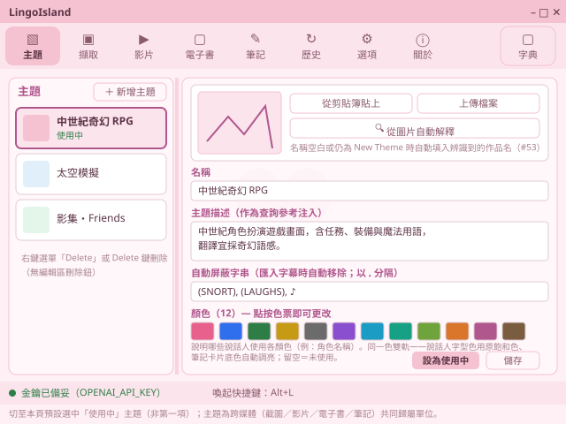

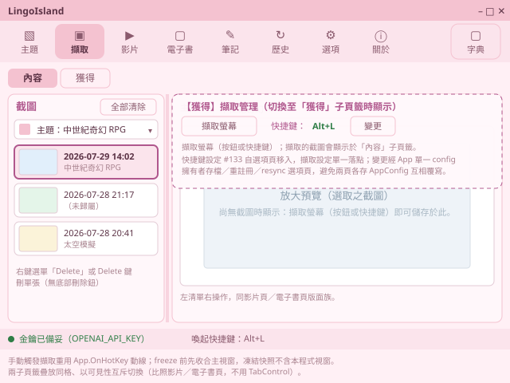

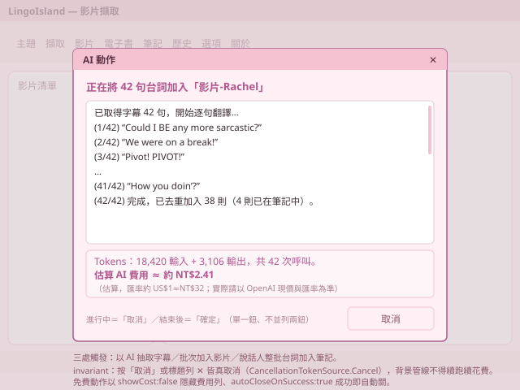

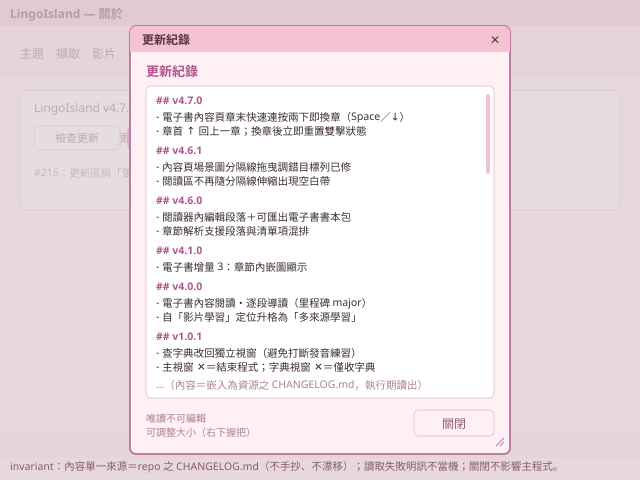

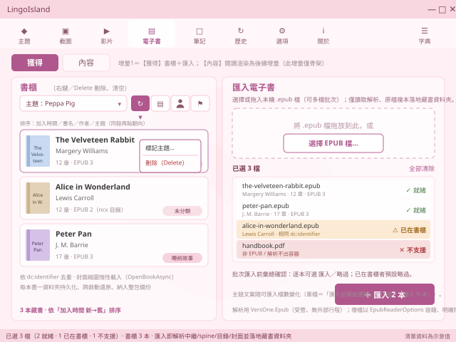

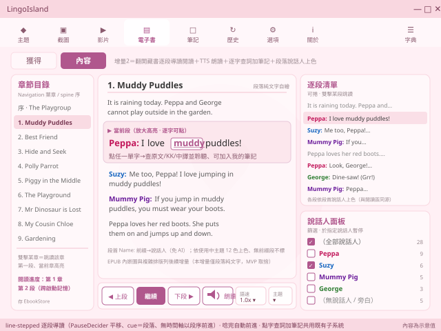

#### 4. 部署作法

> 建置／測試／部署指令（繼承 modTechStack；短節註＋單行決策，不放部署圖）。

* [sysLingoIsland系統]：繼承 modTechStack ＝ WinApp——**建置指令** `dotnet build -c Release`、**發佈指令** `dotnet publish sysLingoIsland -c Release -r win-x64 --self-contained -p:Version={VERSION} -o publish`（**不用** `PublishSingleFile`——Velopack 打包以目錄為單位、官方明示不需單檔；csproj 之 `IncludeNativeLibrariesForSelfExtract=true` 對非單檔發佈惰性無害、留置以保單檔路徑健康，Issue #49/#51）、**打包指令** `vpk pack --packId LingoIsland --packVersion {VERSION} --packDir publish --mainExe LingoIsland.exe --icon sysLingoIsland\assets\app.ico --outputDir Releases`（`dotnet tool` `vpk`；`--icon` 使 `Setup.exe` 及其開始功能表／桌面捷徑、解除安裝項皆帶**應用圖示**〔Issue #177：安裝檔須按業界常規帶圖示，非 Velopack 預設圖示；安裝後主程式 `LingoIsland.exe` 圖示另由 csproj `<ApplicationIcon>` 提供、兩者一致〕；產 `Setup.exe`／`Portable.zip`／`full.nupkg`〔有前版基準時另產 delta〕／`releases.win.json`；**publish＋pack 已固化於 `build\pack.ps1`**〔讀 VERSION、發佈、帶 `--icon` 打包〕）、**測試指令** `dotnet test`（單元／模組層）＋ `pwsh test/scripts/captureEbookSplitter.ps1`（電子書場景圖分隔線拖曳之桌面 UIA 機判）＋ `pwsh test/scripts/captureEbookChapterHop.ps1`（章界雙擊換章之實機接線驗證：植入兩章樣書、以真實鍵盤事件驗章界雙擊換章；判定本體之全分支歸單元測試 `ChapterHopDeciderTests`）＋ `pwsh test/scripts/captureShelfCardLayout.ps1`（**書櫃／影片櫃卡片版式之機判**，#275：對兩櫃各取標題最長之卡片，斷言 ①標題確實換行〔標題 `TextBlock` 高度 > 同卡最矮文字列高 × 1.5——單行基準取自同卡實測、不硬編像素，故不受 DPI／字級影響〕、②標題 UIA `Name` 與資料層書名／片名逐字相符〔＝完整未被裁切〕、③主題標籤 `BoundingRectangle.Y` < 標題 Y〔＝確在標題之前〕、④**右鍵 hit-test**〔卡片外層由 `Horizontal StackPanel` 改 `Grid` 後仍接得到滑鼠右鍵、刪除選單喚得出；只驗喚出即 `Esc` 關閉、**不點 Delete**、不動使用者真實資料〕；卡片文字元素帶 `AutomationId`＝`BookCardTheme`／`BookCardTitle`／`VideoCardTheme`／`VideoCardTitle` 供定位）＋ `pwsh test/scripts/captureEbookBilingualSpeak.ps1`（**中英雙語朗讀之實機煙霧**，#252：植入三段皆中英夾雜之樣書，驗 App 存活與當前段自動前進；聲音本身由 `SpeechPromptTests` 之 SSML 斷言把關、聽感由 USR 確認）；前者為桌面 UIA 機判＋手冊證據擷取管線（兩者共用 `test/scripts/uiaCommon.ps1` 之 P/Invoke 與前景／截圖工法：**自啟新實例後以 `Start-AppAndGetWindow` 輪詢「行程名 `LingoIsland` 且具主視窗」者取得受測視窗、並自該視窗反查 pid 供命中斷言**〔**不得以 `Start-Process -PassThru` 回傳之行程為錨**——Velopack 打包成品之 `LingoIsland.exe` 為外殼、另起真正 app 行程後自身即退出，以其為錨恆逾時失敗；dev build 亦相容此法〕、`%APPDATA%` 起手備份 `finally` 還原、`PrintWindow` 直取視窗表面、以 UIA `BoundingRectangle` 量測拖曳前後之圖塊／閱讀區／篩選列高度並斷言消長；產出最終態證據圖 `docs/manual-assets/ebook-splitter-drag.png`）＋ `pwsh test/scripts/captureThemePushConsumers.ps1`（**主題變更推送之消費端實機走查**，#290／#297：改名並儲存後不切頁不重開，驗影片頁卡片主題標籤〔`VideoCardTheme`〕與篩選下拉、螢幕擷取頁與電子書頁之篩選下拉、**書櫃卡片主題標籤**〔`BookCardTheme`〕皆為新名，並驗派送後 App 存活且各頁可操作；**卡片標籤依 `ThemeId` 即時解析**、非加入當下之名稱快照——快照式寫法即 #297 之缺陷，重繪也修不好）；**六支腳本皆須以 `-ExePath` 對「dev build」與「打包成品」各跑一次皆綠**（後者先 `build\pack.ps1`、解開 `Releases\*Portable.zip` 取其 `LingoIsland.exe`），使驗收對真正交付之成品有效、非僅對 dev build（Issue #270）、**部署方法** GitHub Release 掛上述打包資產（即自動更新之更新源；新使用者跑 `Setup.exe`，既有安裝啟動時自動更新）。
* **方案層**：於 Windows 11 實機以 Velopack 安裝版跑 README 全走驗收與契約 invariant 驗證。

# III. 規格指標

> spec 清單（need：客戶目的／營運議題／成效期待，不混工程手段；粒度一致互不包含），**每條自帶長期追蹤指標**。spec# 自 1 連續、為 ＜II.A.(A).3＞ orgSop 承接之上游錨，貫穿 design→README→測試→成效之 traceability 主幹。
> 對應關係：螢幕／影片／筆記複習各一（spec#1–#3）、電子書增量1 三條（spec#4–#6＝匯入／書櫃／持久化備份）、電子書增量2 四條（spec#7–#10＝逐段導讀閱讀／TTS 逐段朗讀／閱讀查詞筆記／段落說話人上色），電子書兩增量同域 orgSop#0.4 承接；平台維保為 orgSop#1.1，除下列 spec#11 外無獨立 value-spec（其餘行為由各 spec 之維運面承接）。**spec#11 跨兩條 orgSop**（未存變更不靜默丟失），由 orgSop#0.1（主題設定）與 orgSop#1.1（選項頁）共同承接——其對象為該兩頁之編輯保證，非新作業程序，故不另立域（同檔已有 orgSop:spec 非 1:1 之先例：電子書一域 orgSop#0.4 跨兩增量對應七條 spec）。**本條之機器面判準（守衛不綁頁面型別）不寫於此**——依本節「不混工程手段」，該判準歸 ＜II.C.(A).4＞ 契約 invariant。
> **驗收**＝README 全走 × 契約 invariant（＜II.C.(A).4＞）× cfgTest（＜II.C.(A).4＞）；spec 為需求與長期效益追蹤，**非發版驗收判準**。

* **spec#1-螢幕擷取即時查詢**：玩英文遊戲時能以自訂喚起快捷鍵（預設 `Alt+L`）將畫面凍結、框選（或於某句雙擊由 AI 自動判斷）要查的英文，立即取得**英文原文、KK 音標、繁體中文翻譯**並可整句與逐字聆聽，全程不中斷遊戲、`ESC` 可隨時取消；結果顯於**獨立字典視窗**（與主視窗共存、`Topmost` 疊於無邊框遊戲），可**逐字點選查該字**、**編輯辨識錯的原文重譯**、或**於視窗頂部打字查詢**。並可建立多個**命名主題**（自然語言描述，或貼上／上傳畫面由 vision 自動解釋並補充），擇一設為使用中以「參考、非指令」語氣注入查詢、提升翻譯貼切度（未設＝現行預設行為、不改三欄結構）；並可設定喚起快捷鍵、手動觸發擷取與整理截圖清單。多螢幕與 DPI 縮放下選區對位正確。**追蹤**：熱鍵喚起延遲（<300ms）與成功率、遊戲不中斷、常駐閒置記憶體（<100MB）；自訂快捷鍵（含滑鼠低階 hook）下全系統輸入無可感延遲與各組合擷取正確率、監聽期喚起暫停正確（Issue #89）；多螢幕／DPI 選區 0px 偏移、`ESC` 取消；辨識翻譯三欄齊備率與正確性抽測、單次查詢延遲（1–3s）；逐字點選命中（標點不誤讀）、編輯重譯與頂部打字查正確；命名主題注入生效（含貼圖 vision 解釋、以參考非指令語氣）／未設回歸、不破三欄；擷取快捷鍵設定與手動觸發擷取正確、截圖清單主題篩選與指派正確；金鑰不落地稽核。
* **spec#2-影片擷取學習查詢**：能把 **YouTube 英文影片**當作與螢幕並列之可插拔擷取來源——於「影片擷取」分頁貼入影片後**自動取得其英文字幕**（逐句文字＋時間，以字幕文字為準、免螢幕辨識；字幕不可用時明確告知並中止、不當機不無聲失敗），**導引播放到每句自動暫停**並於畫面下方顯示該句字幕（可續播／重播該句／跳下一句），於暫停句**點選任一英文單字**即以同一套查詢取得原文／KK／中譯並聆聽，並可將擷取之字／句**加入同一套「我的筆記」**；下游查詢、筆記與複習練習完全共用、不另造。**追蹤**：YouTube 連結／ID 解析與載入成功率、非法／私人影片明確錯誤；字幕自動取得成功率、無字幕／取得失敗明確告知並中止（不當機不空白卡住）、逐句文字與時間解析正確；到句暫停命中率與誤差（±0.2s 內、不漏句不早停）、續播／重播／跳句正確、暫停字幕與當前句一致；暫停句點字命中（標點不誤取）、查得三欄與朗讀沿用既有；加入筆記去重／歸類正確、與螢幕來源筆記無差別共存；不下載影片內容（僅字幕）稽核。
* **spec#3-筆記收藏與複習練習**：能把值得記的字句從查詢結果或歷史**加入「我的筆記」**（去重、以自訂資料夾分類、拖曳排序、檢視重聽、長期保存不受歷史清除影響）；每次成功查詢自動留存**查詢歷史**供本機回顧（依日期清單、單筆詳情、重聽、刪除單筆或清除全部、受保留上限管控）；並可對筆記**逐則練習發音**——就地按住麥克風錄音、放開由 AI 評分（須確有對目標句之真正朗讀才給分，靜音／只有背景雜訊判 0、不誤給分），達**可調及格門檻**（預設 80）成績框轉綠並記錄本機留存之**最佳分**，可一鍵清空該夾練習紀錄。查詢與發音評分使用 [USR] 自備之 OpenAI 額度（`OPENAI_API_KEY` 環境變數），**金鑰不落地**於程式／設定檔／repo。**追蹤**：收藏去重正確與 toast、資料夾 CRUD／歸類、拖曳排序持久化（重啟沿用）、`notes.json` 損毀退空不致命、筆記不受歷史清除影響；查詢歷史留存／依日期分組／刪除清除即時且重啟正確、上限截汰、`history.json` 損毀退空不影響主流程；發音評分回應率與延遲、錄音時音量條即時反映、無真正朗讀評 0 不誤判通過、及格門檻套用與門檻改動即時重判、**最佳分**取 Max 落地與重啟留存、清空練習回未練、各異常（無麥克風／未授權／空錄音／無網）明確降級不當機、錄音不落地與金鑰不入日誌。
* **spec#4-電子書匯入本機來源**：能把自己的**本機 EPUB 電子書**（EPUB 2 或 EPUB 3）當作與螢幕、影片並列之可插拔擷取來源——於「電子書」分頁**選檔或拖入 `.epub`**（可一次多檔批次），程式**讀取解析**其書名、作者、語言、章節目錄與封面（EPUB2 之 ncx 與 EPUB3 之 nav 目錄皆可、封面缺漏時明確以佔位呈現不當機），壞檔／非 EPUB／解析失敗明確告知並略過該檔、不中斷整批、不當機；本工具僅讀取解析、原檔複本落地個人藏書、不改寫使用者原檔。**追蹤**：`.epub` 匯入成功率、EPUB 2（ncx 目錄）與 EPUB 3（nav 目錄）皆解析、書名/作者/語言/dc:identifier/章數/封面欄位齊備率；封面缺漏以佔位呈現不當機、壞檔／非 EPUB／解析失敗明確告知並略過該檔且不中斷整批、不當機；批次匯入逐檔進度與結果摘要正確；僅讀取解析、原檔未被改寫稽核。
* **spec#5-電子書書櫃瀏覽整理**：匯入之藏書能在**書櫃**一覽整理——每本以**封面縮圖＋書名／作者／章數**呈現，可**依主題篩選**、**依加入時間／書名／作者／主題四種排序**（同鍵可正反向、選擇跨啟動沿用）、**同一本書（依 dc:identifier）不重複入櫃**，可標記所屬主題、**右鍵或 `Delete` 刪除單本或清空書櫃**；書櫃與影片清單、截圖清單同一套「左清單右操作」版面族、易於在多本藏書間切換管理。**追蹤**：書櫃封面縮圖／書名／作者／章數呈現正確；主題篩選、四鍵排序（加入時間／書名／作者／主題正反向）即時且選擇跨啟動沿用；依 dc:identifier 去重（同書不重複入櫃）；右鍵／`Delete` 刪除單本與清空書櫃即時、與影片/截圖清單同版面族操作一致。
* **spec#6-電子書藏書跨啟動保存與備份**：匯入之藏書**每本一資料夾長期保存於本機**（書名／作者／語言／目錄等中繼、原始 `.epub` 複本、封面圖皆落地），**關閉重開程式後書櫃原樣還原**（清單、主題歸屬、排序偏好沿用）、讀寫失敗退空/降級不致命；且藏書**納入既有整包資料備份**（「匯出資料…／匯入資料…」之 zip 辨識並涵蓋），換電腦一併帶走。**追蹤**：每本一資料夾落地（中繼／原始 `.epub`／封面）完整、重啟後書櫃清單與主題歸屬/排序偏好原樣還原；`ebooks.json` 或藏書資料夾毀損／不可寫退空/降級不致命、不影響其他分頁；藏書納入整包備份 zip（`BackupService` 辨識並涵蓋）、匯入還原後書櫃一致；金鑰不入藏書。
* **spec#7-電子書內容逐段導讀閱讀**（增量2）：能把匯入書櫃的 EPUB **翻開閱讀**——於「電子書」分頁【內容】選一本書、依章節目錄（spine 順序）讀章節，內文以**逐段**呈現、**當前段放大高亮**，可**上一段／下一段／繼續**逐段前進、**雙擊左側章節目錄或任一段落即跳讀**該處；**讀到哪一章／段跨啟動記住**（重開程式回到上次閱讀位置）。章節渲染僅**純文字內文**，且**段落（`
`）與清單項（`<ul>`／`<ol>` 之 `<li>`）混排之章兩者皆須成段、依原文順序交錯呈現**——對白以項目符號標記者（`<li>` 內 `Name: 台詞`）不得遺漏；純導覽用之清單項（僅含單一內部連結者，如目錄章）不成段、不朗讀。表格與複雜排版（雙欄等）**本階段未支援**——明確為 MVP 取捨、遇之以純文字呈現不當機；使用者原檔唯讀不改寫。**追蹤**：章節依 spine 順序渲染成功率、段落（`
`）切分正確；當前段高亮與上一段／下一段／繼續前進正確、雙擊章節目錄／段落跳讀命中；閱讀進度（章／段）跨啟動還原正確；EPUB 內嵌圖／複雜排版未支援之明確降級（純文字、不當機）；原檔唯讀不改寫稽核。
* **spec#8-電子書逐段 TTS 朗讀**（增量2）：能對閱讀中的電子書**逐段朗讀**——按朗讀鈕以 Windows 內建語音（離線、免金鑰）唸出**當前段**，**唸完自動前進到下一段**續讀（形成連續導讀），可**續讀／重聽本段／調整語速**（沿用既有發音／語速設定）；朗讀游標與逐段導讀同步（＝當前段）、切書／跳讀／暫停即止、不誤讀；無語音包明確降級不當機。**追蹤**：逐段朗讀以 Windows 內建語音發聲、唸完自動前進到下一段（`SpeakCompleted` 驅動）；續讀／重聽本段／調速正確、朗讀游標與當前段同步；切書／跳讀／暫停即止不誤讀；無語音包明確降級不當機。
* **spec#9-電子書閱讀中查詞與加入筆記**（增量2）：閱讀中能於任一段落**逐字點選查詞**——點某英文單字即以同一套查詢取得**英文原文／KK 音標／繁中翻譯**並可聆聽（來源改內文文字、免辨識誤差），並可將擷取之字／句**加入同一套「我的筆記」**（去重／資料夾／發音練習）；與螢幕、影片來源之筆記無差別共存、完全共用既有查詢與筆記子系統、不另造；金鑰不落地。**追蹤**：內文逐字點選命中（標點不誤取）、查得三欄與朗讀沿用既有；加入筆記去重／歸類正確、與螢幕/影片來源筆記無差別共存；查詢降級／重試沿用既有；金鑰不落地稽核。
* **spec#10-電子書段落說話人上色**（增量2）：對白密集之書能**依說話人辨色閱讀**——段落開頭之 `Name:` 前綴（劇本／對話體）辨識為說話人，依**使用中主題之 12 色**為該段說話人上色（無前綴段不標）；沿用影片頁之**說話人面板**（篩選只看某些說話人、於指定說話人自動暫停導讀），主題切換即重算配色。說話人一律取自內文既有前綴、免 AI。**追蹤**：段首 `Name:` 前綴抽取正確（合唸拆原子、非前綴段不標）、依使用中主題 12 色上色且主題切換重算；說話人面板篩選／於指定說話人暫停正確；免 AI 稽核。
* **spec#11-設定與主題編輯的未儲存變更不靜默丟失**（**quality-spec**；#1–#10 為功能軸、本條為品質軸，粒度依 need 定義之「營運議題」可比，軸別不同故並列於同一序列）：於 [modHmi主題管理頁] 與 [modHmi選項分頁] 修改內容後尚未儲存時，凡會使該筆編輯失效之操作——**切換至其他分頁**、**於同頁改選另一個編輯對象**（含改選另一主題、新增主題、設為使用中；刪除當前編輯中之主題除外，其本意即捨棄）、**結束程式**（主視窗 ✕／`Alt+F4`／系統匣選單「結束」，三入口皆須攔；掛鉤點與理由見 ＜II.C.(B).3＞ [modHmi統一主視窗] 頁列）——皆須先提示並提供三個選項：儲存並離開／捨棄變更並離開／取消留在原處。選「取消」須**完整留在原處**（分頁選取、清單選取、程式皆不動），且**編輯內容原封不動**（撥回之機器面判準見 ＜II.C.(A).4＞，不在本條重述）。選「儲存並離開」而**儲存失敗**時**不得離開**，須留在原處，並**以持續性通道報錯**（頁內 inline 或不自動消失之提示，**非成功那款數秒閃示**——沿 ＜II.C.(A).1＞ #125 既有 invariant，不因一般化而放寬），承 [sysTechType桌面App] ＜III.A節＞ 明確錯誤降級。`ESC`／對話 ✕ 一律等同「取消」。未存判定須涵蓋該頁**每一個會被儲存寫回的欄位**——主題頁＝主題名稱、**主題描述**、**自動屏蔽字串**、12 組色票色值、12 組色彩描述、尚未儲存之貼圖（共六類，即 `themes.json` 之全部可編輯落地欄位）；儲存成功後即回復為無未存變更。**追蹤**：**五種觸發**（切分頁／改選另一主題／新增主題／設為使用中／結束程式〔✕・`Alt+F4`・系統匣〕）**× 六類欄位**（名稱／主題描述／自動屏蔽字串／12 色色值／12 色描述／未存貼圖）皆跳提示；三選各自正確（存後離開、捨棄還原後離開、取消留原處且**編輯內容原封不動**）；儲存失敗時不離開且有明訊；`ESC`／✕＝取消；未改動時上述操作皆不誤觸、且於同一頁重複點同一分頁不誤觸；儲存後未存狀態歸零；選項頁既有守衛行為（#125）回歸不變。
* **spec#12-主題配色變更即時套用至各消費頁**：於 [modHmi主題管理頁] 改動配色（12 色色值或色彩描述）並**儲存**後，**其他頁不必重開程式、也不必等切分頁才更新**——電子書內容頁與影片內容頁之**說話人字型色**、各頁之**主題篩選下拉**、書櫃／影片清單之**主題標籤**皆即時重算為最新設定。主題之新增、更名、刪除、設為使用中同此。**推送而非各頁自取**：由主題存放區於寫回成功後發出變更通知、各消費頁訂閱後自行重算；**不採「各頁在切入時自行重讀」**——後者要求每個新頁面各自記得補一行，漏加不會有任何錯誤訊息、只會靜默顯示舊配色（與 spec#11 所修之守衛同形）。**追蹤**：主題頁改色票／改色彩描述／改名／新增／刪除／設為使用中並儲存後，電子書內容頁與影片內容頁之說話人配色即時反映（不需切分頁、不需重開）；各頁主題篩選下拉之項目與名稱即時反映；書櫃與影片清單之主題標籤即時反映；未儲存前不套用（避免半成品外溢）；**螢幕擷取頁之主題篩選下拉與截圖清單主題標籤亦即時反映**；**新增之承載頁若未表態是否消費主題，或持有主題存放區卻宣告不消費，測試即紅燈**（訂閱與派送只有 [MainWindow] 一個落點，消費頁不自行訂閱）。
* **spec#13-朗讀中以游標示意「運作中但仍可操作」**：電子書逐段朗讀進行中，閱讀區之滑鼠游標改為 Windows 之「**忙碌但可互動**」樣式（`AppStarting`，箭頭附忙碌指示），使用者一眼分得出「現在是程式在唸、還沒輪到我」；朗讀停止（唸完、暫停、跳讀、切書、切章）即回復預設游標。**不採「阻塞等待」樣式**（`Wait`）——朗讀期間逐字查詞、跳段、暫停、切章一律照常可用，用阻塞樣式會誤導使用者以為畫面卡住。游標只掛在**閱讀區**：左側章節目錄與右側說話人面板不屬朗讀範圍、維持預設。**閱讀區內須逐段設定、且逐字連結不得自帶游標**——每個段落是撐滿內文欄之容器且平時自帶「可點」手指游標，其優先權高於外層；只設外層時忙碌樣式僅在段落間縫隙可見，即「**有字的地方永遠看不到**」，功能形同不存在。逐字連結改為繼承所屬段落之游標（朗讀中一律忙碌樣式，點選查詞照常可用；非朗讀中回復手指）。「朗讀中」**含單段朗讀**（唸完該段即回復），非僅連續朗讀。**追蹤**：按播放後閱讀區游標即轉為忙碌但可互動樣式、暫停／唸完／跳讀／切書／切章後即回復；**指標停於單字上時亦須為忙碌樣式**（否則即本條所述之失效態）；按「朗讀單段」時同樣生效；**滑鼠不移動亦須即時換樣式**；朗讀中逐字點選查詞、跳段、暫停等操作仍可用（游標非阻塞語意之實證）；左右兩欄游標不受影響。

# IV. 備註記錄

> 歷次修訂紀錄（逐條「日期：改了什麼、為什麼、誰拍板」）＋決策考量。不放 spec／機制／檢討（三者各歸其位）。

* **2026-08-10：主題變更推送之消費端缺口補平——訂閱上收至主視窗、加契約測試（Issue #290；sprint 2026-08.2〔#293〕；USR 拍板全自動授權；版號級距 minor）**。起因：sprint #284 發車前之 `P3` 人工層評審列為「下期債務」之三項，皆為 #286 所建立之推送模型在**消費端**的缺口——① [modHmi影片擷取頁] 收到通知後只重填主題篩選與重算說話人配色、**未重整影片清單**，而 README 明文承諾「影片清單卡片上的主題標籤」即時更新（該承諾當時只是恰好成立：清單卡片之主題標籤取自重整時的主題快照，凡未重整即顯示舊名）；② [modHmi螢幕擷取頁] **從未訂閱**，只靠 `IsVisibleChanged` 於切回本頁時重填——正是 #286 明文否決之反模式；③ **無任何測試**強制消費頁訂閱，故 ② 那類遺漏不會紅燈。
  * **不新增 spec**：本件為 `spec#12` 之實作缺口補平與防再生機制，spec 條文與追蹤面（＜III＞）只擴充受影響頁與機檢紅燈條件，總數維持 13 條。
  * **訂閱與派送上收至 [MainWindow]，消費頁不自行訂閱**：#286 之推送只做了一半——事件是推的，**訂閱卻仍是各頁自己記得寫**，於是「漏加不會報錯、只會靜默顯示舊配色」原封不動地換了個位置存在。改為主題存放區之變更通知**只有一個訂閱點**，由主視窗對其所承載之頁**反射枚舉**後逐一派送；派送方法以 `[ThemeChangeDispatch]` 自我指名、簽章不參照任何具名頁型別，**與 spec#11 之 `[LeaveGuard]` 同形**（同一種脆弱性已在本產品撞三次，故採同一種結構解法而非再補一行）。
  * **消費端契約恰一成員（`OnThemesChanged`）**：一成員即「本頁全部主題衍生呈現」——刻意**不拆為配色／篩選／清單三個成員**，拆了就會出現「實作了兩個、漏了第三個」，即缺口 ① 的形狀。[modHmi影片擷取頁] 之實作據此補上影片清單重整。
  * **三態標記＋「宣告不得與實情相反」**：八頁以 `[ThemeConsumer]`／`[NoThemeConsumption]`／`[ThemeConsumptionOutOfScope("理由")]` 標記完備，未標即紅燈；另加一條 spec#11 所無之斷言——**持有主題存放區欄位者不得標 `[NoThemeConsumption]`**。理由：純三態標記只擋得住「新頁忘了表態」，擋不住「表態成不消費」，而缺口 ② 恰恰是後者（[modHmi螢幕擷取頁] 持有存放區、確實呈現主題篩選與標籤，卻從未接上）。持有存放區欄位是「本頁讀主題資料」少數可靠的機器信號。
  * **八頁標記對照（免實作者自行拍板）**：[modHmi螢幕擷取頁]／[modHmi影片擷取頁]／[modHmi電子書擷取頁] 標 `[ThemeConsumer]`；[modHmi主題管理頁] 標 `[ThemeConsumptionOutOfScope("本頁即變更來源，儲存後自行重載，不由推送驅動")]`（**產生者訂閱自己發的事件會造成重入**——儲存成功→重載→改選→再觸發）；[modHmi筆記分頁] 標 `[ThemeConsumptionOutOfScope("卡片底色一軌未納入 spec#12 推送")]`；[modHmi歷史分頁]／[modHmi選項分頁]／[modHmi關於分頁] 標 `[NoThemeConsumption]`。
  * **`IsVisibleChanged` 之重填不移除**：推送已涵蓋其職能，但該路徑同時承擔切回本頁時之其他重整（清單資料本身、選取還原），移除須逐頁分辨哪一半是主題、哪一半不是——本件不做，**列為已知冗餘**而非缺陷；判準是「漏了會不會靜默失效」，而推送在場時漏了不會。
  * **範圍外（明記不做）**：#290 內文第 4 項（主題寫回失敗擋住離開、手冊未給脫身路徑）屬手冊與對話文案，不在本件之推送路徑範圍，另案處理；筆記卡片底色一軌仍不納入即時重算。
* **2026-08-03：朗讀中以游標示意「運作中但仍可操作」（Issue #283；sprint #284〔2026-08〕；USR 拍板全自動授權；版號級距 minor）**。起因：[USR] 回報「有時候電子書發音間隔時，不知道是不是輪到我了」——逐段朗讀在段與段之間有停頓，使用者分不出「程式還在唸」與「等我念」。[USR] 於 `O1` 澄清所欲語意為「**既表示電腦運作中，也仍然可點選控制**」。改法逐條如下。
  * **新增 `spec#13`**（接續 #1–#12）；＜II.A.(A).3＞ 前言之 spec 數同批追平為 13 條。
  * **選 `AppStarting` 而非 `Wait`**：後者於 Windows 慣例為「阻塞、現在不能操作」，與本功能實況相反——朗讀期間逐字查詞、跳段、暫停、切章皆照常可用。選型直接對應 [USR] 原話之兩個條件。
  * **掛在閱讀區而非整頁**：左側章節目錄與右側說話人面板不屬「朗讀中」之範圍。
  * **只設外層容器不足，須逐段設＋逐字連結不自帶游標（`P3` 人工層評審攔下之實作缺陷，發車前補正）**：初版只設 `ReadingScroller.Cursor`，但每段是撐滿內文欄之 `Border` 且自帶 `Cursors.Hand`、段內每個 `Hyperlink` 亦自帶——兩者優先權皆高於外層，**忙碌樣式只在段落間 2px 縫隙與末段以下空白可見，凡有字之處全被蓋掉**，等同功能不存在而手冊照常宣稱。改法：`Hyperlink` 移除自帶游標（`Cursor` 為可繼承相依屬性，改繼承所屬段落），段落 `Border` 之游標隨朗讀狀態切換（建立時與狀態變更時各設一次，切章重建亦涵蓋）。**教訓**：可繼承屬性之「掛最外層即可」直覺，遇到內層自帶值就整片失效，且**單元測試看不出來**——同類視覺屬性須驗「使用者指標實際會停的位置」而非「有沒有設到」。
  * **含單段朗讀、且不靠滑鼠移動觸發**：另補兩處同批攔下之缺口——「朗讀單段」未設狀態旗標故完全無游標（新增 `_ttsOnce`，唸完之非取消完成事件歸零；取消事件不認，避免被前一次 `StopTts` 排出的舊事件誤關）；WPF 僅於指標移動時重評游標，故切換後補一次 `Mouse.UpdateCursor()`——否則使用者按下播放鈕後指標停在鈕上不動，移進內文前都不會變。
  * **與朗讀旗標同源**：游標切換掛於既有之 `UpdateSpeakButton()`（朗讀狀態之唯一呈現點），**不新增第二個狀態來源**——播放鈕文字與游標必然同步，不會出現「鈕顯示暫停、游標仍忙碌」之分岔。
  * **範圍外（明記不做）**：影片頁之導引播放不納入本增量；朗讀中之其他視覺提示（如當前段高亮）沿用現況、不改。
* **2026-08-03：主題配色變更即時套用至各消費頁——改推送、不再各頁自取（Issue #286；sprint #284〔2026-08〕；USR 拍板全自動授權；版號級距 minor）**。起因：[USR] 於主題頁改配色後切到電子書頁，說話人配色仍是舊的（#281 原始需求，經 sprint #284 之 `O1` 拆為本件與 #285）。查證病灶——[modHmi電子書擷取頁] 之 `IsVisibleChanged` 只重填主題篩選與書櫃、**未重算說話人配色**；[modHmi影片擷取頁] 之 `IsVisibleChanged` 只管輪詢與焦點、亦未重算。改法逐條如下。
  * **新增 `spec#12`**（接續 #1–#11）：主題配色變更即時套用；＜II.A.(A).3＞ 前言之 spec 數同批追平為 12 條。
  * **推送而非各頁自取**：[modQuery模組] 主題存放區於**寫回成功後**發出變更通知（`ThemeStore.Changed`，掛在 `TrySave` 成功分支——失敗不發，避免半成品外溢），[modHmi電子書擷取頁] 與 [modHmi影片擷取頁] 訂閱後各自重算配色與篩選。**不採「各頁於 `IsVisibleChanged` 自行重讀」**——那要求每個新頁面各自記得補一行，漏加不會有任何錯誤訊息、只會靜默顯示舊配色，**與 `spec#11` 所修之守衛完全同形**（同一期連撞兩次同一種脆弱性，故一併改為推送）。
  * **即時性優於原始需求**：[USR] 原文只要求「跳到其他頁時」套用，實作為**存檔當下**即套用（不需切分頁、不需重開）——切分頁只是其中一條路徑，推送模型自然涵蓋。
  * **範圍外（明記不做）**：筆記卡片底色（`ColorMath.LightenForBackground` 之另一軌）本增量不宣稱即時重算；主題資料之結構與儲存格式不變更。
* **2026-08-03：主題頁未儲存離開時提醒——離開守衛自綁定選項頁一般化為不綁頁面型別（Issue #285；sprint #284〔2026-08〕；USR 拍板全自動授權；版號級距 minor）**。起因：[USR] 於主題頁編輯配色後未按儲存即換頁，變更靜默消失且無任何提示，與同一程式的選項頁行為不一致（#281 原始需求，經 sprint #284 之 `O1` 拆為本件與 #286）。查證發現病灶不在「主題頁少寫一段提示」，而在**守衛機制未一般化**——`MainWindow.ConfirmLeaveOptions()` 之判斷式把保護對象（`_options`）與保護機制（三選提示、取消撥回）綁死，`ReselectOptionsTab()` 亦寫死撥回選項頁；任何後續新增之可編輯頁面都不會自動受保護，且**忘記加不會有任何錯誤訊息、只會靜默失去保護**。改法逐條如下。
  * **新增 `spec#11`（接續既有 #1–#10，不重編）**：設定與主題編輯的未儲存變更不靜默丟失。**依 ＜III＞ 明訂之「粒度一致互不包含」合為一條**，不拆多條——各觸發路徑同屬「未存變更不應無聲丟失」此單一使用者期待。
  * **`spec#11` 之 orgSop 歸屬**：由 orgSop#0.1（主題設定）與 orgSop#1.1（選項頁）共同承接、不另立域（同檔已有 orgSop:spec 非 1:1 先例）；＜II.A.(A).3＞ 前言之「spec 10 條／維保無獨立 value-spec」與 ＜III＞ 前言同批追平，避免兩處互斥。
  * **範圍收斂（設計審查 panel 回修）**：`spec#11` 初稿宣稱涵蓋「可編輯頁面」全類別，經審查指出可編輯頁今僅主題頁與選項頁、其餘頁又明記不保護，屬**以空集合外推**，故收斂為具名兩頁。
  * **機器面判準下沉（同上）**：「守衛不得綁定頁面型別」原寫於 `spec#11`，違反 ＜III＞ 前言「不混工程手段」，改置 ＜II.C.(A).4＞ 契約 invariant——連同**頁面契約四成員**與**三條可執行斷言**（標記完備／守衛不認頁／撥回不得反噬），比照 #252 之 invariant＋斷言寫法。原稿只有一句期望、且指標指向不存在的條目，落在「驗收＝README 全走 × 契約 invariant × cfgTest」三者之外＝驗收盲區。
  * **未存判定欄位補齊（阻斷級回修，三位審查員獨立命中）**：初稿列「名稱／12 色色值／12 色描述／未存貼圖」四類，**漏了 `主題描述` 與 `自動屏蔽字串`**——二者皆為可編輯 `TextBox` 且由 `OnSave` 寫回 `themes.json`，同一頁列上文亦自載其存在。照初稿實作將交出「改主題描述仍靜默丟失」之守衛，且測試會判合格。改為明列六類並註明其等於「全部寫回 `themes.json` 之可編輯欄位」。
  * **觸發路徑補齊**：初稿只列切分頁與改選主題。補入 **結束程式**（USR 2026-08-03 裁定納入——`MainWindow.OnClosing` 現不呼叫任何守衛，而 ✕＝結束整個程式，為桌面應用最典型之丟失路徑）。**三個入口一併涵蓋**：主視窗 ✕／`Alt+F4`／**系統匣選單「結束」**——`App` 之 tray「結束」與 ✕ 同走 `ExitApp` 匯流點，且 ＜II.C.(B).3＞ 設計原則明訂 tray 與主視窗為「同一組動作之兩個入口鏡像」，只擋其一即違反本檔自訂原則（複審提出，同批補入）。另補 **新增主題** 與 **設為使用中**（二者皆會改選編輯對象、覆蓋編輯區）；**刪除當前主題明記除外**（本意即捨棄）。
  * **取消之反噬（阻斷級回修）**：初稿只寫「取消＝回原值」。審查指出照字面實作仍會丟資料——撥回分頁會觸發 `TabThemes.Checked` → `Reload(preferActive: true)` 重讀檔並改選使用中主題，覆蓋剛保住的編輯（選項頁未撞上，純因 `TabOptions.Checked` 是唯一不含 reload 者）；撥回清單選取則因 `SelectionChanged` 再進入而成迴圈。`spec#11` 與契約 invariant 各補明「撥回不得重跑進場動作、須抑制事件再進入」。
  * **儲存失敗路徑**：初稿未定。補「儲存並離開」失敗時**不離開、留原處明訊**，承 [sysTechType桌面App] ＜III.A節＞ 明確錯誤降級；`ESC`／對話 ✕＝取消（承本檔 ＜II.C.(B).3＞「`ESC` 一致取消」之 WCAG 精神）。
  * **三選字面統一**：design／README／實機三處原有三種寫法，一律以「儲存並離開／捨棄變更並離開／取消」為準。
  * **[modHmi統一主視窗] 頁列補守衛本體敘述**（含「目標頁與目前頁相同即放行」，免自選項頁點選項頁誤觸）；**`prsnSop#0.1.4.1.1` 敘述補「並儲存；帶未存變更離開時經三選守衛」**——原無落點，而 ＜II.C.(B).3＞ 前言明訂 prsnSop 自頁表反查、落表外＝驗收盲區。
  * **版號級距 patch → minor（USR 2026-08-03 裁定）**：本件新增使用者可見行為**且新立 spec#11**；對照前例 v4.7.0（章界雙擊換章，既有頁面新增互動、無新 spec）即走 minor，定 patch 反較前例寬鬆。
  * **守衛對話不列為具名頁（裁決留痕）**：＜II.C.(B).3＞ 收錄判準要求「使用者摸得到的獨立介面即須成列」，本增量之三選對話有自己的版面與關閉語意，惟**承載零條 wi**、屬既有作業（管理主題／設定）之確認步驟，故不列頁、亦不另立示意圖；主題頁靜態版面未變，`page-主題管理頁.svg` 同批不動（同款既有守衛之選項頁示意圖亦未畫）。
  * **範圍外（明記不做）**：其他分頁（擷取／影片／電子書／筆記／歷史／關於）之未存狀態本增量不宣稱受保護——**影片頁之「Edit YAML」為現存之頁內可編輯面，明記其不在本增量範圍**；主題資料之結構與儲存格式不變更。本能力之桌面通則**回填於 skills 庫 `sysTechType桌面App.md`**（該契約現行能力清單並無此條），由 sprint #284 之 `4階段` 承接。**本增量不在本 repo 撰寫該契約文字**；本 repo 內之 `docs/shared-contracts/sysTechType/sysTechType桌面App.md` 為正本副本（位元組相同、明訂不得本地修改），**正本回填後由 sub-sync-contracts 同步該副本**。
  * **根因之誠實界定（審查回修）**：初稿宣稱一般化可根治「忘記加不會報錯」之沉默失效。審查之魔鬼代言人指出**沉默性只是平移**——忘記在新頁實作契約，一樣不會有錯誤訊息。故本增量之效果誠實界定為「**降低但未消除**」；**複審再指出初版斷言本身不可機判**——其觸發條件「含綁定至 store 之可編輯控制項」在本 repo 無機器信號（不用 data binding、`OnSave` 直讀 `.Text`），且若退而以「含可編輯控制項」近似，`VideoCapturePage`／`ScreenCapturePage`／`DictionaryPage` 將偽陽性命中而與本條「範圍外」互斥。故改為**結構性標記**：每個頁面型別須擇一標記 `[EditablePage]`／`[NoUnsavedState]`，未標記即紅燈——如此「忘記」才真的變成測試期可見。真正消除靠此標記完備斷言，於 `3code` 兌現。
  * **對話文案與契約成員數（USR 2026-08-03 裁定）**：現行文案硬編指名「**選項頁**有未儲存的變更……取消 — 留在**選項頁**」。一般化後若契約僅三成員（無頁名），文案必須退化為「目前的頁面」，選項頁既有使用者所見文字即改變、與本條「對使用者行為不變」之承諾牴觸。USR 裁定**契約增第四成員 `頁面顯示名`**——選項頁文案一字不變、主題頁顯示「主題頁」，成本僅一個唯讀屬性。＜II.C.(A).1＞ ⑥ 與 ＜II.C.(A).4＞ 同批改為四成員。
  * **既有落點追平（複審阻斷）**：＜II.C.(A).1＞ [modPresent模組] 呈現契約 ⑥ 原完整寫著「切離**選項分頁**前提示」「`MainWindow` 撥回**選項分頁**」——那是 #125 守衛的正本落點，正為新 invariant 明文禁止之頁面綁定寫法。同一 SSOT 對同一機制同時說「必須這樣」與「不得這樣」，實作者照哪段都能自稱合規。已改寫為不綁頁面型別，並保留其仍有效之實質判準（副作用聲明、持續性通道報錯）。**成因＝回修只追平自己新寫的地方、未回頭追平同一機制的舊落點**，與本增量所修之原始缺陷同形。
  * **既有標準不得放寬（複審重要）**：初版「儲存失敗須給明確可讀錯誤」弱於 ＜II.C.(A).1＞ #125 既有 invariant「**以持續性通道報錯**（頁內 inline 或不自動消失之提示，**非成功那款數秒閃示**）」，屬靜默放寬。已於 `spec#11` 與頁列補齊原判準。
  * **合併前硬條件（版號三處一致）**：`VERSION`／`CHANGELOG`／README 之版號依 repo 慣例於 `3code` 與程式同一 PR 釘選。**惟本期 #286 亦在名單內，若其先合併，README 已標之 v4.10.0 即靜默錯號，而 repo 無任何機檢會抓 README 版號與 `VERSION` 不一致**。故列為本件合併前之硬條件：三處版號須一致後方可 merge。
  * **實機截圖（合併前補齊）**：本階段無程式故無實機圖；`3code` 之離開守衛 UIA 腳本**須同時產出 `docs/manual-assets/theme-unsaved-guard.png`**（比照 ＜II.C.(B).4＞ 既有腳本產出 `ebook-splitter-drag.png` 之先例）並於 README 本節引用。近版之主要使用者可見變更多附實機圖（如 v4.8.0／v4.9.0／v4.6.2；v4.6.0 部分項目未附，非全數）；本節為純對話框行為，一張實機圖即最強驗收物，而「README 全走」之驗收方式需要它。
  * **畫面按鈕標籤（複審提出，依 USR 文案裁定之同一原則處理）**：design 所載之三選字面「儲存並離開／捨棄變更並離開／取消」為**語意名**；WPF `MessageBox` **不可改按鈕標籤**，畫面實際標籤由 OS 顯示語言決定（實測為 `Yes`／`No`／`Cancel`），中文三選字面僅出現於對話**內文**。裁定**沿用 `MessageBoxButton.YesNoCancel`、不改用 TaskDialog 或自訂對話**——換掉會動到選項頁既有觀感，與本增量核心承諾衝突；此與 USR 對「對話文案」之裁定（寧加第四成員也要保住選項頁文案）同一原則。已載於 ＜II.C.(B).3＞ [modHmi統一主視窗] 頁列，免 `3code` 現場自行裁決。
  * **合併前收尾清單（本增量三輪複審之共同殘留形狀，硬性）**：本增量之殘留**三輪皆為同一形狀**——「改一處而未掃全部落點」。＜IV＞ 已於前條診斷過成因，**診斷寫下後同一輪仍再犯**（tray 補四處漏一處、持續性通道補一處漏一處，且本章一度宣稱「已於頁列補齊」而頁列實未補）。故不再倚賴人眼複審，改立機械收尾：**合併前對下列字串各跑一次全檔 `grep`，逐一確認每個落點敘述一致**——`系統匣`／`持續性通道`／`value-spec`／`對映 spec`／`結束程式`。此即 `3code` GATE ＜5節＞「全域類必查」（宣稱全域／統一者須先 grep 出全集）在本增量之具體落地，本增量已違反該條三次。
  * **八頁標記對照（斷言① 之裁決，免實作者自行拍板而寫下已知為假的宣告）**：`MainWindow` 承載八頁——[modHmi主題管理頁] 與 [modHmi選項分頁] 標 `[EditablePage]`；[modHmi影片擷取頁] 標 `[UnsavedStateOutOfScope("Edit YAML 之未存緩衝，#285 範圍外")]`；[modHmi筆記分頁] 標 `[UnsavedStateOutOfScope("F2 原地更名之暫態編輯，#285 範圍外")]`；[modHmi螢幕擷取頁]／[modHmi電子書擷取頁]／[modHmi歷史分頁]／[modHmi關於分頁] 標 `[NoUnsavedState]`。
  * **範圍外補列（自足性檢核提出）**：`OptionsPage` 匯入資料所走之 `Application.Current.Shutdown()` 與系統登出／關機（`SessionEnding`）**繞過 `App.ExitApp()`，本增量不涵蓋**——前者為使用者主動確認之資料覆蓋流程、後者為 OS 事件，明記以免 `3code` 現場自行擴權或漏想。
  * **design 自足性檢核（`3code` 起手第一步，乾淨脈絡子代理只餵 design／README／契約）**：首判**不自足**，5 阻斷——① 主題頁「嘗試儲存」在現況架構下恆不失敗（`ThemeStore.Save` 吞例外、`WriteImage` 拋穿），且 ＜II.C.(A).1＞ 主題儲存契約反向背書「讀寫失敗退空／降級」；② ＜II.C.(A).1＞ 常駐主控入口契約與 ＜II.C.(A).4＞ 軟硬實體仍寫「✕＝收合而非結束程式」，與 ＜II.A.(B).3＞／spec#11／程式現況互斥；③ 四成員契約僅有中文語意名、無 C# 介面與簽章；④ 斷言③ 因靜態 `MessageBox` 不可注入且測試專案無 STA 而無法自動化；⑤ 結束路徑接線與 `[LeaveGuard]` 歸屬未定。**五項已於本輪全數補齊**（見上列各條），其餘 10 條缺口經評估屬「實作者猜了也不會錯得離譜」等級，擇要併入。
  * **②之成因（第三次復發，記明）**：`✕＝收合` 之舊說位於 ＜II.C.(A).1＞ 與 ＜II.C.(A).4＞，而 ＜IV.2026-07-29＞ 該條**宣稱**已更正「常駐主控入口契約」——實際未改到。與本增量前兩輪之殘留同形（**改一處而未掃全部落點**），故 `結束程式` 已列入本章之合併前 grep 收尾清單。
  * **測試現況（事實，非檢討）**：`ConfirmLeaveOptions`／`IsDirty`／`RevertChanges` 現行涵蓋率皆為 0，`test/scripts/` 四支 UIA 腳本亦未觸及此路徑。本增量於 `3code` 補未存判定真值表單元測試與離開守衛 UIA 腳本，並登記於 ＜II.C.(B).4＞ 測試指令。**檢討本身歸 sprint #284 之 `P3`／`4階段`，不留於本章**（承 ＜IV＞ 前言「不放 spec／機制／檢討」）。
* **2026-07-29：追平實作現況——UI surface 入追溯鏈、.NET 版本與 Dictionary／主題敘述漂移（Issue #273；USR 拍板；純文件增量、版號級距 NONE、不動任何程式碼）**。起因：#271／PR #272 完成 4.1 形式遷移後，逐一比對 `sysLingoIsland/modPresent/*.xaml`、`LingoIsland.csproj` 與本檔各表，撞出七項**既存**漂移（成因散在 #133／#135／#148／v1.0.1 回滾／commit `8c44b65` 等歷次增量，非 4.1 遷移造成）。改法逐條如下。
  * **`.NET 8` → `.NET 9`（三處）**：＜II.B.(B).1＞／＜II.C.(B).1＞ 之 `modTechStack ＝ WinApp` 宣告與 [modCapture模組] 元件描述，追平 `LingoIsland.csproj` 之 `net9.0-windows10.0.19041.0`，並於 ＜II.C.(B).1＞ 標明 target framework 正本在 csproj。（同檔 ＜II.B.(A).4＞ 述 `VersOne.Epub` 時已寫「.NET 9 相容」，原為自相矛盾。）
  * **「情境(Context)」→「主題(Theme)」整批更名（#148 起之實作事實，本檔遲未追平）**：`ContextStore`→`ThemeStore`、`contexts.json`→`themes.json`、`contexts\`→`themes\`、`ContextPage`→`ThemeManagementPage`；＜II.B.(B).2＞ etyCfg、＜II.C.(A).1＞ 定調段、＜II.C.(A).4＞ 三條契約（儲存／圖片解釋／管理分頁）、＜II.C.(B).1＞ 元件清單、各 SOP 表與頁列一併更名，並補載 [AppDataMigration] 之一次性非破壞遷移與 `ThemeColors.Ensure` 色盤遷移。**未更名者明載**：appsettings 之 `paramContextHint` 鍵名未隨之更名（#14 遺留、僅供相容遷移），文中特別標注以免誤改。
  * **`[modHmi情境分頁]` 一列拆為兩列**：該列實為 #148 前之殘影——情境編輯責任今歸 [modHmi主題管理頁]、螢幕擷取責任歸 [modHmi螢幕擷取頁]，兩頁在 code 中各自存在（`ThemeManagementPage.xaml`／`ScreenCapturePage.xaml`）而本檔僅有一列混寫。拆列後補 `teamSop#0.1.6`（擷取快捷鍵設定與手動觸發）／`#0.1.7`（截圖清單瀏覽與整理）與對應 prsnSop 成對作業項及 `wi`／`ackWi`。
  * **補三個未入追溯鏈之 UI surface**：[modHmi主題管理頁]（#169／#189／#217；12 色色盤與自動屏蔽字串之單一落點）、[modHmiAI動作確認頁]（commit `8c44b65`；**付費 AI 動作之唯一費用揭露 surface**，三處觸發）、[modHmi更新紀錄頁]（#79）。三者原僅以散文或字樣出現、無頁列無 wi 無 prsnSop——4.1 之驗收覆蓋性靠追溯鏈**構造**保證，落表外即等同驗收盲區。AI 動作確認頁之 `wi` 依介面併用（硬規則⑨）掛入既有 `teamSop#0.2.1`／`#0.2.3` 之作業項（`prsnSop`↔`wi` 多對多），不另開 teamSop；更新紀錄頁則與關於分頁同掛新增之 `teamSop#1.1.4`。
  * **Dictionary 分頁 → 獨立字典視窗（v1.0.1 回滾，本檔停在 #135）**：`MainWindow` 現無 Dictionary 分頁，`App` 持有獨立 `DictionaryWindow`（`ShowInTaskbar`＋`Topmost`、與主視窗共存）。病因＝分頁制下於筆記分頁檢視單字會令主視窗跳頁、打斷進行中的發音練習。頁名改 [modHmi字典頁]、surface 改「獨立視窗」，並逐項載明**恢復**（位置大小記憶、`ESC`／✕ 入口）、**未恢復**（失焦自動隱藏，`paramResultHideOnBlur` 仍停用——原敘述將其停用理由歸於「浮窗移除」，浮窗回來後該理由已失效，一併更正）、**改為隱藏語意**（✕／`ESC`＝隱藏可再喚出、程式結束才真關）與**單一實例**（「同時至多一個」由結構保證）。連帶更正 ＜II.C.(A).1＞ 架構圖節點標籤與各處「結果於 Dictionary 分頁」之敘述。
  * **主視窗 ✕ 語意（同批 v1.0.1）**：原載「關閉主視窗＝收合而非結束程式」，實為 `OnClosing` 轉交 App 統一結束＝**✕ 結束整個程式**、背景常駐改以最小化達成；字典視窗 ✕ 則僅收字典。＜II.A.(B).3＞、＜II.C.(A).4＞ 常駐主控入口契約與 ＜II.C.(B).3＞ 頁列一併更正。
  * **功能列分頁序**：原載「情境／筆記／歷史／選項／關於」五分頁，實為**主題／擷取／影片／電子書／筆記／歷史／選項／關於**八分頁＋右端「字典」動作鈕（MDL2 字圖一併追平為實測值）。
  * **順修（4.1 遷移未落地之既存筆誤）**：＜II.C.(B).3＞ 設計原則段「安裝金鑰與移除（#0.2.1.1.1／#0.2.3.1.1）」仍為舊碼、實指維保之安裝與移除——4.1 遷移紀錄雖已宣告改正，正文未落地，本次改為 `#1.1.1.1.1`／`#1.1.3.1.1`。＜II.B.(B).3＞ 導覽衍生段之半遷移編號（`#1.3`／`#1.5`／`#2.2`／`#5.2`／`#4.3`）一併補齊為五段全碼。
  * **示意圖**：新增 `page-主題管理頁.svg`／`page-螢幕擷取頁.svg`／`page-ai動作確認頁.svg`／`page-更新紀錄頁.svg`（硬規則⑤：每個具名頁各一張），並掛入既有但未被引用之 `about-changelog-same-row.svg`（#216 現行版面）。**退役**：`page-情境分頁.png` 停止引用——其畫面為舊 `ScreenTrans` 品牌與已不存在之五分頁列，續掛會誤導；檔案保留於 repo 供歷史對照。`about-changelog-after-checkupdate.svg`（#199）已被 #216 取代，維持不引用。
  * **＜III 規格指標＞之事實更正**：spec#1 內文之「結果顯於主視窗 Dictionary 分頁」「命名應用情境」改為「獨立字典視窗」「命名主題」，並於能力敘述與追蹤指標補「擷取快捷鍵設定／手動觸發擷取／截圖清單整理」。**僅更正措辭與事實、未增刪或重排任何 spec#**，需求本身不變。
  * **未動**：所有 spec 之需求範圍、架構圖結構、契約 invariant 之實質判準、關鍵組態鍵名（含刻意保留之 `paramContextHint`）一律不動；本增量**不改任何 `.cs`／`.xaml`／`.csproj`**、不改變任何執行期行為。
* **2026-07-29：formatVersion 3.2 → 4.1 全檔遷移（USR 拍板；純文件增量、版號級距 NONE）**。起因：本檔停在 3.2，docLint 判 3.2 已廢止而恆為 FAIL（49 項），每個增量都得在工單重述「既存、非本增量造成」，形式 gate 實質失效。改法逐條如下。
  * **章骨架**：三章制（I 需求分析／II 方案設計／III 系統設計）改為全庫四章制 `I. 緣起目的／II. 分析設計／III. 規格指標／IV. 備註記錄`；三高度降為 ＜II＞ 之小節（A 需求分析／B 方案設計／C 系統設計（sysLingoIsland系統）），內部改甲案五層 `(A) 運作想定`〔1 架構圖／2 單位組織／3 作業程序／4 軟硬實體〕＋`(B) 實作規劃`〔1 技術選型／2 關鍵組態／3 人機介面／4 部署作法〕。舊各層 `A. 主旨摘要` 之需求層內容上提為 ＜I 緣起目的＞，方案層與系統層之定調段各留於所屬 ＜(A) 運作想定＞ 節首（內容一字未刪）。
  * **規格外拆**：舊 ＜I.D 規格效益＞ 之 spec 與 ＜I.D.(B) 效益指標＞ 逐條合併為 ＜III 規格指標＞ 之「spec#N-標題：內文。**追蹤**：指標」單行制（10 條全數保留、內容未刪）；舊 ＜II.D＞ cfgTest 表移入 ＜II.C.(A).4 軟硬實體＞。
  * **課目族刪除**：docProgTest#01–#09、e2eTest#01–#06、intTest#01–#71（71 列驗收矩陣）整批移除——依 4.1 canon 之驗收 doctrine 裁定「課目族＝手冊×spec×契約之冗餘 join，不再另立」，驗收改為「README 全走 × 契約 invariant × cfgTest」。USR 2026-07-29 於本增量起手閘就此衝突（「不得刪減既有規格內容」vs「課目族廢止」）拍板採 canon 裁定。原矩陣之測試腳本本體（`test/scripts/*.ps1`、單元測試）未動，僅移除 design 內之課目表；＜II.C.(B).4 部署作法＞ 之測試指令改以功能敘述取代 `intTest#NN` 編號。
  * **SOP 追溯鏈重編號**：舊頂層域大類識別字退休、改用 `domain`（自 0 連續）——domain#0 多來源英文擷取學習／domain#1 系統維運；orgSop 改兩段 `#域.序`（舊 #1→#0.1、#2→#0.2、#3→#0.3、#5→#0.4、#4→#1.1）；teamSop 改三段 `#域.序.款`；prsnSop 改五段 `#域.序.款.項.目`。**新增督核目（`.2`）**：4.1 要求每個作業項之目恰為 {1 執行, 2 督核}，本方案為單人方案，故執行與督核同為 [prsn玩家] 本人先後承擔（先操作、後自檢），督核持獨立之 `ackWi…` 自檢工作指導、與執行 wi 分離；3.2 版所寫「組長督核不適用」之偏離宣告就此收回。
  * **人機面三高度**：新增 `solHmi`（形式：[solHmi桌面常駐應用]，並註明「非網站」之技術強制原因＝全域熱鍵／全桌面擷取／系統匣常駐非瀏覽器沙箱可得）、`sysHmi`（存取端點：[sysHmi統一主視窗]／[sysHmi選區遮罩]／[sysHmiOS標準設定]，後二者為技術強制分裂並具理由）、`modHmi`（12 個具名頁）；各 ＜(A).3 作業程序＞ 表一律加「關聯 hmi」末欄（具名、非裸層級 token）；＜II.C.(B).3＞ 逐頁表加「本頁 wi 清單」欄（自 ＜II.C.(A).3＞ 之 prsnSop↔wi 機械反查、非新編）。
  * **技術選型四層**：舊三層選型識別字（tech 前綴之 App／Stack／Item 三名）全數改為 `sysTechType`／`modTechStack`／`cmpTechItem`（43 處），並補宣告 `solTechStyle`＝[solTechStyle淺粉童趣桌面風格]（內容取自舊 ＜I.C.(C)＞ 之「統一美術」段，非新創）。宣告位改為：solTechStyle 於 ＜II.A.(B).1＞、sysTechType 於 ＜II.B.(B).1＞、modTechStack＋cmpTechItem 於 ＜II.C.(B).1＞。
  * **候選契約收攏**：3.2 時因家規四選一無桌面選項而提出、待家規裁決之 .NET／WPF 桌面候選契約就此退場——4.1 之 modTechStack 封閉枚舉已納 `WinApp`，改宣告 `modTechStack ＝ WinApp`，不再另立候選。
  * **交叉引用平移**：＜I＞→＜II.A＞、＜II＞→＜II.B＞、＜III＞→＜II.C＞、＜I.C.(A)＞→＜II.A.(B).1＞、＜II.C.(A)＞→＜II.B.(B).1＞、＜III.C.(A)＞→＜II.C.(B).1＞、＜III.C.(C)＞→＜II.C.(B).3＞、＜I.D.(B)＞→＜III 規格指標＞ 等全檔一次到位；`§` 之章節引用一律改全形 `＜X節＞`（教育部規範、HTML 安全），design 內文對 skill 工具章節（FORMAT／GATE）之引用一併移除（設計文件須獨立於 skill）。
  * **順修（既存筆誤）**：舊 ＜III.C.(C)＞ 設計原則段「安裝金鑰與移除（#2.1.1／#2.3.1）」實指維保之安裝與移除，舊碼誤指影片擷取，改正為新碼 #1.1.1.1.1／#1.1.3.1.1。
  * **未動**：所有規格內容、架構圖、契約 invariant、關鍵組態、人機介面敘述、示意圖連結一律逐字保留，本次僅動骨架、編號與 token。
